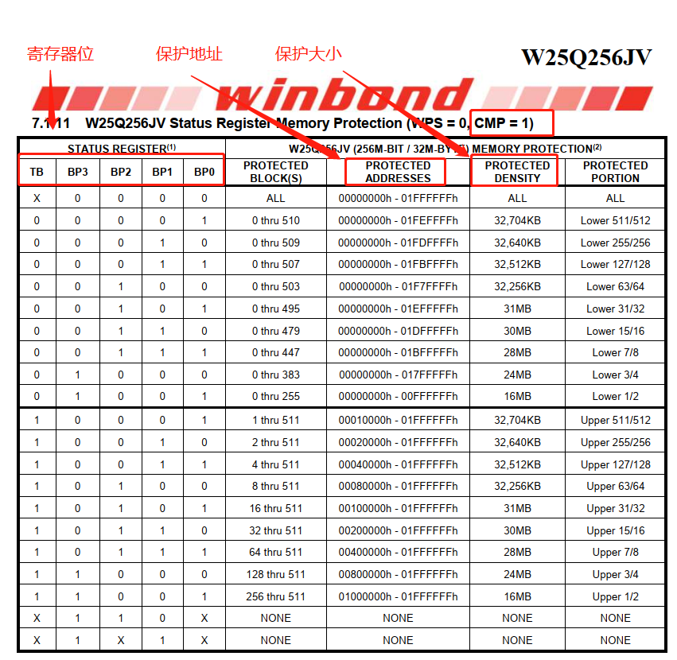
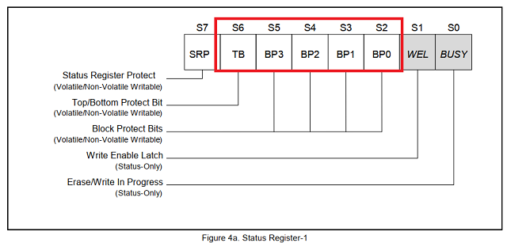
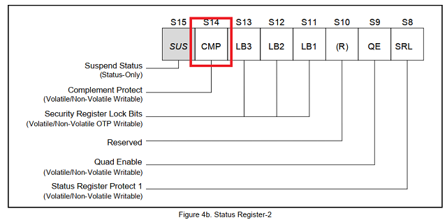
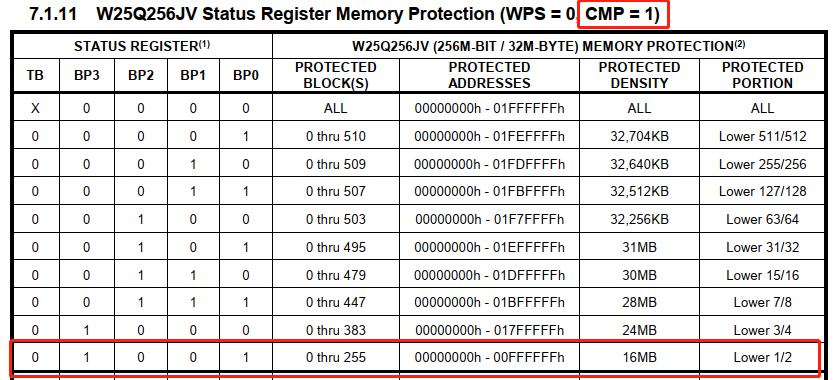

#   FLASH写保护参数使说明

> 本工程展示了flash写保护参数的使用方法。
>

---

## 适用平台

> 本工程适用以下芯片类型：
>
> 1. AC79系列芯片：AC790N、AC791N
>
> 杰理芯片和评估板的更多信息可在以下地址获取：[链接](https://shop321455197.taobao.com/?spm=a230r.7195193.1997079397.2.2a6d391d3n5udo)
## 工程配置说明

在SDK选择[demo_hello](../../../../apps/demo_hello/board)主工程文件或者主工程Makefile, 然后添加本事例工程代码。

> **说明：SDK默认不对flash进行区域写保护，需要用户自行打开**，打开如下步骤1.
>
> 1.添加 [flash_write_protect.c](..\..\system\flash_write_protect.c) 到工程，并且在该文件设置 **FLASH_WRITE_PROTECT_EN**  为 1。
>
> **添加 [flash_write_protect.c](..\..\system\flash_write_protect.c) 到工程后，默认华邦flash的SDK启动全部保护，用户可以添加自己flash id型号和写保护参数，推荐用户根据flash型号只打开最后一大半最安全。**
>
> 下列为 [flash_write_protect.c](..\..\system\flash_write_protect.c) 中的flash id型号和写保护参数列表，默认华邦flash打开写保护后SDK启动全保护，用户可在该列表添加，用户使用SDK过程z
> 
> 中应**注意：启动flash写保护之后读写flash数据不对的情况**。
> 
> static const struct flash_protect flash_protect_index[] = {
>     //id      //写全保护参数
>     /******华邦W25QXX*********/
>        0xEF4014, 0x34,//W25Q80
>        0xEF4015, 0x38,//W25Q16
>     0xEF4016, 0x3C,//W25Q32
>     0xEF4017, 0x3C,//W25Q64
>     0xEF4018, 0x1003C,//W25Q128
>     0xEF4019, 0x1003C,//W25Q256
> };
>    
>    flash写保护函数1说明：int norflash_write_pretect(u32 cmd);
>    
>    flash写保护函数2说明：norflash_ioctl(NULL, IOCTL_SET_WRITE_PROTECT, cmd);
>    
>    **参数 cmd：** 当传参的 cmd为0，则内部系统则对flash进行**全部解除写保护**。
>    
>    如何配置写保护参数cmd，下面举例为华邦的flash配置，其他型号flash同理。
> 
>    ①在flash数据手册找到flash区域写保护的表格，如下图，注意容量大的flash会有2个表格，区别在不同的CMP位。
>    
>    
>    
>    
>    
>    ②查看flash对应的寄存器位，如下图寄存器1(S0-S7)和2(S8-S15)，对应的红色框内的位是写保护相关的参数，具体功能详情flash数据手册。
>    
> 
> 
> 
>    
>    ③根据实际保护区域选合适的TB、BP3、BP2、BP1、BP0的值。
>    
> 如在上图的32M的flash中，需对flash进行前一半（0x0-0xFFFFFF）加上写保护，则选择如下如。
>    
>    
>    
>    那么对于的TB BP3 BP2 BP1 BP0为0 1 0 0 1，CMP为1，结合flash寄存器的分布，得知寄存器1(S0-S7)和2(S8-S15)的二进制分别为：
>    
>    0b00100100(0x24)、0b01000000(0x40)，**则放在cmd参数32位整形数据十六进制为0x4024：寄存器1放在0-7位，寄存器2放在8-15位**。
>    
>    **注意：**在写保护参数cmd中：第16位表示要写的flash寄存器2（S8-S15）（当写保护参数有CMP=0或1时，需要使用第16位，即设置cmd参数的第16位为1；
>    
>    在某些小容量flash的写保护参数没有使用CMP位，则第16位设置为0）。在上述的32M flash需要使用CMP位，则cmd的第16位为1，则cmd参数的十六进制
>    
>    为：0x14024，此时通过函数norflash_write_pretect(0x14024)可以把flash的前一半（0x0-0xFFFFFF）地址加上写保护。**当然，根据上图则可知解除全保护**
>    
>    **的cmd命令为0x10000**（当cmd为0，则内部系统重置命令为0x10000，因此cmd=0也可以完成解除写保护）。
>    
>    
>    
>    当使用CMP=0，则同理cmd=0x10064为写保护flash前一半区域，如下图。
> 
> 
## 操作说明

> 1. 使用串口线连接打印
> 2. 编译工程，烧录镜像，复位启动
> 3. 系统启动后，查看系统打印
>
> JIELI SDK的编译、烧写等操作方式的说明可在以下文档获取：[文档](../../../../doc/stuff/usb updater.pdf)
---

## 常见问题

> * N/A

## 参考文档

> * N/A