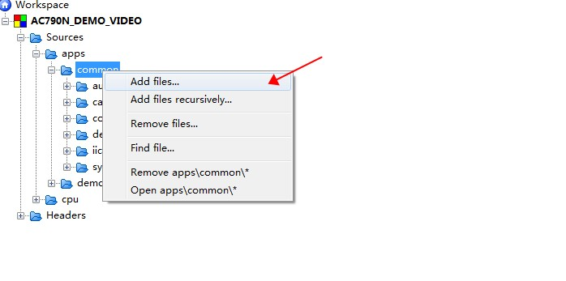
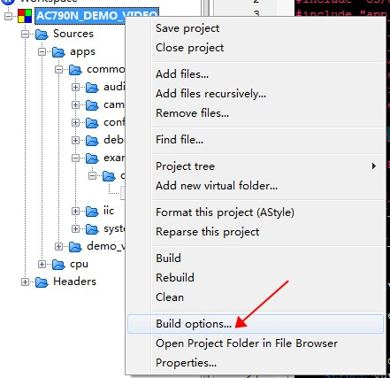
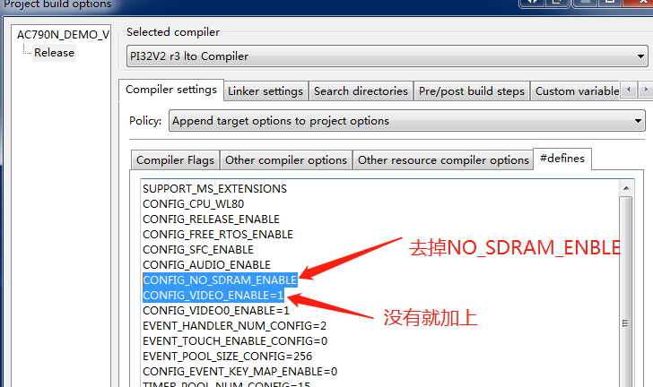
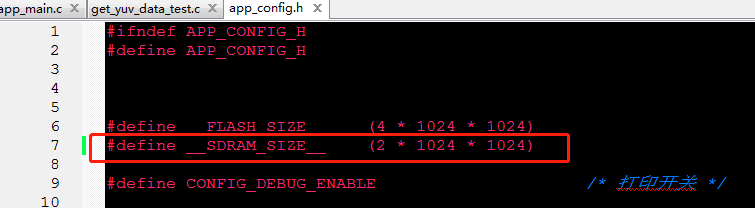
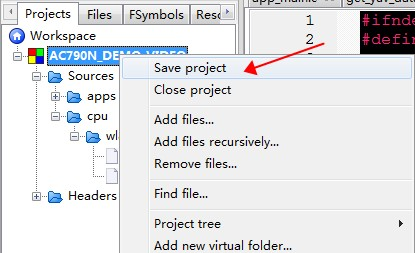
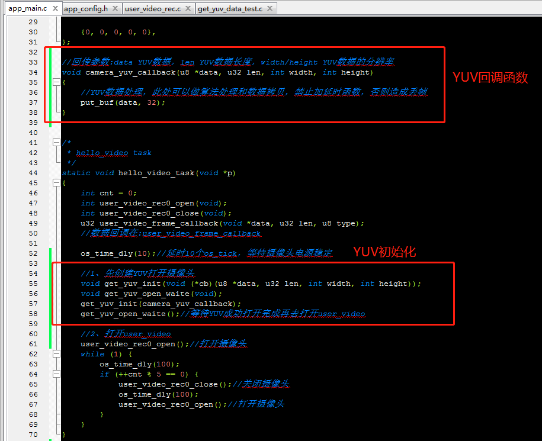
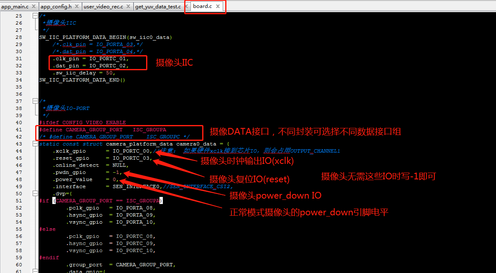
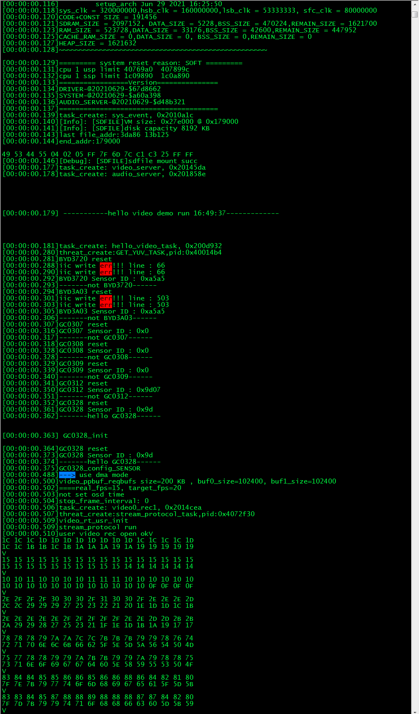

# 获取摄像头YUV数据使用示例工程说明

> 本工程展示了yuv接口使用示例:
>
> 1. 如何注册和创建YUV任务;
> 2. 如何获取camera的YUV数据;

---

## 适用平台

> 本工程适用以下芯片类型：
> 1. AC79系列芯片：AC790N、AC791N
>
> 杰理芯片和评估板的更多信息可在以下地址获取：[链接](https://shop321455197.taobao.com/?spm=a230r.7195193.1997079397.2.2a6d391d3n5udo)
>
> 注意：YUV数据获取功能，芯片务必带sdram 2M以上才能使用。

## 依赖性
>1、获取摄像头YUV功能依赖video0和vdieo相关库，同时依赖芯片需有sdram-2M以上，因此需要在demo_video工程基础上添加。
>
>2、依赖摄像头，用户先看如何移植摄像头驱动（example/camera_sensor路径 [readme.md](..\camera_sensor\readme.md) ）。

## 工程配置说明

> 在SDK选择[demo_video](../../../../apps/demo_video/board)主工程文件或者主工程Makefile, 然后添加本事例工程代码
>
> 下列为codeblock添加步骤：
>
> 1、添加get_yuv_data_test.c文件到工程，下图为codeblock使用添加文件。
>
> 
>
> 2、确定芯片为带sdram 2M以上，开启CONFIG_VIDEO_ENABLE，去掉CONFIG_NO_SDRAM_ENABLE
>
> 
>
> 
>
> 
>
> 3、demo_video的app_config.h修改SDRAM_SIZE宏定义小，修改成对应的sdram大小
>
> 
>
> 4、保存工程文件
>
> 
>
> 6、添加下列YUV回调函数，并加把YUV初始化加在hello_video_task
>
> ```c
> //回传参数:data YUV数据，len YUV数据长度，width/height YUV数据的分辨率
> void camera_yuv_callback(u8 *data, u32 len, int width, int height)
> {
>   //YUV数据处理，此处可以做算法处理和数据拷贝，禁止加延时函数，否则造成丢帧
>   put_buf(data, 32);//打印前32字节数据，可以去掉
> }
> 
> //hello_video_task函数添加：
> 
> //1、先创建YUV打开摄像头
> void get_yuv_init(void (*cb)(u8 *data, u32 len, int width, int height));
> void get_yuv_open_waite(void);
> get_yuv_init(camera_yuv_callback);
> get_yuv_open_waite();//等待YUV成功打开完成再去打开user_video
> 
> ```
>
> 如下图：
>
> 
>
> 7、摄像头IIC和DATA接口配置说明
>
> 
>
> 8、全编译，然后下载到板子运行，下图为正常系统遍历摄像头后获取摄像头的YUV打印。
>
> 

---


### 操作说明：

> 2. 编译工程，烧录镜像，复位启动
> 3. 系统启动后，可以通过串口软件看到示例的打印信息

> JIELI SDK的编译、烧写等操作方式的说明可在以下文档获取：[文档](../../../../doc/stuff/usb updater.pdf)

### 代码流程

> * app_main.c
>   > 1. hello_video_task()入口：
>   >     A）get_yuv_init()初始化YUV（包括注册YUV回调函数，创建任务并去打开摄像头）
>   >
>   >     B）get_yuv_open_waite()等待YUV打开成功
>   >
>   >     C ) user_video_rec0_open()打开用户video获取JPEG（user_video使用时再打开，example只是例子！！！）

---

## 常见问题

> * 1、摄像头IIC检测出错，id无法检测。
>
>   A）排查board.c ：IIC、xclk、pwdn_gpio、power_value有没有配置正确，根据摄像头数据手册确定摄像头pwdn正常工作电平。
>
>   B）确定xclk输出到摄像头时钟正常（可以用示波器、逻辑分仪抓取），确定xclk IO是否被占用， **当供给摄像头的时钟xclk不正常时无法读取id！**
>
>   C）确定摄像头是否已经损坏，**当接通电源发热严重则可能电源不对或者电源接反！**
>
>  * 2、摄像头id读取正常，但出现“isc line in err ”或者“isc line out err”打印，说明摄像头行数据输出到cpu的行数出错。
>
>    A）确定hsync和vsync接线是否正确。
>
>    B）确定app_config.h配置的CONFIG_VIDEO_IMAGE_W和CONFIG_VIDEO_IMAGE_H是否在镜头的输出范围内。
>
>  * 3、出现“isc bwerr !!!”和“osd bandwith err”，说明cpu带宽不足。
>
>    A）确定摄像头输出帧率和分辨率是否过高导致出现带宽不足。
>
>    B）把相应的video的buffer指定到内部sram，或者提高系统的频率（详见：[readme.md](..\系统频率\readme.md) ）。
>
> 

## 参考文档

> * N/A