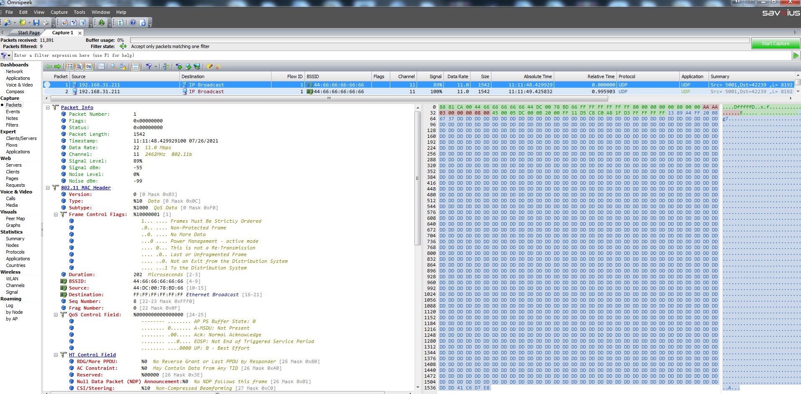

# WIFI 使用底层RF搭建私有通信示例工程

> 当用户想绕过802.11和802.3协议栈,需要直接通过WIFI RF向空中发送一个原始的 802.11 数据包,实现传输私有通信协议,可以使用本工程提供的方法实现

---

## 适用平台

> 本工程适用以下芯片类型：
>
> 1. AC79系列芯片：AC790N、AC791N
>
> 杰理芯片和评估板的更多信息可在以下地址获取：[链接](https://shop321455197.taobao.com/?spm=a230r.7195193.1997079397.2.2a6d391d3n5udo)

## 工程配置说明

> 在SDK选择[demo_wifi](../../../../../apps/demo//demo_wifi/board)主工程文件或者主工程Makefile, 然后添加本事例工程代码

---

### 操作说明：

> * 设备端操作:
>
>   1. 编译工程，烧录镜像，复位启动
>   2. 系统启动后，可以通过串口软件看到示例的打印信息, JIELI SDK的编译、烧写等操作方式的说明可在以下文档获取：[文档](../../../../doc/stuff/usb updater.pdf)
>3. 使用WIFI捉包工具可以看到如下图所示发出的数据包

### 代码流程

> 1. c_main()入口：
>    A）创建任务wifi_private_communication_test_task
>
> 2. wifi_private_communication_test_task
>
>    A）进入混杂模式,并且配置为只监听一个信道
>    
>    B ) 注册接收802.11数据帧回调
>    
>    C ) 配置WIFI RF 通信信道
>    
>    D ) 配置底层重传次数
>    
>    E ) 定时发送数据包测试
>    
>    3. wifi_rx_cb入口：
>       A）打印接收到的数据帧

---

## 常见问题

> N.A
