
## 概述

AC79 Wi-Fi 功能列表:

- 兼容IEEE802.11b/g/n标准

- 支持802.11N MCS0~7,数据传输率最高到72.2Mbps

- 支持仅 station 模式（即 STA 模式或 Wi-Fi 客户端模式），此时 AC79 连接到接入点 (AP)

- 支持仅 AP 模式（即 Soft-AP 模式或接入点模式），此时基站连接到 AC79

- 支持WPA、WPA2 及 WEP 等安全模式

- 支持 AMPDU、HT40(AC791系列支持)、QoS 

- station 模式下支持低功耗休眠

- 扫描接入点（包括主动扫描及被动扫描）

- 支持混杂模式监听 IEEE802.11 Wi-Fi 数据包

  

## AC79 Wi-Fi  编程模型

AC79 Wi-Fi 编程模型如下图所示：


Wi-Fi 驱动程序可以看作是和上层代码（如 TCP/IP 堆栈、应用程序任务等）隔离的组件,通常用户应用程序代码负责调用Wi-Fi初始化以及必要的配置, 然后Wi-Fi 驱动程序接收并处理 API请求的数据，并将相关事件通知到到应用程序去处理.


## AC79 Wi-Fi 事件描述

[wifi_connect.h](../../../../include_lib/net/wifi/wifi_connect.h)描述了所有的WIFI_EVENT,每个事件会统一发送到用户注册的回调函数wifi_set_event_callback,下面具体说明每个事件的具体意义以及用户代码需要作出的响应

### WIFI_EVENT_MODULE_INIT

Wi-Fi驱动初始化前配置,接收到此事件后用户需要配置Wi-Fi工作模式,例如STA模式连接的SSID和密码, AP模式SSID,IP网关地址等

### WIFI_EVENT_MODULE_START

Wi-Fi驱动启动成功后的事件,通常不需做任何响应

### WIFI_EVENT_MODULE_STOP

Wi-Fi驱动关闭成功后的事件,通常不需做任何响应

### WIFI_EVENT_STA_START

Wi-Fi驱动STA模式启动成功后的事件,通常不需做任何响应

### WIFI_EVENT_STA_STOP

Wi-Fi驱动STA模式停止后的事件,通常不需做任何响应

### WIFI_EVENT_STA_SCAN_COMPLETED

扫描完成事件,通常由STA模式连接过程中扫描空中所有信道完成或者用户调用wifi_sta_scan_once请求扫描触发的事件,接收到此事件后，应用程序的事件回调函数可以调用wifi_get_scan_result获取扫描结果

### WIFI_EVENT_STA_CONNECT_SUCC

STA 已成功连接目标 AP的事件，接收到此事件后，Wi-Fi 驱动程序根据应用程序响应返回结果决定是否启动 DHCP  客户端服务并开始获取 IP 地址,还是说使用静态IP地址

### WIFI_EVENT_STA_CONNECT_TIMEOUT_NOT_FOUND_SSID

连接目标 AP超时事件,原因是超时时间内扫描不到指定SSID,超时时间应用程序可以通过wifi_set_sta_connect_timeout接口配置

### WIFI_EVENT_STA_CONNECT_TIMEOUT_ASSOCIAT_FAIL

连接目标 AP超时失败事件,原因是超时时间内关联失败,通常原因是密码错误,或者距离太远/干扰太多导致通信失败

### WIFI_EVENT_STA_DISCONNECT

STA模式下与AP断开事件,此事件将在以下情况下产生:

-  Wi-Fi station 已成功连接至 AP的情况下调用了wifi_enter_ap_mode,wifi_enter_sta_mode,wifi_enter_smp_cfg_mode,wifi_off函数触发
- Wi-Fi 连接因为某些原因而中断，例如：由于信号太差,station 连续多次丢失 太多 beacon帧、AP 脱离 station 连接、AP 验证模式改变等

接收到此事件后，通常需要通知针对基于套接字编写的客户端应用程序关闭套接字.如果此事件不是用户期待的,可以调用wifi_enter_sta_mode进行重新连接

### WIFI_EVENT_STA_NETWORK_STACK_DHCP_SUCC

当 DHCP 客户端成功从 DHCP 服务器获取 IP 地址，将引发此事件, 意味着应用程序可以获取到设备IP地址,并且可以创建套接字连接服务器

### WIFI_EVENT_STA_NETWORK_STACK_DHCP_TIMEOUT

当 Wi-Fi station 已成功连接至 AP, 但是DHCP 客户端在指定超时时间内未能够从 DHCP 服务器获取 IP地址，将引发此事件, 通常情况下是由于距离远信号不好,空间干扰大导致的,应用程序可以调用lwip_set_dhcp_timeout设定超时时间,默认不指定为15秒. 引发事件后lwip协议栈内部会不断重试获取 IP地址

### WIFI_EVENT_AP_START

Wi-Fi驱动AP模式启动成功后的事件,通常不需做任何响应

### WIFI_EVENT_AP_STOP

Wi-Fi驱动AP模式停止后的事件,通常不需做任何响应

### WIFI_EVENT_AP_ON_ASSOC

在AP模式下,每当有一个 station 成功连接时，将引发此事件,接收到此事件后，应用程序的回调函数可以直接获取已连接 STA 的MAC地址,和通过wifi_get_sta_entry_rssi获取已连接 STA 的RSSI等。

### WIFI_EVENT_AP_ON_DISCONNECTED

AP模式下与 station离开事件,此事件将在以下情况下产生:

-  Wi-Fi station 已成功连接至 AC79 AP的情况下调用了wifi_enter_ap_mode,wifi_enter_sta_mode,wifi_enter_smp_cfg_mode,wifi_off函数,或者调用wifi_disconnect_station仅断开指定mac地址的station端
-  Wi-Fi 连接因为某些原因而中断，例如：由于信号太差,AP太长时间没有接收到station的数据包
-  station 主动断开与 AP79 AP 之间的连接

发生此事件时，应用程序的事件回调函数通常需执行一些操作，例如通过dhcps_get_ipaddr获取到离开的station 并且关闭与此 station 相关的套接字等

### WIFI_EVENT_SMP_CFG_START

Wi-Fi驱动混杂模式启动成功后的事件,通常不需做任何响应,此事件也是意味着,AirKiss配网功能的启动

### WIFI_EVENT_SMP_CFG_STOP

Wi-Fi驱动混杂模式停止后的事件,通常不需做任何响应

### WIFI_EVENT_SMP_CFG_TIMEOUT

Wi-Fi驱动混杂模式模式下在指定超时时间内获取不到配网信息的事件,应用程序可以通过wifi_set_smp_cfg_timeout配置超时时间,默认为无限超时时间

### WIFI_EVENT_SMP_CFG_COMPLETED

Wi-Fi驱动混杂模式下AirKiss配网功能获取到结果引发的事件,通常用户在配网情况下触发此事件,应用程序可以在此事件后获取配网结果信息

### WIFI_FORCE_MODE_TIMEOUT

若应用程序在WIFI_EVENT_MODULE_INIT事件下配置wifi_set_default_mode的force参数为3-200以内,并且默认配置STA模式下启动,那么在force参数代表的超时时间内未连接上AP,将引发此事件.通常用于给用户配置一个默认连接的SSID,方便客户调试使用, 发生此事件时，一般需要切换到配网模式或者连接其他AP

### WIFI_EVENT_P2P_XXX

Wi-Fi驱动P2P模式暂时不做说明


## AC79 Wi-Fi station 模式下正常连接场景示例

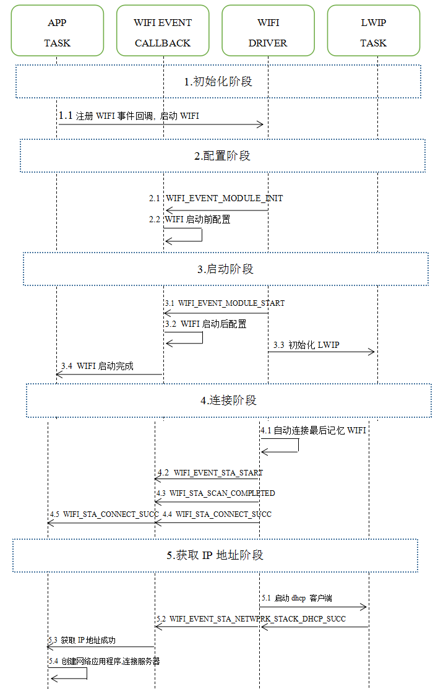

### 1.Wi-Fi初始化阶段

- 1.1 app任务调用wifi_set_event_callback注册Wi-Fi事件回调接口, 然后调用wifi_on接口启动Wi-Fi

### 2.Wi-Fi配置阶段

- 2.1 Wi-Fi进入启动流程以后,首先引发WIFI_EVENT_MODULE_INIT事件
- 2.2 用户需要在WIFI_EVENT_MODULE_INIT事件下进行WIFI初始化前的一些配置,例如没记忆的情况下默认进入的WIFI模式,例如如果用户配置默认WIFI模式为配网模式,那么设备首次启动WIFI后进入配网模式,在设备使用过程中如果应用程序调用 wifi_store_mode_info覆盖默认配置为station模式,那么下次启动WIFI后设备就进入station模式.

### 3.Wi-Fi启动阶段

- 3.1 Wi-Fi驱动引发WIFI_EVENT_MODULE_START事件
- 3.2 用户可以在WIFI_EVENT_MODULE_START事件下进行WIFI初始化后的一些配置,例如WIFI的通信速率选择,也可以获取到当前WIFI进入了什么模式
- 3.3 初始化 LwIP 协议栈
- 3.4 此时Wi-Fi事件回调函数可以通知应用程序WIFI启动完成,可以启动网络应用程序任务,同时此刻也是wifi_on接口退出返回的时候

### 4.Wi-Fi连接阶段

- 4.1 Wi-Fi驱动程序启动后根据最后记忆的配置(模式,SSID,密码等)进入对应的模式,这里默认为STA模式
- 4.2 Wi-Fi驱动引发WIFI_EVENT_STA_START事件,代表Wi-Fi驱动内部启动扫描/连接过程
- 4.3 Wi-Fi驱动引发WIFI_STA_SCAN_COMPLETED事件,代表Wi-Fi驱动已经扫描完空中的信道
- 4.4 连接上AP后,Wi-Fi驱动引发WIFI_STA_CONNECT_SUCC事件 
- 4.5 Wi-Fi事件回调函数将事件WIFI_STA_CONNECT_SUCC发送到应用程序任务

### 5.Wi-Fi获取IP地址阶段

- 5.1 启动LWIP协议栈的DHCP客户端获取IP地址
- 5.2 获取IP地址成功后,将引发WIFI_EVENT_STA_NETWPRK_STACK_DHCP_SUCC事件
- 5.3 Wi-Fi事件回调函数将事件WIFI_EVENT_STA_NETWPRK_STACK_DHCP_SUCC发送到应用程序任务
- 5.4 此时应用程序可以启动创建 TCP/UDP 套接字进行连接服务器的动作

## AC79 Wi-Fi station 模式下断开连接场景示例

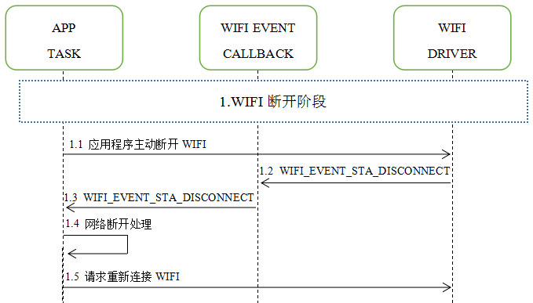

### 1.Wi-Fi断开阶段

- 1.1 Wi-Fi station 已成功连接至 AP的情况下,应用程序调用wifi_enter_ap_mode,wifi_enter_sta_mode,wifi_enter_smp_cfg_mode,wifi_off函数引发主动断开WIFI的动作

- 1.2 当 Wi-Fi 因为主动断开、AP 离线、RSSI 较弱等原因断开连接，Wi-Fi事件回调函数将引发WIFI_EVENT_STA_DISCONNECTED事件

- 1.3  Wi-Fi事件回调函数将事件WIFI_EVENT_STA_DISCONNECTED发送到应用程序任务处理

- 1.4 应用程序接收到网络断开事件后,进行网络应用程序的清除,例如关闭TCP/UDP客户端套接字等

- 1.5 通常由于不期待的原因导致Wi-Fi 断开, 应用程序会重新调用wifi_enter_sta_mode重新连接Wi-Fi 

  

## AC79 Wi-Fi station 模式下关闭Wi-Fi场景示例

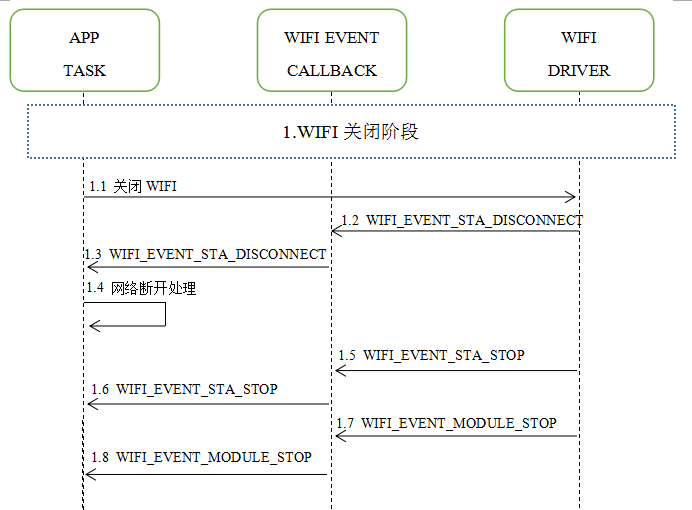

### 1.Wi-Fi关闭阶段

- 1.1 Wi-Fi station 已成功连接至 AP的情况下,应用程序调用wifi_off函数主动关闭Wi-Fi 
- 1.2 Wi-Fi事件回调函数引发WIFI_EVENT_STA_DISCONNECTED事件,如果wifi_off函数是在WIFI_EVENT_STA_DISCONNECTED事件后才被调用的,则直接进入到1.5阶段
- 1.3  Wi-Fi事件回调函数将事件WIFI_EVENT_STA_DISCONNECTED发送到应用程序任务
- 1.4 应用程序接收到网络断开事件后,进行网络应用程序的清除,例如关闭TCP/UDP客户端套接字等
- 1.5 Wi-Fi事件回调函数引发WIFI_EVENT_STA_STOP事件,代表退出STA模式
- 1.6 Wi-Fi事件回调函数将事件WIFI_EVENT_STA_STOP发送到应用程序任务
- 1.7 Wi-Fi事件回调函数引发WIFI_EVENT_MODULE_STOP事件,代表WIFI模块已经关闭完成
- 1.8 Wi-Fi事件回调函数将事件WIFI_EVENT_MODULE_STOP发送到应用程序任务

## AC79 Wi-Fi AP 模式下场景示例

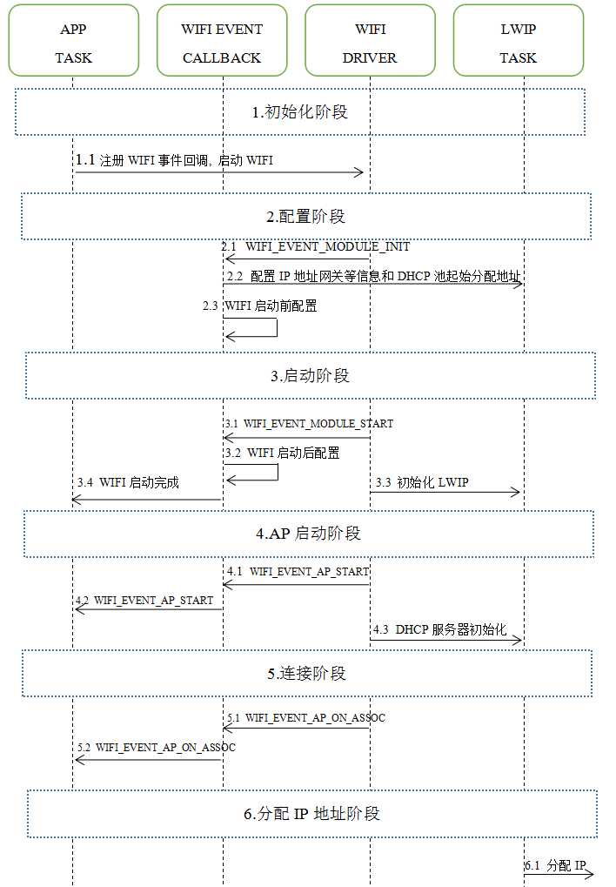

### 1.Wi-Fi初始化阶段

- 1.1 app任务调用wifi_set_event_callback注册Wi-Fi事件回调接口, 然后调用wifi_on接口启动Wi-Fi

### 2.Wi-Fi配置阶段

- 2.1 Wi-Fi进入启动流程以后,首先引发WIFI_EVENT_MODULE_INIT事件
- 2.2 应用程序需要在此调用wifi_set_lan_setting_info配置IP地址网关信息和DHCP池起始分配地址
- 2.3 用户需要在WIFI_EVENT_MODULE_INIT事件下进行WIFI初始化前的一些配置,例如没记忆的情况下默认进入的WIFI模式(SSID,PWD),例如如果用户配置默认WIFI模式为AP模式(SSID为"AC79_WIFI_DEMO_", PWD为""),那么设备首次启动WIFI后进入此AP模式,在设备使用过程中如果应用程序调用 wifi_store_mode_info覆盖默认配置为AP模式(SSID为"AC79_WIFI_CAMERA", PWD为"12345678"),那么下次启动WIFI后设备就进入此AP模式. 需要注意的是,如果AP模式需要配置默认的SSID和MAC地址相关,需要在这里调用init_net_device_mac_addr产生/得到MAC地址.

### 3.Wi-Fi启动阶段

- 3.1 Wi-Fi驱动引发WIFI_EVENT_MODULE_START事件
- 3.2 用户可以在WIFI_EVENT_MODULE_START事件下进行WIFI初始化后的一些配置,例如WIFI的通信速率选择,过滤数据帧类型,也可以获取到当前WIFI进入了什么模式
- 3.3 初始化 LwIP 协议栈
- 3.4 此时Wi-Fi事件回调函数可以通知应用程序WIFI启动完成,可以启动网络应用程序任务,同时此刻也是wifi_on接口退出返回的时候

### 4.AP启动阶段

- 4.1  Wi-Fi驱动引发WIFI_EVENT_AP_START事件,代表Wi-Fi驱动内部AP模式已经启动,空中可以搜索到热点
- 4.2 Wi-Fi事件回调函数将事件WIFI_EVENT_AP_START发送到应用程序任务

### 5.Wi-Fi连接阶段

- 5.1 当有stasion成功连接到AC79 Wi-Fi 的时候,引发WIFI_EVENT_AP_ON_ASSOC事件,此时可以获取到stasion端的mac地址,以及RSSI等信息
- 5.2 Wi-Fi事件回调函数将事件WIFI_EVENT_AP_ON_ASSOC发送到应用程序任务

### 6.Wi-Fi分配IP地址阶段

- 6.1 通常stasion成功连接到AC79 Wi-Fi后,会启用DHCP客户端请求IP地址,此时AC79的DHCP服务器会从IP地址池分配IP给stasion,由于DHCP协议为UDP协议,因此有可能因为RSSI 较弱的原因stasion端获取IP地址失败,而AC79 Wi-Fi得不到事件通知.

  另外AC79的DHCP服务器会针对依次接入的stasion端依次递增分配IP地址,并且对同一个mac地址的stasion端分配相同的IP地址

## AC79 Wi-Fi AP 模式下断开连接场景示例

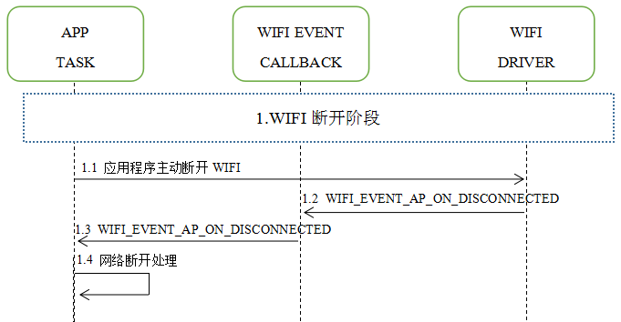

### 1.Wi-Fi断开阶段

- 1.1 当Wi-Fi station端已成功连接至 AC79 AP的情况下,应用程序调用wifi_enter_ap_mode,wifi_enter_sta_mode,wifi_enter_smp_cfg_mode,wifi_off函数引发主动断开WIFI的动作,或者调用wifi_disconnect_station仅断开指定mac地址的station端
- 1.2 当 Wi-Fi 因为主动断开、station端 离开、RSSI 较弱等原因断开连接，Wi-Fi事件回调函数将引发WIFI_EVENT_AP_ON_DISCONNECTED事件
- 1.3  Wi-Fi事件回调函数将事件WIFI_EVENT_AP_ON_DISCONNECTED发送到应用程序任务处理
- 1.4 应用程序接收到station端网络断开事件后,进行网络应用程序的清除,通过dhcps_get_ipaddr获取到离开的station 并且关闭与此 station 相关的套接字等

## AC79 Wi-Fi AP 模式下关闭Wi-Fi场景示例

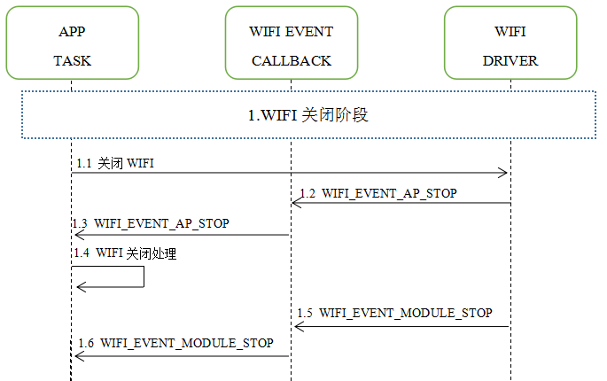

### 1.Wi-Fi关闭阶段

- 1.1 当Wi-Fi station端已成功连接至 AC79 AP的情况下,应用程序调用wifi_off函数主动关闭Wi-Fi 
- 1.2 Wi-Fi事件回调函数引发WIFI_EVENT_AP_STOP事件
- 1.3  Wi-Fi事件回调函数将事件WIFI_EVENT_AP_STOP发送到应用程序任务
- 1.4 应用程序接收到WIFI_EVENT_AP_STOP事件后,进行网络应用程序的清除,关闭与所有 station 端相关的套接字等
- 1.5 Wi-Fi事件回调函数引发WIFI_EVENT_MODULE_STOP事件,代表WIFI模块已经关闭完成
- 1.6 Wi-Fi事件回调函数将事件WIFI_EVENT_MODULE_STOP发送到应用程序任务

## AC79 Wi-Fi 配网模式下场景示例

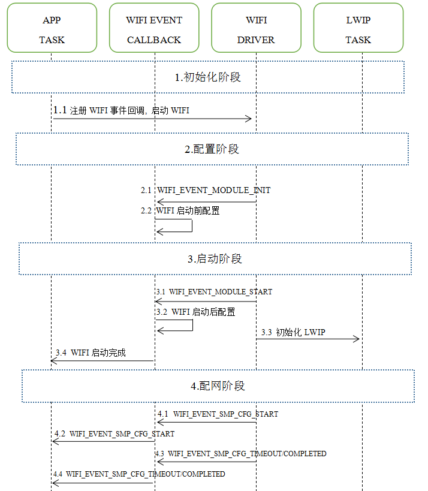

### 1.Wi-Fi初始化阶段

- 1.1 app任务调用wifi_set_event_callback注册Wi-Fi事件回调接口, 然后调用wifi_on接口启动Wi-Fi

### 2.Wi-Fi配置阶段

- 2.1 Wi-Fi进入启动流程以后,首先引发WIFI_EVENT_MODULE_INIT事件
- 2.2 用户需要在WIFI_EVENT_MODULE_INIT事件下进行WIFI初始化前的一些配置,例如没记忆的情况下默认进入的WIFI模式,例如如果用户配置默认WIFI模式为配网模式,那么设备首次启动WIFI后进入此配网模式,在设备使用过程中如果应用程序调用 wifi_store_mode_info覆盖默认配置为STA模式,那么下次启动WIFI后设备就进入STA模式

### 3.Wi-Fi启动阶段

- 3.1 Wi-Fi驱动引发WIFI_EVENT_MODULE_START事件
- 3.2 用户可以在WIFI_EVENT_MODULE_START事件下进行WIFI初始化后的一些配置,例如WIFI的通信速率选择,过滤数据帧类型,也可以获取到当前WIFI进入了什么模式
- 3.3 初始化 LwIP 协议栈
- 3.4 此时Wi-Fi事件回调函数可以通知应用程序WIFI启动完成,可以启动网络应用程序任务,同时此刻也是wifi_on接口退出返回的时候

### 4.配网阶段

- 4.1  Wi-Fi驱动引发WIFI_EVENT_SMP_CFG_START事件,代表Wi-Fi驱动内部配网模式已经启动

- 4.2 Wi-Fi事件回调函数将事件WIFI_EVENT_SMP_CFG_START发送到应用程序任务

- 4.3 当Wi-Fi驱动接收到配网信息成功以后,将引发WIFI_EVENT_SMP_CFG_COMPLETED事件,若应用程序通过wifi_set_smp_cfg_timeout配置了超时时间,那么将引发WIFI_EVENT_SMP_CFG_TIMEOUT事件

- 4.4 Wi-Fi事件回调函数将事件WIFI_EVENT_SMP_CFG_COMPLETED/WIFI_EVENT_SMP_CFG_TIMEOUT发送到应用程序任务

  

## AC79 Wi-Fi STA/配网模式下启动一次信道扫描场景示例


### 1.Wi-Fi处于STA模式或者配网模式

- 1.1 应用程序调用wifi_sta_scan_once函数启动一次扫描
- 1.2 Wi-Fi驱动内部扫描所有信道
- 1.3 Wi-Fi驱动扫描完成引发WIFI_EVENT_STA_SCAN_COMPLETED事件
- 1.4 Wi-Fi事件回调函数将事件WIFI_EVENT_STA_SCAN_COMPLETED发送到应用程序任务
- 1.5 应用程序通过调用wifi_get_scan_result函数获取扫描结果

## AC79 Wi-Fi 从配网模式切换到STA模式场景示例

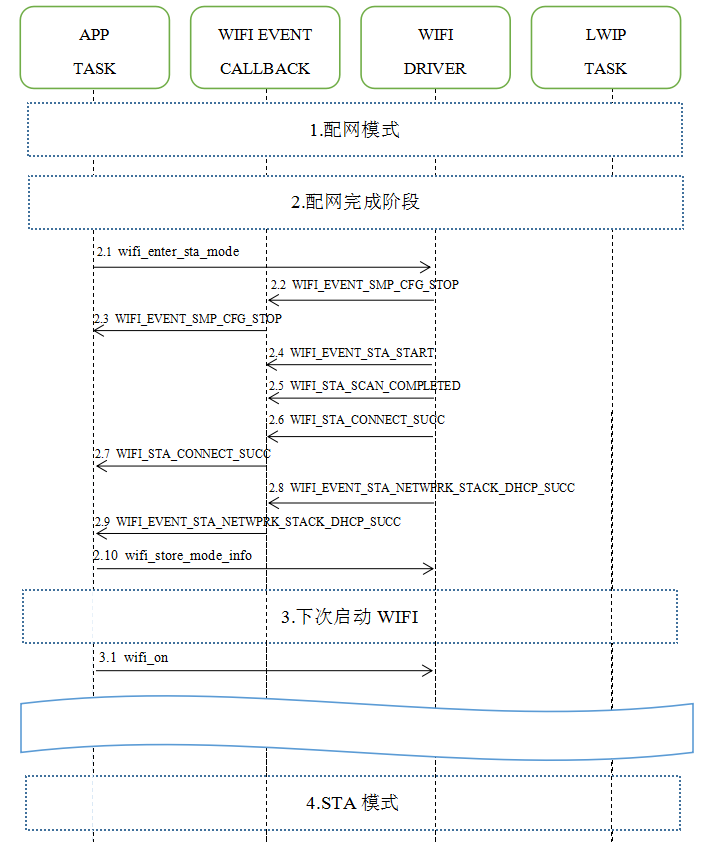

### 1.Wi-Fi启动后处于配网模式

### 2.Wi-Fi配网阶段完成后

- 2.1 应用程序调用wifi_enter_sta_mode函数切换到STA模式
- 2.2 Wi-Fi驱动引发WIFI_EVENT_SMP_CFG_STOP事件,代表配网模式已经停止
- 2.10 当STA模式连接成功后,应用程序调用wifi_store_mode_info保存WIFI模式配置信息,覆盖WIFI启动默认配置模式,下次调用wifi_on函数启动Wi-Fi,驱动程序会根据最后保存的配置(模式,SSID,密码等)进入STA模式

## AC79 Wi-Fi 从AP模式切换到STA模式场景示例

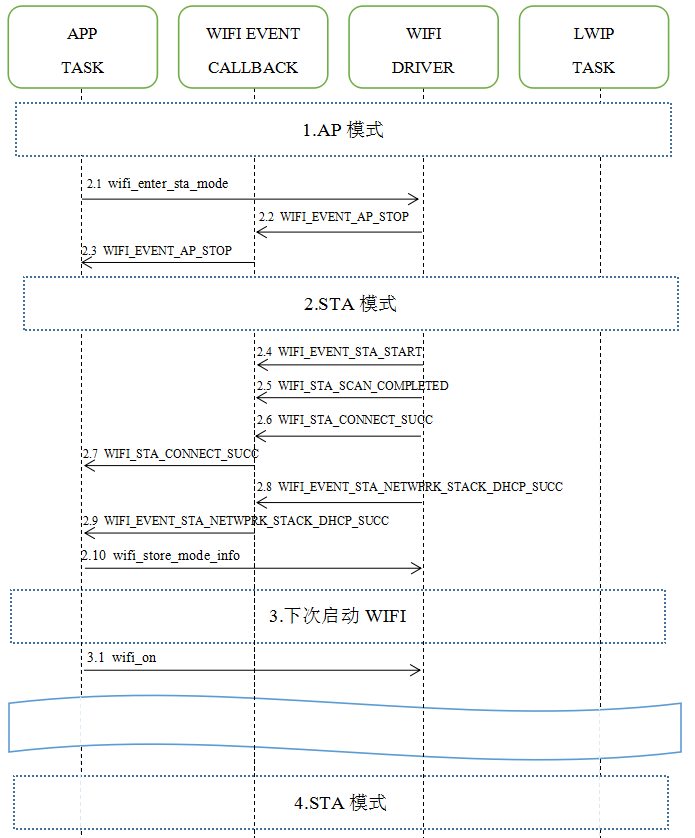


## AC79 Wi-Fi 从STA模式切换到STA模式场景示例

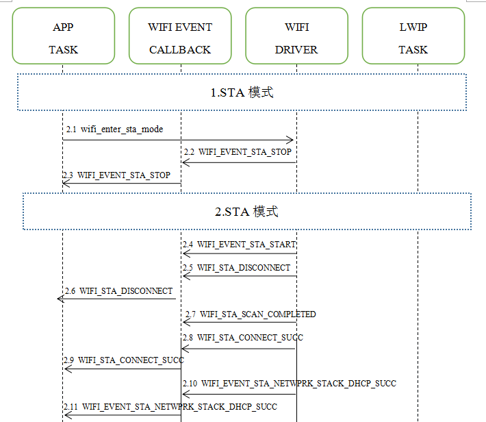


## AC79 Wi-Fi  函数接口使用注意事项

-  Wi-Fi提供的函数接口统一在[wifi_connect.h](../../../../include_lib/net/wifi/wifi_connect.h)头文件,分类了哪些函数是哪个模式下使用的,哪些是公共使用的,每个函数的具体意义都有注释描述

- 应用程序需要注意接口的使用顺序,这部分可以参考当前目录下Wi-Fi提供的例程

- 应用程序调用wifi_set_event_callback注册的事件回调函数是在Wi-Fi驱动内核调度的,而有些函数需要调度到Wi-Fi驱动内核, 为了防止阻塞挂机的情况, 应用程序在使用wifi_enter_sta_mode, wifi_enter_ap_mode, wifi_enter_smp_cfg_mode, wifi_sta_scan_once, wifi_on, wifi_off, wifi_store_mode_info,这些函数的时候不能够直接在事件回调函数内执行,而是在事件回调函数把事件发送到应用程序的任务中执行

  

## Wi-Fi  失败代码原因

  

  

## WIFI基本配置

- [wifi_conf.c](../../../../apps/common/net/wifi_conf.c)的WL_AP_DAT提供了AP模式下的配置,WL_STA_DAT提供了STA模式下的配置,下表详细描述一些常用的配置项

### AP/STA/配网模式公共部分基本配置  

| WirelessMode   | Wi-Fi 无线模式选择,默认配置为802.11BGN_MIXED:<br />0:802.11BG_MIXED<br/>1:802.11B<br/>4:802.11G<br/>6:802.11N 2.4G<br/>7:802.11GN_MIXED<br/>9:802.11BGN_MIXED |
| :------------- | ------------------------------------------------------------ |
| BGProtection   | 有利于较慢的11b/g无线客户端在复杂的多种模式下能顺利连接到11n无线网络,默认为自动<br />0:自动<br/>1:打开<br />2:关闭 |
| TxPreamble     | 前导码主要用于确定移动设备和AP接入点或者无线路由之间何时发送和接收数据，传输进行时告知其它移动设备以免冲突，同时传送同步信号及帧间隔。Preamble完成，接收方才开始接收数据。对于无线传输来说，传输的数据帧中，Preamble越长，有效数据就越短，因此短preamble的支持可以让无线接口传输效率更高。<br />默认配置为短前导码 |
| RTSThreshold   | 一个无线帧的大小如果超过设置的RTS阈值,才发送RTS; 否则,为保证吞吐量和空中环境的平衡,不发送RTS.默认配置为2347 |
| FragThreshold  | 发送数据包最大分段大小,默认为2346字节                        |
| PktAggregate   | 在基于分组的通信网络中，分组聚合是将多个分组一起连接到单个传输单元中的过程，以便减少与每个传输相关联的开销。在每个传输单元可能具有显着开销（前导码，报头，循环冗余校验等）或者与可传输的最大信息量相比预期分组大小较小的情况下，分组聚合是有用的。在基于分层OSI模型的通信系统中，分组聚合可以负责将多个MSDU加入到单个MPDU中，该MPDU可以作为单个单元传送到物理层以进行传输。但是，当数据包过大时，会导致数据包错误率变大，增加排队延迟，增加端到端的延迟。<br />广播帧和多播帧不会被聚合，只有单播帧且接收地址相同和优先级相同的帧才会被聚合<br />默认配置关闭数据包聚合 |
| TxBurst        | 当TxBurst打开时，Tx数据包的优先级将高于Rx数据包,使得TX性能将高于RX. 默认关闭<br />0:关闭<br/>1:打开 |
| WmmCapable     | WMM是无线传输协议802.11e的一个子协议，是无线局域网的Qos,主要针对无线局域网中的音频,视频等多媒体应用的优化,比普通的数据文件有更高的优先权发送。一方面它可使某些面向网络的应用程序更流畅地运行，另外一方面就得牺牲其它应用程序。不过，这是分配用户的网络带宽的最佳方式。<br />此功能需要消耗一定的内存<br />0:关闭I<br/>1:打开 |
| CountryRegion  | 选择不同国家的WLAN信道列表,默认配置为1,支持1-13个信道, 具体配置可以参考[WIFI 不同国家channel list设置](https://blog.csdn.net/linbounconstraint/article/details/80899321),例如配置为5就是支持1-14个信道 |
| CountryCode    | 选择无线WIFI国家码, 默认为CN                                 |
| DtimPeriod     | dtim时槽：该值在1 至255  毫秒之间，指定传输指示消息(dtim)的间隔。dtim是一种倒数计时作业，用以告知下一个要接收播送及多播的客户端窗口。当路由器已经为相关联的客户端缓存了播送或者多播信息时，它就会传送夹带有下一个dtim时槽的dtim；当客户端听到beacon讯号时，就会接收该播送和组播信息。默认值为1。简单的理解成一种数据多播的缓存时间，过了这个周期则会一起发送。 |
| APSDCapable    | WiFi联盟的WMM省电认证协议,默认关闭.目前Wi-Fi驱动内核AP模式不支持此功能<br />0:关闭I<br/>1:打开 |
| HT_MpduDensity | 置1个A-MPDU中MPDU的分离时间间隔,默认配置为4<br />0:  无限制<br/>1: 1/4 µs<br/>2: 1/2 µs<br/>3: 1 µs<br/>4: 2 µs<br/>5: 4 µs<br/>6: 8 µs<br/>7: 16 µs |
| HT_BW          | 置通道宽度,默认为 20 MHz, 注意AC790系列仅支持20 MHz<br />0:  20 MHz<br/>1: 40 MHz |
| HT_GI          | 保护间隔是802.11n针对802.11a/g所做的改进,无线信号在空间传输会因多径等因素在接收侧形成时延，如果后续数据块发送过快，会和前一个数据块形成干扰，而GI就是用来规避这个干扰的,Long GI时长为800us，而Short GI时长为400us，在使用Short GI的情况下，可提高10%的速率。另外，Short GI与带宽无关，支持20MHz、40MHz带宽。<br />默认配置为Long GI<br />0:Long GI<br/>1:Short GI |
| HT_MCS         | 设置无线调制编码策略,默认配置为自动适配<br />0~15,32:fix MCS rate<br />33:自动适配 |
| HT_BADecline   | 设置拒绝Block ACK请求,通过DELBA Request报文来撤消一个已经建立的Block Ack协定<br /> 0: disable<br/> 1: enable |
| HT_AutoBA      | 设置自动Block ACK<br />0: disable Block ACK<br/>1: enable Block ACK |
| HT_BAWinSize   | 设置Block Ack window size, 值为1-64,默认配置为64,代表64*16bits=128bytes,每个bit表示MPDU是否发射成功 |

### AP模式专属基本配置  

| MaxStaNum            | 配置最大接入多少个stasion,默认配置为2个,为了节省内存消耗,Wi-Fi驱动内核限制了不能够超过5个 |
| :------------------- | ------------------------------------------------------------ |
| BssidNum             | 配置支持多个Bssid,Wi-Fi驱动内核目前限定一个                  |
| IdleTimeout          | 最长多少秒未接收到stasion端的数据包断开超时时间,默认为300秒.注意配置太小会有手机容易断开的兼容性问题 |
| Channel              | 无线工作信道,中国允许范围1-13信道,默认配置为11信道.如果AutoChannelSelect=1则无效 |
| AutoChannelSelect    | 0:关闭自动信道选择<br/>1:开启自动信道选择,wifi_on以后Wi-Fi驱动内核根据空中干扰情况选择最佳信道 |
| BeaconPeriod         | 信标帧发送周期,默认为100毫秒                                 |
| DtimPeriod           | dtim时槽：该值在1 至255  毫秒之间，指定传输指示消息(dtim)的间隔。dtim是一种倒数计时作业，用以告知下一个要接收播送及多播的客户端窗口。当路由器已经为相关联的客户端缓存了播送或者多播信息时，它就会传送夹带有下一个dtim时槽的dtim；当客户端听到beacon讯号时，就会接收该播送和组播信息。默认值为1。简单的理解成一种数据多播的缓存时间，过了这个周期则会一起发送。 |
| NoForwarding         | 启用或禁用不同的sta的包在相同的SSID转发,Wi-Fi驱动内核暂时不支持此功能<br />0:disableI<br/>1:enable |
| NoForwardingBTNBSSID | 禁用或启用在每个BSSID之间不转发,Wi-Fi驱动内核暂时不支持此功能<br />0:disableI<br/>1:enable |
| HideSSID             | 禁用或启用隐藏SSID<br />0:disableI<br/>1:enable              |
| StationKeepAlive     | 禁用或启用周期性自动检测活跃的sta,默认禁用<br />0:disableI<br/>n:无数据交互后n毫秒探测sta是否还活跃 |
| RekeyMethod          | 组密钥更新方式<br />DISABLE:不更新组密钥<br/>TIME:基于时间方式更新<br />PKT:基于数据包方式更新 |
| RekeyInterval        | 指定组密钥更新间隔,若基于数据包方式更新,则单位为1K packets,若基于时间方式更新,则单位为秒 |

### STA模式专属基本配置  

| PSMode         | 禁用或启用WIFI低功耗节能模式<br />CAM:不启用节能模式<br/>LEGACY_PSP:常规节能模式<br />MAX_PSP:最大节能模式<br />FAST_PSP:快速节能模式 |
| :------------- | ------------------------------------------------------------ |
| AutoRoaming    | 禁用或启用多个相同AP之间自动漫游,默认禁用<br />0:disableI<br/>1:enable |
| RoamThreshold  | 当启用自动漫游配置,如果信号强度小于RoamThreshold门限时，就触发roaming操作,默认配置为-70dbm |
| BeaconLostTime | 配置续多少秒接收不到AP端的beacon帧视为与AP断开连接引发断开事件,默认配置为16秒 |

  

## Wi-Fi 安全机制

- 支持WEP/WPA-TKIP/WPA2-CCMP传统的安全保障方法,针对AP模式,默认使用WPA2PSK-AES加密方式,用户也可以在[wifi_conf.c](../../../../apps/common/net/wifi_conf.c)的wl_set_passphrase函数内更改配置,针对STA模式会自动根据AP端加密方式选择匹配的方式


## WIFI RF 参数校准

由于Wi-Fi IC在不同的板子上表现的RF性能差异性问题, 需要根据不同的板子测试指标(Power、EVM、Mask、Freq.Error)来重新校准WIFI RF 参数, 分别有晶振电容配置,PA trim值配置, 每个速率的数字增益配置(如果只需要运行蓝牙不运行WIFI此项不需要), 如果测试性能达不达标,客户可以联系FAE支持重新画板

用户可以根据[FCC测试工具和文档](../../../../sdk_tools/WIFI_MP_TEST_TOOL)进行操作,然后把测试好的校准值填写到SDK里面对应board板级文件的wifi_calibration_param参数

```c
const struct wifi_calibration_param wifi_calibration_param = {
    .xosc_l     = 0xb,// 调节晶振左电容
    .xosc_r     = 0xa,// 调节晶振右电容
    .pa_trim_data  ={7, 7, 1, 1, 5, 0},// 根据MP测试生成PA TRIM值
    .mcs_dgain     ={
        64,//11B_1M
        64,//11B_2.2M
        64,//11B_5.5M
		64,//11B_11M
        64,//11G_6M
        64,//11G_9M
        64,//11G_12M
        64,//11G_18M
        64,//11G_24M
        38,//11G_36M
        34,//11G_48M
        27,//11G_54M
        64,//11N_MCS0
        64,//11N_MCS1
        64,//11N_MCS2
        64,//11N_MCS3
        40,//11N_MCS4
        34,//11N_MCS5
        29,//11N_MCS6
        25,//11N_MCS7
    }
};
```


## 		如何配置WIFI模拟发射功率

- 在 WIFI_EVENT_MODULE_START 事件之后就可以 调用wifi_set_pwr 配置, WIFI运行过程中可以动态配置, 如果不配置默认使用最大的档位

  

## 		如何指定WIFI发送速率

- 针对特殊应用场合,用户可以指定选择 B模,G模,N模的Wi-Fi发送速率,例如用户需求带宽比较高,则低速率的调制编码方式不满足需求

- 用户可以在wifi_event_callback的case WIFI_EVENT_MODULE_START:事件下调用wifi_set_tx_rate_control_tab配置,也可以在Wi-Fi运行过程中动态配置,该配置会同时限定重发速率

  ```c
  static int wifi_event_callback(void *network_ctx, enum WIFI_EVENT event)
      switch (event) {
      case WIFI_EVENT_MODULE_START:
              u32  tx_rate_control_tab = // 不需要哪个速率就删除掉该行,可以动态设定
              0
              | BIT(0) //0:CCK 1M
              | BIT(1) //1:CCK 2M
              | BIT(2) //2:CCK 5.5M
              | BIT(3) //3:OFDM 6M
              | BIT(4) //4:MCS0/7.2M
              | BIT(5) //5:OFDM 9M
              | BIT(6) //6:CCK 11M
              | BIT(7) //7:OFDM 12M
              | BIT(8) //8:MCS1/14.4M
              | BIT(9) //9:OFDM 18M
              | BIT(10) //10:MCS2/21.7M
              | BIT(11) //11:OFDM 24M
              | BIT(12) //12:MCS3/28.9M
              | BIT(13) //13:OFDM 36M
              | BIT(14) //14:MCS4/43.3M
              | BIT(15) //15:OFDM 48M
              | BIT(16) //16:OFDM 54M
              |BIT(17) //17:MCS5/57.8M 
              |BIT(18) //18:MCS6/65.0M
              |BIT(19) //19:MCS7/72.2M
              ;
             wifi_set_tx_rate_control_tab(tx_rate_control_tab);
  break;
  ```

  

## Wi-Fi 低功耗模式

### Wi-Fi省电软件策略

- Wi-Fi低功耗策略可以通过配置更低的模拟发射功率和数字发射功率
- AP模式下增大Beacon帧间隔
- 稍微降低app_config.h的VDC14_VOL_SEL_LEVEL(WIFI电压VDD14)
- 使用wifi_set_tx_rate_control_tab函数配置 Wi-Fi发送datarate,限制在高带宽的速率

### STA节能模式PSMode

- Wi-Fi station 必须与AP已连接的状态下，station将根据负载情况定期在活动状态和睡眠状态之间切换,

  PSMode 模式下每个 DTIM 间隔，station都将被系统唤醒以接收AP发出的beacon帧, 广播数据在 DTIM 之后传输，因此不会丢失。但是，由于 DTIM 间隔长短由AP决定，如果该间隔时间设置较短，则省电效果不大,一般路由器默认配置为1个DTIM周期即100毫秒
  
- 具体使用方法请参考[STA节能模式PSMode](low_power)

### AP 节能模式

- 暂不支持AP节能模式


## WIFI  MAC地址配置

WIFI MAC地址配置位于[assign_macaddr.c](../../../common/net/assign_macaddr.c),WIFI和BT/BLE MAC地址是一致的, 配置方式有以下几种:

1.使用flash的uuid和随机数产生mac地址;

2.使用[MAC地址配置工具](../../../../sdk_tools)烧写MAC地址到FLASH;

3.第一次连上外网后，使用杰理服务器分配WIFI模块的MAC地址,需要在app_config.h 打开宏 CONFIG_ASSIGN_MACADDR_ENABLE, 默认统一分配, 如果用户需要指定一批mac地址范围,可以根据[杰理开放平台文档](../../../../doc/stuff/杰理开放平台文档20201216_136.pdf)发送邮件到杰理开发团队申请,然后把申请到的客户批次号填写到[platform_cfg.c](../../../common/net/platform_cfg.c)的get_macaddr_auth_key和get_macaddr_code函数

4.用户自行在init_net_device_mac_addr函数实现获取MAC地址的方法


## 		WIFI AP模式下获取接入的stasion信息

- 获取MAC地址: 可以通过WIFI_EVENT_AP_ON_ASSOC事件获取到连接进来的STA MAC地址, 或者可以通过lwip_get_dest_hwaddr接口,填入IP地址获取对应MAC地址信息
- 获取IP地址:可以通过dhcps_get_ipaddr接口,填入MAC地址获取对应IP地址信息
- 获取RSSI/EVM: 可以通过wifi_get_sta_entry_rssi接口获取连接进来的STA的RSSI/EVM信息


## 		Wi-Fi  STA模式断线重接问题

- 出于多种原因，Wi-Fi 在STA模式下可能会与AP断开连接，应用程序应负责重新连接, 通常的方法为：应用程序接收到WIFI_EVENT_STA_DISCONNECT事件后调用函数wifi_enter_sta_mode进行重新连接
- 如果应用程序希望重新连接的时候连接记忆保存过的最佳网络,则先调用wifi_set_sta_connect_best_ssid函数后调用函数wifi_enter_sta_mode进行重新连接

- 如果断开连接事件是由应用程序主动引发的，那么应用程序可能不期望立刻重新连接


## 		Wi-Fi  直接使用RF收发数据包

- 当用户想绕过802.11协议栈和802.3协议栈,需要直接通过WIFI RF向空中发送和接收一个原始的 802.11 数据包,实现传输私有通信协议,可以参考[Wi-Fi  直接使用RF收发数据包例程](private_communication/)提供的方法实现

  

## 		Wi-Fi HT20/40

- AC791N系列 支持 Wi-Fi 带宽 HT20 或 HT40，AC790N系列 不支持 Wi-Fi 带宽 HT40

- 在 AP/Station  模式下,实际带宽首先在 Wi-Fi 连接时协商。只有当 station 和所连 AP 都支持 HT40 时，带宽才为 HT40，否则为 HT20。如果所连的 AP 的带宽发生变化，则在不断开 Wi-Fi 连接的情况下再次协商实际带宽

- 理论上，HT40 可以获得更大的吞吐量，因为 HT40 的最大原始 PHY 数据速率为 150Mbps，而 HT20 为  72Mbps。但是，如果设备在某些特殊环境中使用，例如周围其他 Wi-Fi 设备过多，HT40  的性能可能会降低。因此，如果应用程序需要支持相同或类似的情况，建议始终将带宽配置为 HT20

  

## Wi-Fi QoS

AC79 支持 WFA Wi-Fi QoS 认证所要求的所有必备功能,目前开放的版本为了节省内存消耗,关闭了QoS功能,如果用户有需求可以向杰理AC79开发团队申请开放

Wi-Fi 协议中定义了四个 AC （访问类别），每个 AC 有各自的优先级访问 Wi-Fi 信道。此外，还定义了映射规则以映射其他协议的 QoS 优先级，例如 802.11D 或 TCP/IP 到 Wi-Fi AC。

下表描述  IP 优先级如何映射到 Wi-Fi AC,该表按优先级降序排列，即 AC_VO 拥有最高优先级。

| IP 优先级 | Wi-Fi AC            |
| --------- | ------------------- |
| 6, 7      | AC_VO (Voice)       |
| 4, 5      | AC_VI (Video)       |
| 3, 0      | AC_BE (Best Effort) |
| 1, 2      | AC_BK (Background)  |

应用程序可以通过套接字选项 IP_TOS 配置 IP 优先级使用 QoS 功能。下面是使套接字使用 VI 队列的示例:

```
const int ip_precedence_vi = 4;
const int ip_precedence_offset = 5;
int priority = (ip_precedence_vi << ip_precedence_offset);
setsockopt(socket_id, IPPROTO_IP, IP_TOS, &priority, sizeof(priority));
```

理论上，高优先级的 AC 比低优先级 AC 具有更好的性能，但并非总是如此，下面是一些关于如何使用 Wi-Fi QoS 的建议：

> - 可以把一些真正重要的应用程序流量放到 AC_VO 队列中, 避免通过 AC_VO 队列发送大流量, 如果流量很大, 性能不会优于其他队列. 另一方面，可能会影响同样使用 AC_VO 队列的管理帧
> - 避免使用 AMPDU 支持的、两个以上的不同优先级，比如 socket A 使用优先级AC_BK，socket B 使用优先级  AC_BE，socket C 使用优先级 AC_VI。因为可能需要更多的内存，不是好的设计。具体来说，Wi-Fi 驱动程序可能会为每个优先级生成一个 Block Ack 会话，则需要更多内存


## 		Wi-Fi   缓冲区以及吞吐率性能

- AC79 Wi-Fi 的性能收到许多参数的影响，各参数之间存在相互制约。如果配置地合理，不仅可以提高性能，还可以增加应用程序的可用内存，提高稳定性。

  在本节中，我们将简单介绍 Wi-Fi/LWIP 协议栈的工作模式，并推荐几种配置等级，用户可以根据使用场景选择合适的等级配置

  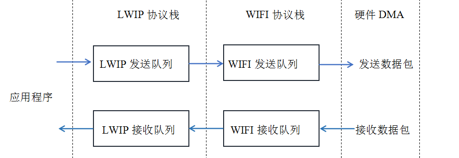

  ​																								           **协议栈数据流路径**

- AC79 网络协议栈分为应用层、LWIP协议层、Wi-Fi协议层和硬件层,在接收过程中，硬件将接收到的数据包放入 DMA BUFFER，然后依次传送到 Wi-Fi 的接收数据缓冲区、LWIP 的接收数据缓冲区进行相关协议处理，最后传送到应用层。在发送过程中，应用程序首先将要发送的消息复制到 LWIP 层的发送数据缓冲区，进行 TCP/IP 封装。然后将消息发送到 Wi-Fi 层的发送数据缓冲区进行 MAC 封装，最后填充到硬件DMA BUFFER发送

- Wi-Fi 的吞吐量很大程度上取决于与收发队列缓存大小相关的配置，如 TCP 窗口大小、Wi-Fi 接收/发送数据动态缓冲区数量等。在考虑内存配置时，应用程序所需的总内存也是一个需要均衡的因素，由于这些原因，不存在一个适合所有应用程序的配置。因此，我们必须为每个不同的应用程序考虑不同的内存配置

- 关于LWIP TCP/IP 层分配缓冲区大小, SDK默认配置了两档预编译好的库文件供用户选择,其中lwip.a库对应配置文件lwipopts.h, lwip_sfc.a库对应配置文件lwipopts_sfc.h,同时[lib/net](../../../../lib/net)目录下也开放了LWIP库的源代码,对LWIP内存使用和性能部分配置有了解的用户可以自行修改重编译库

- 关于 WIFI 协议层分配缓冲区大小, SDK默认配置了一些预编译好的库文件供用户选择,用户需要确认当前自己使用的编译工程文件选择的是哪个库文件

-  开辟较小缓冲区的WIFI库与LWIP库组合的吞吐率在500KB/S左右, 开辟更大缓冲区的WIFI库与LWIP库组合的吞吐率在2MB/S. 一般来说, 如果应用方案功能开发完成以后,有较多剩余内存,都应该选择开辟更大缓冲区的WIFI库与LWIP库,如果用户需求更高精度的缓冲区开辟空间,可以联系杰理AC79开发团队支持定制

- 下表具体描述不同名字的wifi库与lwip库代表的具体意义


| wl_wifi.a         | 包含AP和STA模式,开辟更大缓冲区,收发吞吐率更高, 建议芯片封装带SDRAM的方案选择 |
| ----------------- | ------------------------------------------------------------ |
| wl_wifi_sfc.a     | 包含AP和STA模式,开辟较小缓冲区,占据内存小                    |
| wl_wifi_ap.a      | 包含AP和STA模式,收发吞吐率更高, 建议芯片封装带SDRAM的方案选择 |
| wl_wifi_ap_sfc.a  | 只包含AP模式,开辟较小缓冲区,占据内存小                       |
| wl_wifi_sta.a     | 只包含STA模式,开辟更大缓冲区,收发吞吐率更高, 建议芯片封装带SDRAM的方案选择 |
| wl_wifi_sta_sfc.a | 只包含STA模式,开辟较小缓冲区,占据内存小                      |
| lwip.a            | 开辟更大缓冲区,收发吞吐率更高, 建议芯片封装带SDRAM的方案选择 |
| lwip_sfc.a        | 开辟较小缓冲区,占据内存小                                    |
| wpasupplicant.a   | 如使用STA模式,需要包含, 仅使用AP模式不需要包含               |

- AP模式下开辟最大缓冲区在无干扰环境下吞吐率测试

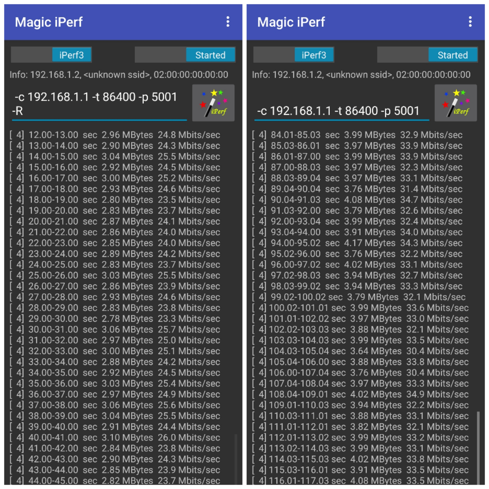


- STA模式下开辟最大缓冲区在无干扰环境下吞吐率测试

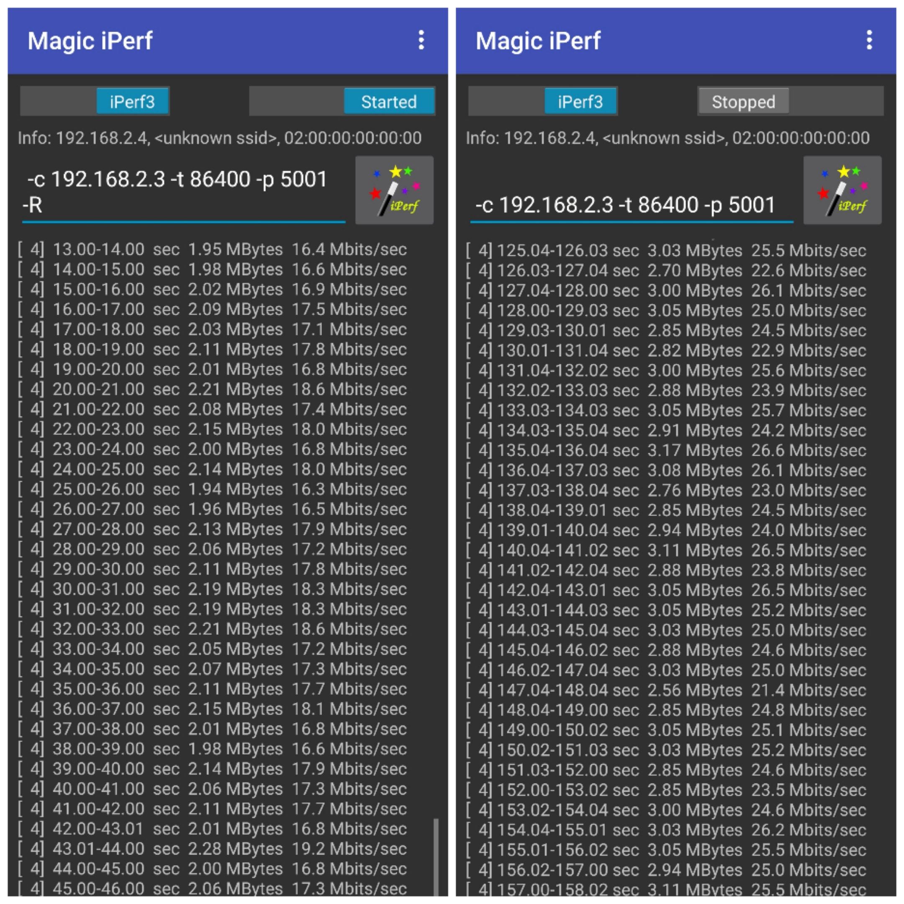

