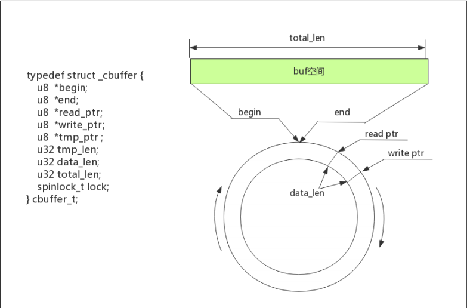
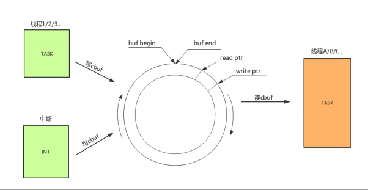

# 循环CBUF使用示例工程说明

>  
> 
>
> 
>
> 本工程展示了cbuf常用接口使用示例:
>
> cbuf 具有如下特点：
> 	1.buf 空间大小固定；
> 	2.数据先进先出；
> 	3.buf 开始和结束头尾相连的，在写到buf 结束会从buf 开始位置继续写入，形成环形结构；
> 	4.数据可以多次写入一次读出或者一次写入多次读出；
> 	5.无碎片产生问题；

---

## 适用平台

> 本工程适用以下芯片类型：
> 1. AC79系列芯片：AC790N、AC791N
>
> 杰理芯片和评估板的更多信息可在以下地址获取：
> [链接](https://shop321455197.taobao.com/?spm=a230r.7195193.1997079397.2.2a6d391d3n5udo)

## 工程配置说明

> 在SDK选择[demo_hello](../../../../apps/demo_hello/board)主工程文件或者主工程Makefile, 然后添加本事例工程代码

---

### 操作说明：

> 2. 编译工程，烧录镜像，复位启动
> 3. 系统启动后，可以通过串口软件看到示例的打印信息
>
> JIELI SDK的编译、烧写等操作方式的说明可在以下文档获取：[文档](../../../../doc/stuff/usb updater.pdf)

### 代码流程

> 1. c_main()入口：
>
>         A）cbuf基本读写测试 lib_system_cbuf_write_read_test
>        B) cbuf申请读写测试 lib_system_cbuf_write_read_alloc_test
>         C) cbuf预写预读测试 lib_system_cbuf_prewrite_test
>        C) cbuf多线程读写测试 lib_system_cbuf_mult_task_wr_api_test
>    
---

## 常见问题

> * cbuf通过用于什么场合?
>
>   答:适合用于流形式的数据包, 并且任务间数据流读写动态平衡的场合
>
>   
>
> * circular_buf.h 除了给出事例以外的接口如何使用?
>
>      答:如果例子展示的接口不满足客户应用需求, 请联系杰理技术团体增加更完善的接口使用说明

## 参考文档

> * N/A