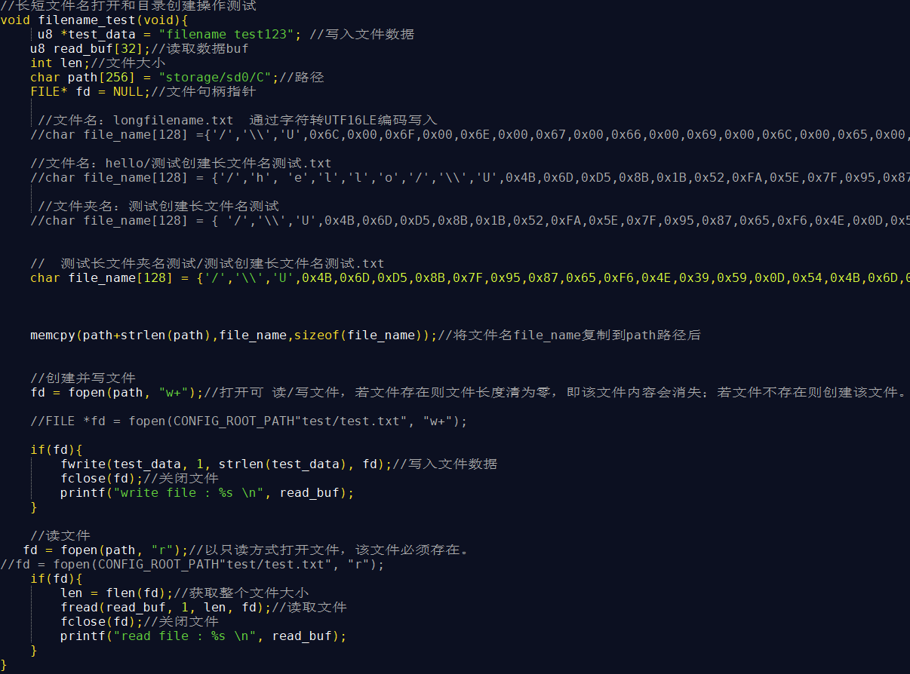
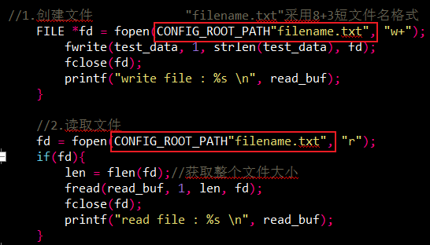
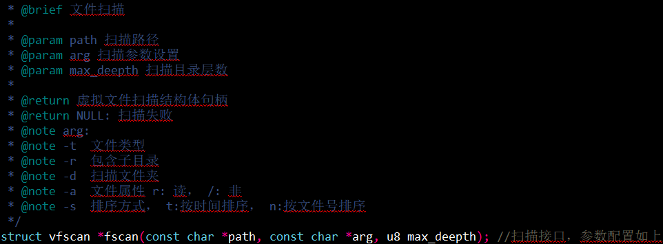
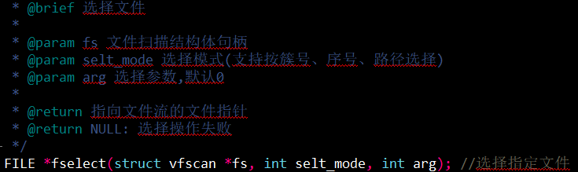
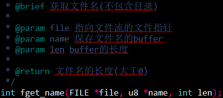

# 文件系统接口示例

> 本例子展示了：通过挂载SD卡进行文件系统接口调用：
>
>  1、长文件名和短文件名的打开
>  2、长文件名和短文件名的目录创建
>  3、fscan、fslect和fget_name的用法

---

## 适用平台

> 本工程适用以下芯片类型：
>
> 1. AC79系列芯片：AC790N、AC791N

> 杰理芯片和评估板的更多信息可在以下地址获取：
> [链接](https://shop321455197.taobao.com/?spm=a230r.7195193.1997079397.2.2a6d391d3n5udo)

## 工程配置说明

> 在SDK选择[wifi_camera](../../../../../apps/wifi_camera/board)工程CBP文件或者工程Makefile, 然后添加本事例工程代码
>
> app_config.h：
>
> * 使能SD卡，需要定义#define TCFG_SD0_ENABLE   1

## 模块依赖

> * fs.a 文件系统
> * event.a 设备事件相关驱动


---

### 操作说明：
>1. 编译工程，烧录镜像，插上SD卡，复位启动
>2. 系统启动后，可以通过串口软件看到测试的打印信息

> JIELI SDK的编译、烧写等操作方式的说明可在以下文档获取：
> [文档](/doc/stuff/usb%20updater.pdf)

### 控制命令

> * N/A

### 代码流程

>1.c_main()入口：
>A）创建任务sd_fs_test;
>
>2.sd_fs_test函数流程
>
>A）filename_test()：长文件名和短文件名的文件打开
>
>- 长文件名：通过path写入路径，由通过字符转UTF16LE编码写入file_name中，然后通过memcpy将filename的文件名加到path路径后面。通过fopen的"w+"打开可 读/写文件，若文件存在则原文件会被直接覆盖；若文件不存在则创建该文件。通过fopen的"r"以只读方式打开文件，该文件必须存在。
>
>
>
>
>- 短文件名文件除了通过以上长文件名的方式进行创建和打开读写之外，也可以直接通过路径+短文件名如CONFIG_ROOT_PATH"filename.txt"，使用8+3规则，短文件名不能超过8个字节。
>
>
>
>
>
>B）filename_test()：长文件名和短文件名的目录创建
>
>- 创建长文件夹名/长文件名目录：测试“长文件夹名测试/测试创建长文件名测试.txt”，将filename_test()中的file_name修改如下：
>
>```
>//创建目录
>//文件夹名：测试创建长文件名测试
>//char file_name[128] = { '/','\\','U',0x4B,0x6D,0xD5,0x8B,0x1B,0x52,0xFA,0x5E,0x7F,0x95,0x87,0x65,0xF6,0x4E,0x0D,0x54,0x4B,0x6D,0xD5,0x8B};
>```
>
>```
>//同时创建目录和目录下文件
>//测试长文件夹名测试/测试创建长文件名测试.txt
>char file_name[128] = {'/','\\','U',0x4B,0x6D,0xD5,0x8B,0x7F,0x95,0x87,0x65,0xF6,0x4E,0x39,0x59,0x0D,0x54,0x4B,0x6D,0xD5,0x8B,'/',0x00,'\\','U',0x4B,0x6D,0xD5,0x8B,0x1B,0x52,0xFA,0x5E,0x7F,0x95,0x87,0x65,0xF6,0x4E,0x0D,0x54,0x4B,0x6D,0xD5,0x8B,0x2E,0x00,0x74,0x00,0x78,0x00,0x74,0x00};
>
>```
>
>注意在文件夹名后'/',0x00,'\\','U'中间写入0x00，否则会创建目录失败。
>
>
>
>C) fscan和fslect的用法fs_fscan_test():
>
>- fscan()： test中使用fscan()扫描CONFIG_STORAGE_PATH"/C/"路径中，搜索.txt格式文件-tTXT，包括子目录-r，按照按照文件号排序-sn
>
>
>
>.PNG)
>
>- fslect():    test中通过使用fselect()通过选择的按顺序、按簇号和序号选择文件，然后通过fget_name()获取文件名。
>
>
>
>.png)
>
>- fget_name():    传入的buf长度若少于16个字节则获取短文件名，大于等于16个字节则获取长文件名，由小机filename_test()若按照unicode编码创建的文件名读取到文件名均为unicode编码（包括中英文）；由windows创建的短英文文件名读取到文件名为utf-8编码，短中文文件名和长中英文文件名读取文件名均为unicode编码。
>
>
>
>```
>fget_name(fp, name, sizeof(name));//获取文件指针fp文件名
>put_buf(name,sizeof(name));//打印文件名
>```
>
>注意使用fget_name以后使用put_buf将文件名打印，不可使用printf(遇到0会结束打印)，打印的文件名为对应的fget_name获取到的编码格式的编码。
---

## 常见问题

> * SD卡打开文件失败？
>
>   答：确保SD卡已经挂载成功后才能调用文件系统接口。
>
> * 有些SD卡能挂载成功，有些却挂载不了？
>
>   答：不同类型的SD卡读写速率不一样，对于低速卡如果挂载不成功时，尝试调整对应的板级配置


## 参考文档

> 
>
> 