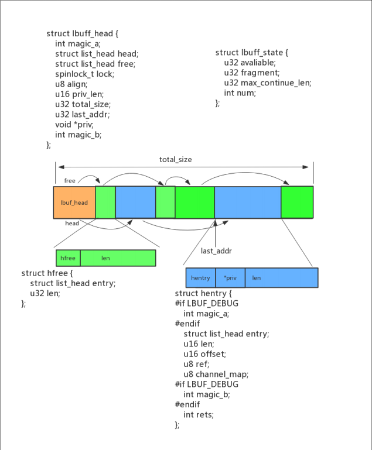
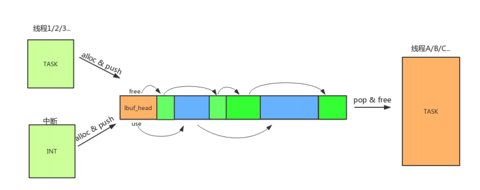

# 帧LBUF使用示例工程说明




>
> 本工程展示了lbuf常用接口使用示例:
>
> lbuf 具有如下特点：
> 	1.以链表的方式对读取和写入的数据进行管理；
> 	2.数据先进先出；
> 	3.在多次读写之后可能会产生碎片；

---

## 适用平台

> 本工程适用以下芯片类型：
> 1. AC79系列芯片：AC790N、AC791N
>
> 杰理芯片和评估板的更多信息可在以下地址获取：
> [链接](https://shop321455197.taobao.com/?spm=a230r.7195193.1997079397.2.2a6d391d3n5udo)

## 工程配置说明

> 在SDK选择[demo_hello](../../../../apps/demo_hello/board)主工程文件或者主工程Makefile, 然后添加本事例工程代码

---


### 操作说明：

> 2. 编译工程，烧录镜像，复位启动
> 3. 系统启动后，可以通过串口软件看到示例的打印信息
>
> JIELI SDK的编译、烧写等操作方式的说明可在以下文档获取：[文档](../../../../doc/stuff/usb updater.pdf)

### 代码流程

> 1. c_main()入口：
>
>
>         A）lbuf单线程简单写入和读取测试
>         B）lbuf多线程多通道读写测试
>
> 2.lib_system_lbuf_write_read_test:
>
> ```
> A）lbuf初始化
> B）lbuf申请和写入
> C）lbuf读取和释放
> D）lbuf关闭
> ```
>
> 3.lib_system_lbuf_mult_task_wr_api_test:
>
> ```
> A）lbuf初始化
> B）创建lib_system_lbuf_task1任务往LBUF的通道0和通道1写入数据块
> C）创建lib_system_lbuf_task2任务从LBUF的通道0读取数据块
> D）创建lib_system_lbuf_task3任务从LBUF的通道1读取数据块
> ```
>
> 
---

## 常见问题

> * lbuf通过用于什么场合?
>
>   答:适合用于以数据以包/帧为单位读写的应用场合

## 参考文档

> * N/A