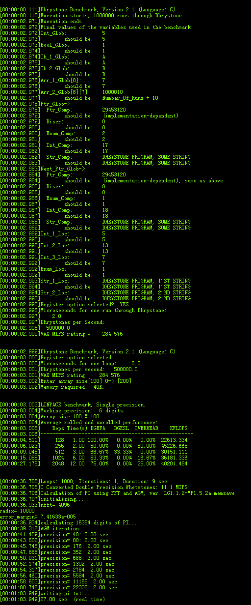

# CPU性能测试示例工程说明

> 本工程展示了CPU性能指标的测试:
>
> 1. dhrystone测量处理器运算能力;
> 2. Linpack测试系统浮点性能;
> 3. pi_css5_src 测试CPU的浮点运算能力,测试CPU计算特定位数圆周率所需的时间;
> 4. whetstone测试浮点运算效率和速度;

---

## 适用平台

> 本工程适用以下芯片类型：
> 1. AC79系列芯片：AC790N、AC791N

> 杰理芯片和评估板的更多信息可在以下地址获取：[链接](https://shop321455197.taobao.com/?spm=a230r.7195193.1997079397.2.2a6d391d3n5udo)

## 工程配置说明

> 在SDK选择[demo_hello](../../../../apps/demo_hello/board)主工程文件或者主工程Makefile, 然后添加本事例工程代码

---

### 操作说明：

> 2. 编译工程，烧录镜像，复位启动
> 3. 系统启动后，可以通过串口软件看到示例的打印信息

> JIELI SDK的编译、烧写等操作方式的说明可在以下文档获取：[文档](../../../../doc/stuff/usb updater.pdf)

### 代码流程

> * main.c
	> 1. c_main()入口：
	>     A）创建BenchMark_test_task任务
	>
	> 2. BenchMark_test_task
	>
	>     A）测试dhrystone
	>
	>     B ) 测试Linpack
	>     
	>     C）测试whetstone
	>     
	>     D）测试pi_css5_src

---

## 常见问题

> * 通常影响CPU性能测试结果的因素有:
>
>   1.代码运行在内部ram,sdram,flash会依次降低cpu性能;
>
>   2.flash时钟,双/四线,sdram时钟,系统时钟影响cpu性能
>
>   3.由于硬件只支持单精度浮点指令, 因此双精度浮点影响cpu性能

## 参考文档

> * https://www.cnblogs.com/sddai/p/7642738.html
>
>   
>
> *  AC79,跑SFC, CPU时钟320M, SDRAM时钟240M, flash 2线模式,SFC时钟80M 的测试结果