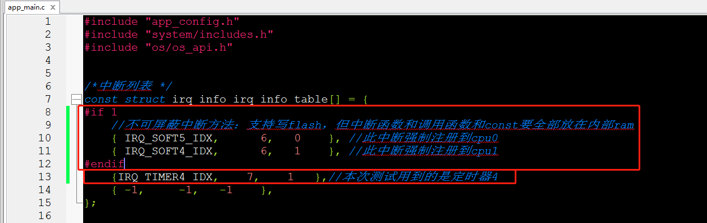
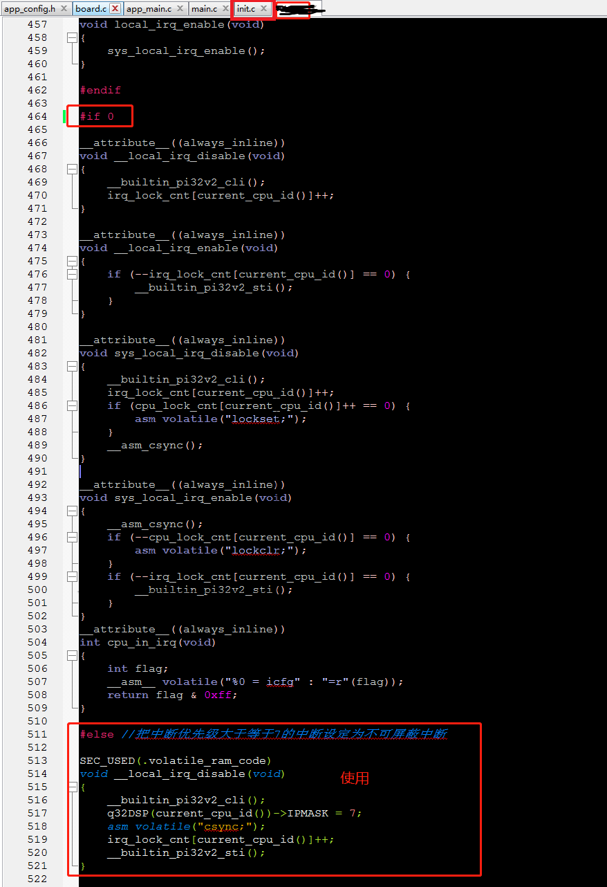

#   不可屏蔽中断使用示例工程说明

> 本工程展示了不可屏蔽中断接口使用方法，下面为建议开启不可屏蔽中断。
>
> * 中断频繁，则可以开启不可屏蔽中断;
> * 中断请求时需要立刻执行中断函数，例如接收数据：系统进临界区时中断响应需要立刻执行；

---

## 适用平台

> 本工程适用以下芯片类型：
>
> 1. AC79系列芯片：AC790N、AC791N
>
> 杰理芯片和评估板的更多信息可在以下地址获取：[链接](https://shop321455197.taobao.com/?spm=a230r.7195193.1997079397.2.2a6d391d3n5udo)
## 工程配置说明

在SDK选择[demo_hello](../../../../apps/demo_hello/board)主工程文件或者主工程Makefile, 然后添加本事例工程代码。

例如：本例子使用硬件定时器来模拟中断请求。

> 1.本例子为：添加硬件定时器代码到工程，使得系统有中断请求（硬件定时器代码在example目录的hw_timer里 [main.c](..\hw_timer\main.c) ）。
>
> 注意：建议中断函数和中断函数调用函数都指定在内部sram，指定方法：在函数定义加上 SEC_USED(.volatile_ram_code)，如下程序的TSEC宏使用。
>
> ```c
> //用户只能选择：JL_TIMER2、JL_TIMER3、JL_TIMER4、JL_TIMER5
> //PWM使用定时器2或者3映射PWM时候，不能用于定时
> 
> static JL_TIMER_TypeDef *TMR = JL_TIMER4;//选择定时器4
> static u8 timer_irq = IRQ_TIMER4_IDX;//选择定时器4
> 
> static const u8 timer_index[16] =  {0, 4, 1, 5, 2,  6,  3,  7,   8,   12,  9,    13,   10,   14,   11,    15};
> static const u32 timer_table[16] = {1, 2, 4, 8, 16, 32, 64, 128, 256, 512, 1024, 2048, 4096, 8192, 16384, 32768};
> static u32 timer_clk = 0;
> 
> #define AWINLINE   __attribute__((always_inline))
> 
> #define TSEC SEC_USED(.volatile_ram_code) //不可屏蔽中断函数放在内部ram
> //#define TSEC
> 
> static AWINLINE TSEC void timer_cfg(u32 freq, u32 us)
> {
>     u32 clock = timer_clk;
>      u8 psc = 0;
>      u8 tmp = 0;
>      u32 prd = 0;
>      u32 ts = us / (1000 * 1000);//计算秒
>      u32 tu = us % (1000 * 1000);//计算秒剩余us
>      u8 i;
>     float tp = 0;
>  
>     if (freq >= clock)
>      {
>          freq = clock;
>        }
>      else if (freq <= 1)
>      {
>          freq = 1;
>            if (ts)
>            {
>                tp = (float)tu / (1000 * 1000);
>            }
>        }
>      /*求prd值*/
>      prd = clock / freq;
>      if (prd > 65535)
>      {
>          for (psc = 0; psc < 16; psc++)
>            {
>                prd = (u32)(clock / (timer_table[psc]) / freq);
>                if (prd <= 65535)
>                {
>                    break;
>                }
>                else if (psc == 15)
>                {
>                    prd = 65535;
>                    break;
>                }
>            }
>        }
>      prd = ts ? (prd * ts + tp * prd) : prd;
>      psc = timer_index[psc];
>      TMR->CON = 0;
>      TMR->CNT = 0;
>      TMR->CON |= BIT(14);
>      TMR->PRD = prd;
>      TMR->CON |= psc << 4; //lsb_clk分频
>     TMR->CON |= BIT(0);
> }
> static void TSEC timer_set(u32 us)//设置时间，该函数可以在中断调用重新设置定时器值
> {
>     u32 freq = 1000000 / us;
>     timer_cfg(freq, us);
> }
> static void TSEC timer_freq_set(u32 freq)//设置频率，该函数可以在中断调用重新设置定时器值
> {
>     timer_cfg(freq, 0);
> }
> static ___interrupt TSEC void timer_isr(void)//中断
> {
>     if (TMR->CON & BIT(15))
>      {
>          TMR->CON |= BIT(14);
>            putchar('@');
>            //todo，中断函数执行程序...
>       }
> }
> 
> //example test
> static int c_main(void)
> {
>     timer_clk = clk_get("timer");//先获取定时器的时钟源
>     request_irq(timer_irq, 3, timer_isr, 0);//注册中断函数定和中断优先级
>  #if 1
>     timer_set(50 * 1000); //初始化50ms进一次中断
>  #else
>     //timer_freq_set(10000);//设置10K频率进中断
>  #endif
>     return 0;
> }
> late_initcall(c_main);
> ```
> 
>
> 
>2、app_main.c中断列表添加：指定的中断号和优先级和指定核，**中断优先级务必设置为7才能生效**，同时需要支持写flash时候也可以支持不可屏蔽中断方式，需要添加以下代码：（中断优先级设置为6，使用以下代码即可，无需更改）
>  { IRQ_SOFT5_IDX,      6,   0    }, //此中断强制注册到cpu0
>     { IRQ_SOFT4_IDX,      6,   1    }, //此中断强制注册到cpu1
>    
>**注意：不可屏蔽中断方式的中断函数，和中断函数中使用的函数和const要全部放在内部ram，中断函数在调试阶段可以调用打印函数等，但需要注意打印函数可能影响到接收数据。**
> 
>```c
> #if 1
>  //不可屏蔽中断方法：支持写flash，但中断函数和调用函数和const要全部放在内部ram
>     { IRQ_SOFT5_IDX,      6,   0    }, //此中断强制注册到cpu0
>     { IRQ_SOFT4_IDX,      6,   1    }, //此中断强制注册到cpu1
>    #endif
>  //中断号           //指定中断优先级为7(最高为7)    //指定注册到核1(0/1)
>     {IRQ_TIMER4_IDX,    7,    1   },//本次测试用到的是定时器4
>    
> ```
> 
>如图：
> 
>
> 
>3、[init.c](../../../../apps/common/system/init.c) 修改#if 1为#if 0，使用不可屏蔽中断的开关中断函数，如下：
> 
>```c
> #if 0 //修改此处
> 
> __attribute__((always_inline))
> void __local_irq_disable(void)
> {
>  __builtin_pi32v2_cli();
>     irq_lock_cnt[current_cpu_id()]++;
>    }
> ......
> #else //把中断优先级大于等于7的中断设定为不可屏蔽中断
> 
> SEC_USED(.volatile_ram_code)
> void __local_irq_disable(void)
> {
>  __builtin_pi32v2_cli();
>     q32DSP(current_cpu_id())->IPMASK = 7;
>     asm volatile("csync;");
>     irq_lock_cnt[current_cpu_id()]++;
>     __builtin_pi32v2_sti();
>    }
> ......
> #endif
> ```
> 
>如图：
> 
>

---
## 操作说明

> 1. 使用串口线连接打印
> 2. **全编译工程**，烧录镜像，复位启动
> 3. 系统启动后，查看定时器中断打印.
>
> JIELI SDK的编译、烧写等操作方式的说明可在以下文档获取：[文档](../../../../doc/stuff/usb updater.pdf)
## 常见问题

> * N/A

## 参考文档

> * N/A