# 多Demo合并操作及注意事项

> **AC79NN SDK 设计原则:** 
>
> 1. 用户可以选择我们已经做好的scan_box, wifi_camera, wifi_story_machine 等具体案子上面开发, 如果功能差异不大, 用户在上述具体案子上面自己进行剪裁增添功能   
> 2. 如果找不到合适案子开发, 用户需要重新使用多个DEMO+EXAMPLE合并重新开发案子.
>
>
>
> 本工程使用了demo_audio与demo_ble作为例子展示了多Demo的codeblocks合并操作及注意事项，主要目的是为了让客户了解熟悉demo合并流程，客户可根据实际需求灵活合并

---

## 适用平台

> 本工程适用以下芯片类型：
> 1. AC79系列芯片：AC790N、AC791N
>
> 杰理芯片和评估板的更多信息可在以下地址获取：[链接](https://shop321455197.taobao.com/?spm=a230r.7195193.1997079397.2.2a6d391d3n5udo)

### 操作说明：
> 1. 选择需要合并的两份codeblocks, 此说明使用demo_audio与demo_ble作为例子, 找到任意一个demo的.cbp工程, 复制粘贴创建一个副本(目的为了不影响原demo工程)
>
> 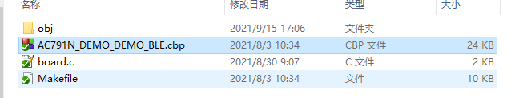
>
> 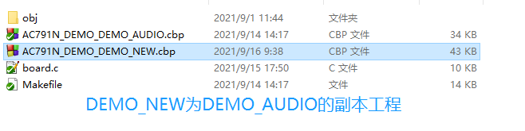
>
> 2. 使用记事本或Notepad同时打开.cbp工程(**以下统称AC791N_DEMO_DEMO_BLE.cbp工程为副工程 ,AC791N_DEMO_DEMO_NEW.cbp为主工程**) 
>
> 3. 在Notepad编辑添加修改配置:
>
>    3.1. 工程名称：修改工程名称(可选)AC791N_DEMO_DEMO_NEW
>
>    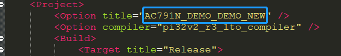
>
>    对应codeblocks的地方是
>
>    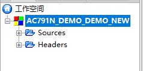
>
>    3.2. 宏定义：从副工程中复制粘贴**“\<Compiler\>”**以下, **"<Add directory="** 以上的带**"\<Add option="**前缀的**"DCONFIG"**宏定义到主工程中
>
>    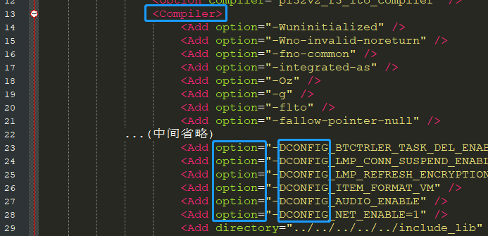
>
>    对应codeblocks的地方是
>
>    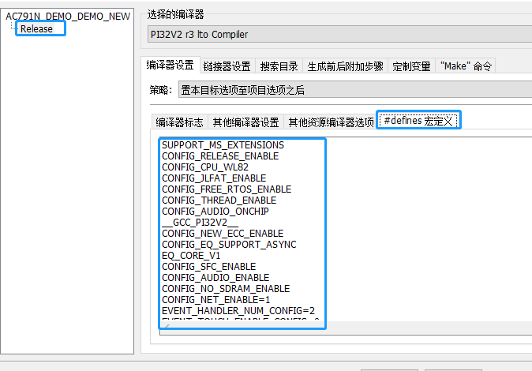
>
>    3.3. 搜索目录：紧接上一步骤, 从副工程中复制粘贴以**"<Add directory="**前缀的路径到主工程中,到为止**"\</Compiler\>"** (***请注意路径层级是否对应***)
>
>    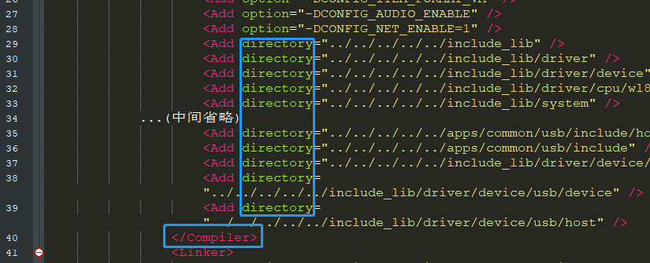
>
>    对应codeblocks的地方是
>
>    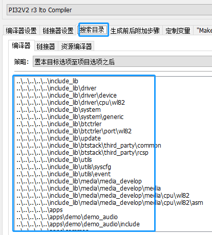
>
>    3.4. 连接器选项：复制副工程 **"<Add option="--start-group"** />" 以下, **"<Add option="--end-group""** />以上的.a 到主工程 (***请注意路径层级是否对应***)
>
> 	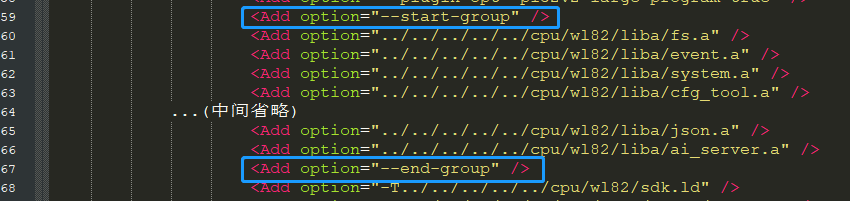
> 	
> 	对应codeblocks的地方是
> 	
> 	
> 	
> 	3.5. 工程包含文件：复制副工程**"</Build>"**以下, **"</Project>"**以上的内容到主工程 (***请注意路径层级是否对应***)
> 	
> 	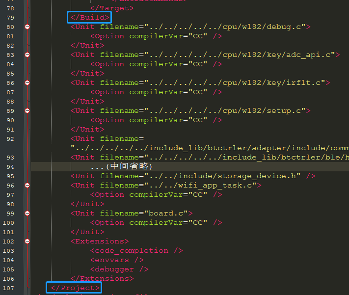
> 	
> 	对应codeblocks的地方是
> 	
> 	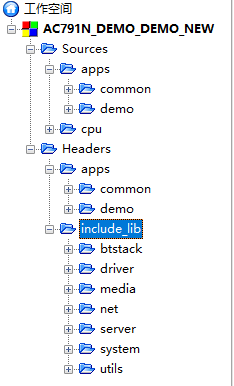
> 	
> 	3.6. 副工程到主工程的移植完成, 删除主副工程出现冲突的地方, 该例子可搜索 "apps/demo/demo_ble" 查找到 (app_main.c , board.c , app_config.h文件只需要一份, 删除掉demo_ble路径的内容, 搜索路径也只需要一份)
> 	
> 	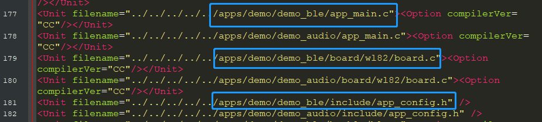
> 	
> 	
> 	
> 	3.7.  (可选, 目的为了不影响其他工程及工程的统一性)修改配置, 添加副工程有, 但是主工程没有的文件,  该例子可搜索 "apps/demo/demo_ble" 查找到
>
> 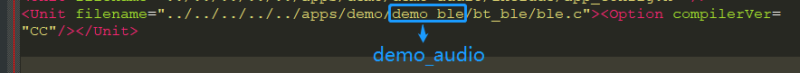
>
> 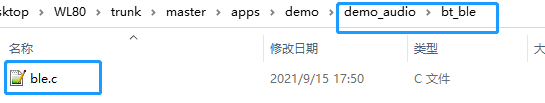
> 4. 打开主工程(*打开工程后建议先编译一次看下3步骤移植合并的情况*), 添加副工程有, 主工程没有的代码 (app_main.c , board.c , app_config.h文件)
>
> app_main.c:
>
> 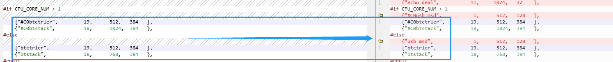
>
> 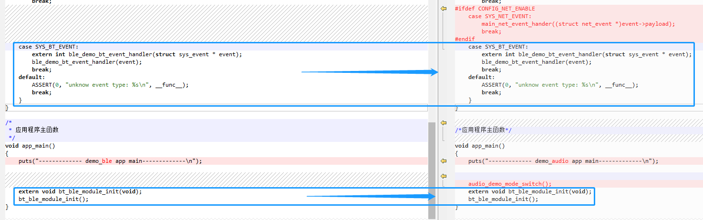
>
> app_config.h:
>
> 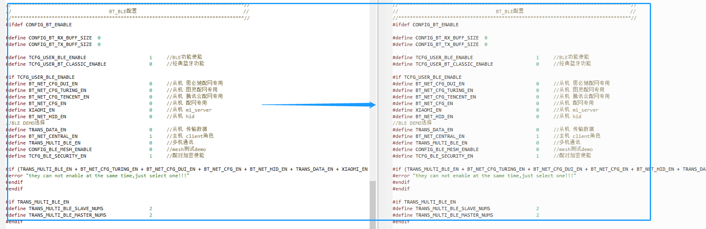
>
> 5. 编译工程, 运行代码, 即可看到两个demo合并后的效果

> JIELI SDK的编译、烧写等操作方式的说明可在以下文档获取：[文档](../../../../doc/stuff/usb updater.pdf)

### 代码流程

> * N/A
---

## 常见问题

> * 可不可以新建一个文件夹来创建工程?
>
>   答: 可以, 需要注意的是路径是否对应添加到指定的文件
>
> 
>
> * 主工程与副工程在复制粘贴中发现有很多完全重复的内容, 这些内容影响cbp工程的运行吗?
>
>   答: 不影响, 按正常流程移植合并, 使用codeblocks打开cbp工程后, 重复的内容会自动优化删除掉
>
> 
>
> * 若想合并两个以上的demo，该如何操作？
>
> 	答：先合并其中两个, 验证合并后的cbp工程能够正常运行后, 再将该工程与其他demo合并(此操作是为了单步检测合并是否正确)
>
> 
>
> * 若合并前被合并的工程(副工程)目录下有主工程没有的文件, 该如何操作?
> 	答: 参考步骤3.7 
>
> 
>
> * 若合并后想关掉某些宏定义，该如何操作？
>
>   答：有些宏定义与库文件不关联，有些宏定义与库文件关联，关掉宏但不替换库会有概率报错，且有多余没有用到的代码占空间，具体参考[库文件简介说明](../库文件简介说明/readme.md), 若不清楚，则主动提供SDK版本号与问题寻求FAE帮助
>
> 

## 参考文档

> * N/A

