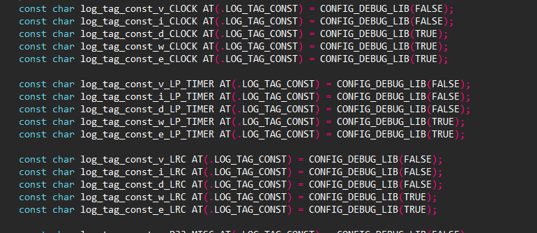

# 打印使用示例工程说明

> 本工程展示了打印的多种方式

---

## 适用平台

> 本工程适用以下芯片类型：
> 1. AC79系列芯片：AC790N、AC791N
>
> 杰理芯片和评估板的更多信息可在以下地址获取：[链接](https://shop321455197.taobao.com/?spm=a230r.7195193.1997079397.2.2a6d391d3n5udo)

## 工程配置说明

> 在SDK选择[demo_hello](../../../../apps/demo_hello/board)主工程文件或者主工程Makefile, 然后添加本事例工程代码

---

### 操作说明：

> 2. 编译工程，烧录镜像，复位启动
> 3. 系统启动后，可以通过串口软件看到示例的打印信息

> JIELI SDK的编译、烧写等操作方式的说明可在以下文档获取：[文档](../../../../doc/stuff/usb updater.pdf)

### 代码流程

> * N/A
---

## 常见问题

> * 如何关闭所有打印,节省代码和内存
>
>   答: 在app_config.h 屏蔽 CONFIG_DEBUG_ENABLE
>
> 
>
> * 如何关闭SDK原来所有打印,只保留用户新增的打印
>
>   答: 在app_config.h 增加两个宏定义
>
>   #define CONFIG_USER_DEBUG_ENABLE	
>   #define CONFIG_SYS_DEBUG_DISABLE
>
>   然后使用printf.h里面user_*的接口来实现打印,如user_printf
>
> 
>
> - 如何关闭全部log_x的打印
>
>   答：在app_config.h 中增加定义#define CONFIG_RELEASE_ENABLE。
>
>   如果没有定义该宏，则在lib_driver_config.c中CONFIG_DEBUG_LIB(TRUE)的对应log打印开启。如下图所示。
>
>   

> * 如何把打印输出到TF卡里面保存成文件
>
>   答:
>
>   (1)在dubug_user.c中开启宏定义
>
>   #CONFIG_SDCARD_DEBUG_ENABLE//开关SD卡记录打印信息
>
> 
>
> * 如何把打印输出到云端服务器保存
>
>   答:
>
>   （1）在dubug_user.c中开启宏定义
>
>   #define CONFIG_NETWORK_DEBUG_ENABLE //可以触发打印信息上传到服务器端
>
>   （2）打开云串口调试工具，获取KeyCode值，并将生成的KeyCode值写到dubug_user.c的#define LOG_KEYCODE“”中如：
>
>   #define LOG_KEYCODE	"KRPNOCNSTGUMSRNL"		//客户随机填写12-16个字符串，用于日志查询
>
>   （3）开启wifi,使用STA模式，具体可以参考[wifi](../../../../../apps/common/example/wifi)配置
>
>   （4）定时调用void upload_log_trig(void);函数，具体定时中断可以参考[hw_timer](../../../../../apps/common/example/hw_timer)配置
>
>   （5）在云串口调试工具中查看日志,关于云串口调试工具的使用可以参考云串口调试工具.pdf
>
> * 如何使用USB虚拟串口作为打印口
>
>   答:
>
>   (1)在dubug_user.c中开启宏定义
>
>   #define CONFIG_USB_DEBUG_ENABLE  //开关USB虚拟串口打印信息
>
>   (2)在app_config.h中增加宏定义
>
>   #define TCFG_PC_ENABLE  1
>   #define USB_PC_NO_APP_MODE                  2
>   #define TCFG_USB_SLAVE_ENABLE    1
>   #define TCFG_UDISK_ENABLE                   0
>   #define USB_DEVICE_CLASS_CONFIG    (CDC_CLASS)
>
>   注意：在使用打印输出到TF卡、打印输出到云端服务器保存和USB虚拟串口作为打印口时要在app_config.h中开启宏
>
>   #defined CONFIG_DEBUG_ENABLE
>
>   在跑代码时，把串口拔掉。

## 参考文

> * N/A

