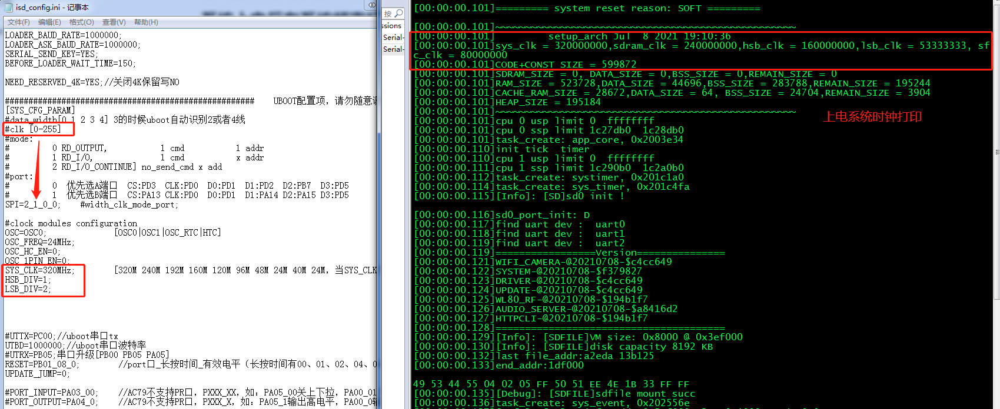

# 系统频率说明

## 系统上电后有系统频率打印
> 
>
>sys_clk：系统时钟，可以在对应CPU目录下的  [isd_config.ini](..\..\..\..\cpu\wl82\tools\isd_config.ini) 文件中"SYS_CLK=320MHz;"修改配置
>
>sdram_clk：sdram时钟，当芯片不带sdram，则该时钟为0，可以在对应CPU目录下的  [isd_config.ini](..\..\..\..\cpu\wl82\tools\isd_config.ini) 文件中"SDRAM_CL=3;"修改配置
>
>
>hsb_clk：高速时钟（系统时钟分频），可以在对应CPU目录下的  [isd_config.ini](..\..\..\..\cpu\wl82\tools\isd_config.ini) 文件中"HSB_DIV=1;"修改配置
>
>lsb_clk：低速时钟（高速时钟分频），可以在对应CPU目录下的 [isd_config.ini](..\..\..\..\cpu\wl82\tools\isd_config.ini) 文件中"LSB_DIV=2;"修改配置
>
>sfc_clk：flash时钟（高速时钟分频，正常跑系统时从flash读取程序的时钟），可以在对应CPU目录下的 [isd_config.ini](..\..\..\..\cpu\wl82\tools\isd_config.ini) 文件中"[SYS_CFG_PARAM]"的"#clk [0-255]"修改配置，如sfc_clk分频系数为2:SPI=2_1_0_0; sfc_clk分频系数为4:SPI=2_3_0_0; 
>
>上述的hsb_clk、lsb_clk、sfc_clk的配置项是对应时钟分频系数，计算方法为：时钟/(分频系数+1)，写0则没有分频（即1分频），1则为2个分频。
>
>
>
>注意事项：一般系统：sys_clk为160M-320M，hsb_clk应为80M-160M，lsb_clk应为30M-60M，sfc_clk应为60M-80M，时钟越低越有助于降低系统功耗。

## SDRAM时钟

>sdram时钟在可以在对应CPU目录下的  [isd_config.ini](..\..\..\..\cpu\wl82\tools\isd_config.ini) 文件中"SDRAM_CL=3;"修改时钟配置
>
>sdram时钟应根据系统时钟来配置，SYS_CLK<=240M或=320M时:[0-120M,1-160M,2-192M,3-240M,4-246M,5-252M,6-258M,7-264M,8-270M,9-276M,10-282M,11-288M]，详见下图。
>
>
>
>
>注意事项：
>
>sdram时钟尽量<=240M，大于240M以上时钟sdram稳定性性不高，特别是270M以上，温度漂移对sdram稳定性影响较大。
>
>一般情况下SDK默认240M，用户只能减小sdram时钟，不能随意增大，建议使用默认即可。

## 高低速（HSB/LSB）时钟硬件模块
### AC790x
> 高速时钟硬件模块：SFC、SDRAM、PSRAM、AES、DCP、JPEG、ISC。
> 低速时钟硬件模块：USB、SD、SPI、IIC、PAP、TIME、PWM、ADC、DAC、UART、SHA、RDEC、IR、CTMU、PLINK、ALINK、AUDIO、ENC、SBC、SRC、WIFI、BT、DMA_COPY、EQ等。

### AC791x
> 高速时钟硬件模块：SFC、SDRAM、PSRAM、AES、DCP、JPEG、ISC、IMD、EMI。
> 低速时钟硬件模块：USB、SD、SPI、IIC、PAP、EMI、TIME、PWM、ADC、DAC、UART、SHA、RDEC、IR、CTMU、PLINK、ALINK、AUDIO、ENC、SBC、SRC、WIFI、BT、DMA_COPY、EQ等。

## 参考文档

> * N/A

