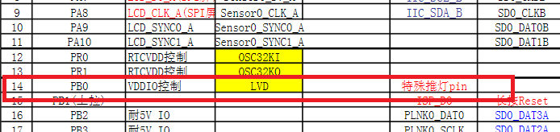
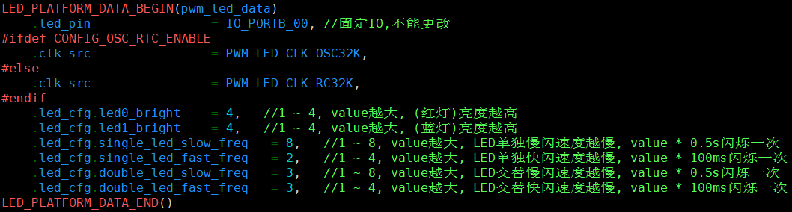
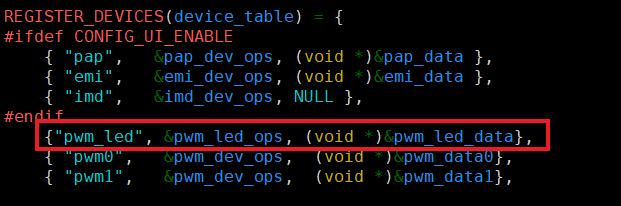
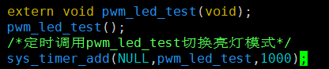

#   PWM_LED使用示例工程说明

> 本工程展示了PWM_LED模块接口使用方法。低功耗/软关机可使用。
>
> PWM_LED进行的软件配置和硬件连接配置说明以及对于各种模式（灯灭、灯常亮、呼吸灯、慢闪、快闪、隔五秒闪一次和隔五秒双闪模式）的开机状态运行和软关机状态下的运行，以及适用的时钟进行说明。PWM_LED可以通过寄存器配置两个周期大小不同的PWM0、PWM1分别控制LED的亮度（PWM0）和亮灭（PWM1）
>
> 可使用单IO单LED、单IO双LED

---

## 适用平台

> 本工程适用以下芯片类型：
>
> 1. AC79系列芯片：AC790N、AC791N
>
> 杰理芯片和评估板的更多信息可在以下地址获取：[链接](https://shop321455197.taobao.com/?spm=a230r.7195193.1997079397.2.2a6d391d3n5udo)
## 工程配置说明

在SDK选择[AC791N_WIFI_STORY_MACHINE](../../../../apps/wifi_story_machine/board/wl80)主工程文件或者主工程Makefile, 然后添加本事例工程代码。

> 1.使用推灯IO:使用固定PB0特殊推灯pin。！！！硬件灯连接：需使用VDDIO供电（软关机/低功耗模式下不掉电正常使用）
>
> 
>
> 
>
> 2.board_7916A.c:板级设置
>
> （1）板级可调参数设置和时钟选择：
>
> ​	osc32k（准确32khz）        (软关机下可用)
>
> ​	lrc32k（需校准200khz） （软关机下可用）
>
> 
>
> （2）设备列表注册pwm设备：需添加{"pwm_led", &pwm_led_ops, (void *)&pwm_led_data},进行注册
>
> 
>
> （3）软关机模式下PWM_LED如果需要保持必须配置
> 
> 
>
## 操作说明

> 1. 模式说明：在需要的位置上调用pwm_led_test()函数，默认为常亮模式，定时调用后，会进行切换亮灯模式：灯常亮、灯灭、慢闪、快闪、隔五秒双闪、隔五秒闪一次和呼吸灯模式，实际使用可调用pwm_led_mode_set设置需要的闪灯模式。
>
> 
>
> 1. 使用串口线连接打印
>
> 2. 编译工程，烧录镜像，复位启动
>3. 系统启动后，观察led灯现象
> 
>JIELI SDK的编译、烧写等操作方式的说明可在以下文档获取：[文档](../../../../doc/stuff/usb updater.pdf)
---

## 常见问题

> * 1.调用pwm_led_test()函数后灯未亮
> * 答：（1）检查硬件连接，是否接到固定使用IO口（PB0）
> * ​        （2）是否在设备注册列表注册初始化
> * 
> * 2.进入软关机后灯未保持亮灯模式
> * 答：（1）检查硬件连接，LED是否适用VDDIO供电
> * ​        （2）查看是否适用软关机下可使用的时钟
> * ​        （3）查看是否设置软关机下可使用

## 参考文档

> * N/A