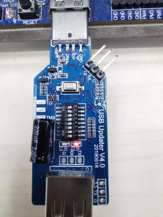
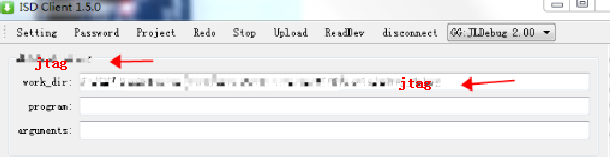
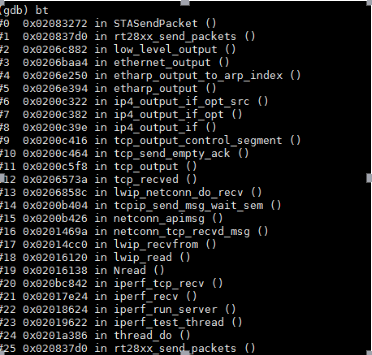
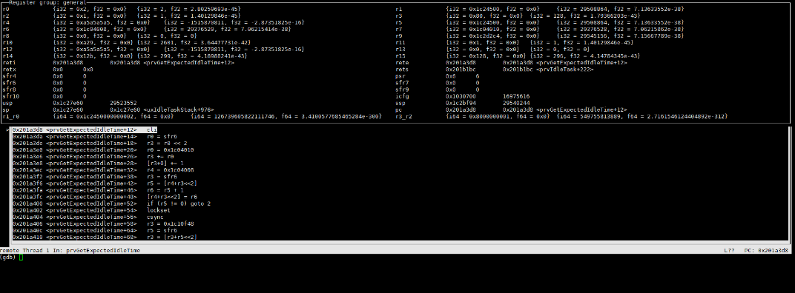
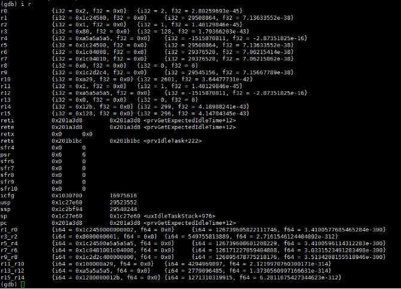

# SDTAP使用示例工程说明

> SDTAP 用于GDB调试程序,例如通过信号(signal)、断点(breakpoint)、通过step命令执行单步调试。在程序暂停之后，你可以检查并改变变量的值，设置新的断点或者移除老的断点，然后继续执行程序。

---

## 适用平台

> 本工程适用以下芯片类型：
> 1. AC79系列芯片：AC790N、AC791N
>
> 杰理芯片和评估板的更多信息可在以下地址获取：[链接](https://shop321455197.taobao.com/?spm=a230r.7195193.1997079397.2.2a6d391d3n5udo)

## 工程配置说明

> 在app_config.h打开宏 SDTAP_DEBUG

---

### 操作说明：

> 1. 编译工程，烧录镜像，复位启动
>
> 2. 1.使用下图USB Updater V4.0版本或以上,开关7拨到ON;
>
>   
>
> 3. 打开SDK工具里面对应cpu的tools目录下的 [DebugServer.exe](../../../../cpu/wl80/tools/jtag/DebugServer.exe)
>
> 4. 在isd_client 创建一个project 命名为: jtag, 选择工作目录为对应cpu的tools目录下的[jtag](../../../../cpu/wl80/tools/jtag)
>
>    
> 5. 在服务器linux终端输入 /opt/gdb cpu/wl82/tools/sdk.elf -ex "target remote proxy:jtag:9872"
>
> 6. 可以继续输入命令进行GDB调试: 
>
>    输入 si :汇编级单步调试
>
>    输入 ni :C语言级单步调试
>
>    输入 b 函数名 : 设置函数入口为断点
>
>    输入 Ctrl + c : 程序停止运行
>
>    输入 c : 程序继续运行
>
>    输入 bt : 查看函数调用树
>
>    输入 i r : 查看寄存器
>
>    输入 layout reg: 可以观察更多
>
>    输入 thread 1/2 : 切换另外一个核
>
>    rwatch 命令：只要程序中出现读取目标变量（表达式）的值的操作，程序就会停止运行；
>
>    awatch 命令：只要程序中出现读取目标变量（表达式）的值或者改变值的操作，程序就会停止运行。
  
  
  

> JIELI SDK的编译、烧写等操作方式的说明可在以下文档获取：[文档](../../../../doc/stuff/usb updater.pdf)

---

## 常见问题

> * 目前SDTAP/JTAG只对内部开放,用户请寻求FAE援助
>
> 

## 参考文档

> * N/A