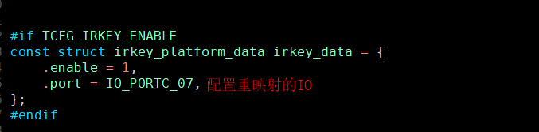
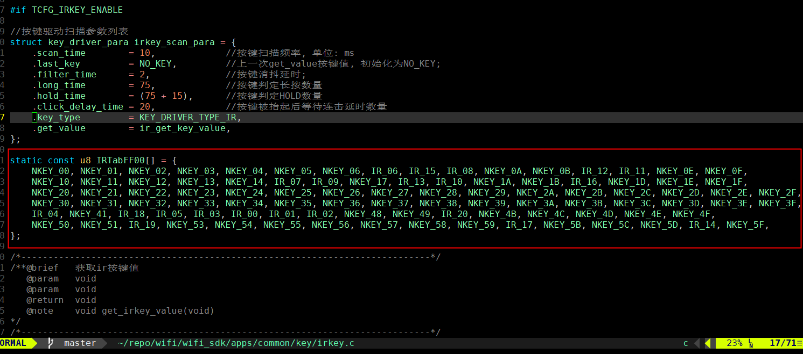
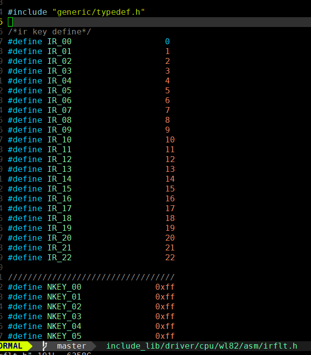

# 红外遥控接收器使用示例说明

> 本工程展示了系统提供的IRFLT模块的红外遥控接收的使用示例
>

---

## 适用平台

> 本工程适用以下芯片类型：
> 1. AC79系列芯片：AC790N、AC791N
>
> 杰理芯片和评估板的更多信息可在以下地址获取：[链接](https://shop321455197.taobao.com/?spm=a230r.7195193.1997079397.2.2a6d391d3n5udo)

## 工程配置说明

> 在SDK选择[demo_hello](../../../../apps/demo/demo_hello/board)或者其他demo的主工程文件或者主工程Makefile,

---

### 操作说明：

> 1. 编译工程，烧录镜像，复位启动
> 2. 系统启动后，可以通过串口软件看到示例的打印信息
>
> JIELI SDK的编译、烧写等操作方式的说明可在以下文档获取：[文档](../../../../doc/stuff/usb updater.pdf)

### 代码流程

> 1. 打开TCFG_IRKEY_ENABLE宏，配置IRKEY映射的IO口
>
>    
>
> 2. 在apps/common/key/irkey.c配置键值表
>    
>
> 3. 配置键值表对应的具体指
>
>    
> 
> 
>
---

## 常见问题

> * N/A
>
>

## 参考文档

> * N/A

