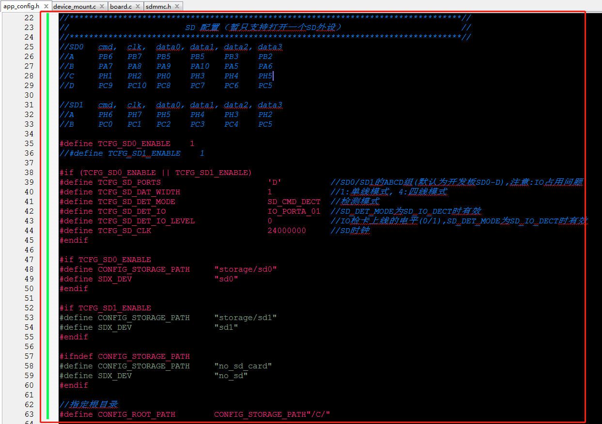
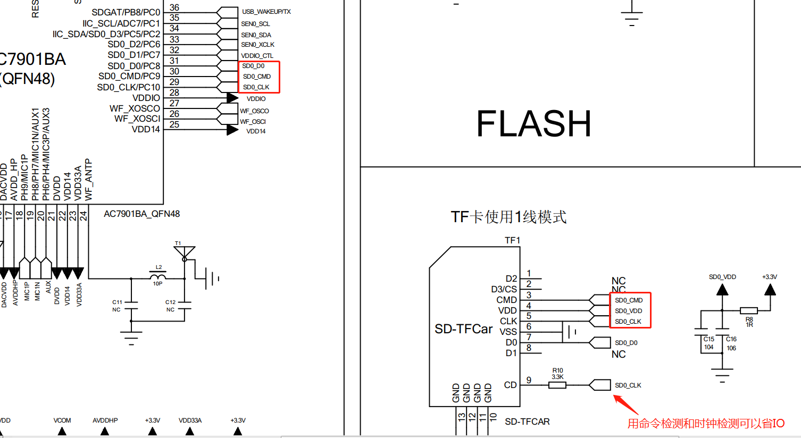
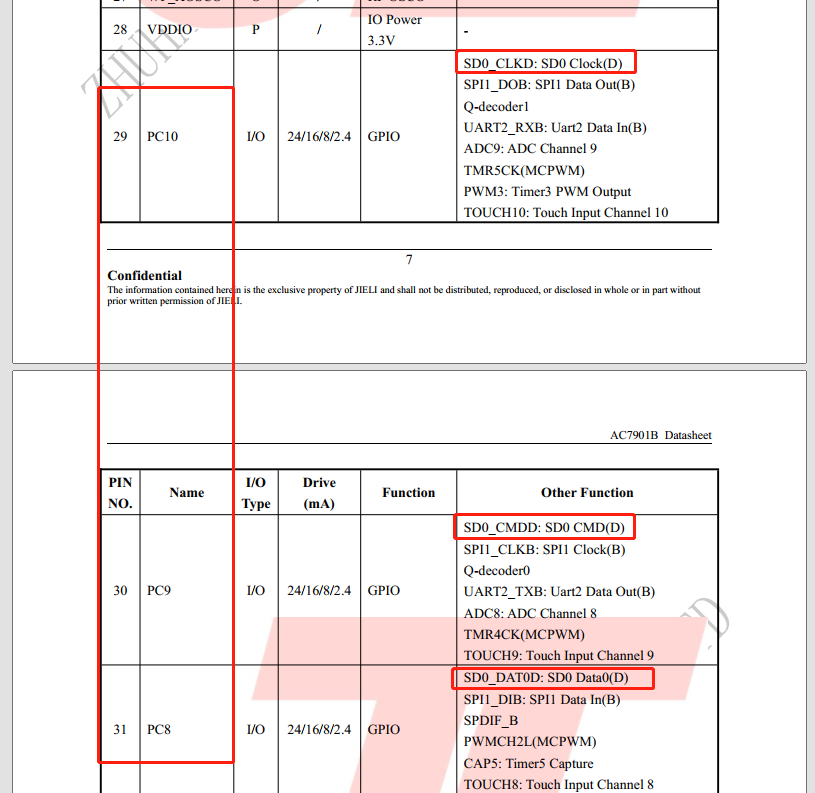
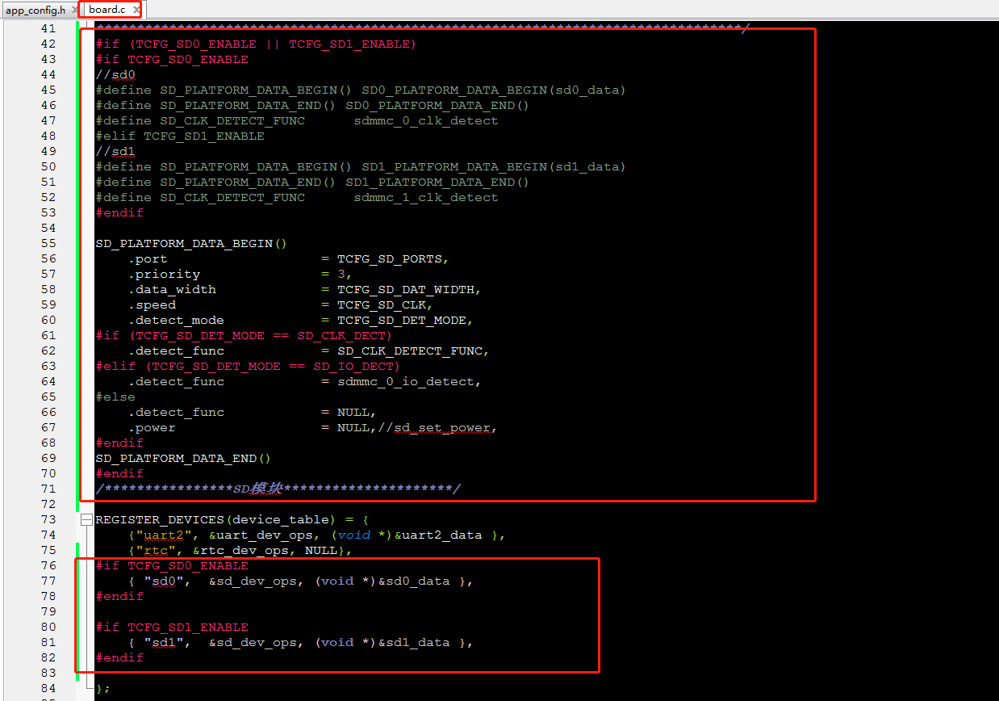

#   SD卡使用示例工程说明

> 本工程展示了SD模块接口使用方法。
>
> * 使用SD卡配置;
> * 使用文件系统测试SD卡；

---

## 适用平台

> 本工程适用以下芯片类型：
>
> 1. AC79系列芯片：AC790N、AC791N
>
> 杰理芯片和评估板的更多信息可在以下地址获取：[链接](https://shop321455197.taobao.com/?spm=a230r.7195193.1997079397.2.2a6d391d3n5udo)
## 依赖文件
> * device_mount.c需要加 [device_mount.c](..\..\system\device_mount.c) 到工程。
> * fs.a //文件系统
> * event.a //设备事件相关驱动

## 工程配置说明

在SDK选择[demo_hello](../../../../apps/demo_hello/board)主工程文件或者主工程Makefile, 然后添加本事例工程代码。

> 1.添加加 [device_mount.c](..\..\system\device_mount.c) 到工程
>
> 2.app_config.h  添加SD基本配置
>
> ```c
> 
> //*********************************************************************************//
> //                        SD 配置（暂只支持打开一个SD外设）                        //
> //*********************************************************************************//
> //SD0 	cmd,  clk,  data0, data1, data2, data3
> //A     PB6   PB7   PB5    PB5    PB3    PB2
> //B     PA7   PA8   PA9    PA10   PA5    PA6
> //C     PH1   PH2   PH0    PH3    PH4    PH5
> //D     PC9   PC10  PC8    PC7    PC6    PC5
> 
> //SD1 	cmd,  clk,  data0, data1, data2, data3
> //A     PH6   PH7   PH5    PH4    PH3    PH2
> //B     PC0   PC1   PC2    PC3    PC4    PC5
> 
> #define TCFG_SD0_ENABLE    1   //使用SD0 IO
> //#define TCFG_SD1_ENABLE    1 //使用SD1 IO
> 
> #if (TCFG_SD0_ENABLE || TCFG_SD1_ENABLE)
> #define TCFG_SD_PORTS                      'D'			//SD0/SD1的ABCD组(默认为开发板SD0-D),注意:IO占用问题
> #define TCFG_SD_DAT_WIDTH                  1			//1:单线模式, 4:四线模式
> #define TCFG_SD_DET_MODE                   SD_CMD_DECT	//检测模式:命令检测，时钟检测，IO检测
> #define TCFG_SD_DET_IO                     IO_PORTA_01	//SD_DET_MODE为SD_IO_DECT时有效
> #define TCFG_SD_DET_IO_LEVEL               0			//IO检卡上线的电平(0/1),SD_DET_MODE为SD_IO_DECT时有效
> #define TCFG_SD_CLK                        24000000		//SD时钟
> #endif
> 
> #if TCFG_SD0_ENABLE
> #define CONFIG_STORAGE_PATH 	"storage/sd0"  //定义对应SD0的路径
> #define SDX_DEV					"sd0"
> #endif
> 
> #if TCFG_SD1_ENABLE
> #define CONFIG_STORAGE_PATH 	"storage/sd1" //定义对应SD1的路径
> #define SDX_DEV					"sd1"
> #endif
> 
> #ifndef CONFIG_STORAGE_PATH
> #define CONFIG_STORAGE_PATH		"no_sd_card" //不使用SD定义对应别的路径，防止编译出错
> #define SDX_DEV					"no_sd"
> #endif
> 
> //指定根目录
> #define CONFIG_ROOT_PATH     	CONFIG_STORAGE_PATH"/C/" //定义对应SD文件系统的根目录路径
> ```
>
> 如图：
>
> 说明：
>
> 1）
>
> #define  TCFG_SD_PORTS     'D' //该值设置的是SD0/1的某一组IO，如下:
>
> //SD0 	cmd,  clk,  data0, data1, data2, data3
> //A     PB6   PB7   PB5    PB5    PB3    PB2
> //B     PA7   PA8   PA9    PA10   PA5    PA6
> //C     PH1   PH2   PH0    PH3    PH4    PH5
> //D     PC9   PC10  PC8    PC7    PC6    PC5
>
> //SD1 	cmd,  clk,  data0, data1, data2, data3
> //A     PH6   PH7   PH5    PH4    PH3    PH2
> //B     PC0   PC1   PC2    PC3    PC4    PC5
>
> 2）
>
> #define TCFG_SD_DAT_WIDTH    1			//1:单线模式, 4:四线模式（单线需要接data0，4线data0-data3都要接，同时还需要cmd clk）
>
> #define TCFG_SD_DET_MODE   SD_CMD_DECT	//检测模式:SD_CMD_DECT命令检测，SD_CLK_DECT时钟检测，SD_IO_DECT IO检测（IO检测接SD卡座子的第9个引脚，会多占用1个IO，不建议使用IO检测）
>
> 3）
>
> 当使用IO检测，则以下宏定义需要用到：
> #define TCFG_SD_DET_IO                     IO_PORTA_01	//SD卡座子的IO检测引脚接芯片端的IO
> #define TCFG_SD_DET_IO_LEVEL               0			//IO检卡上线的电平(0/1),一般SD座子的检测引脚为低电平0是上线
>
> 4）
>
> 如下图是 [AC7901BA TEST V1.0.pdf](..\..\..\..\doc\datasheet\AC790N规格书\schematic\AC7901BA TEST V1.0.pdf) 原理图文件的SD连接部分，SD接口选择了SD0的D口，本例子需要看数据手册的 [AC7901B_Datasheet_V1.2.pdf](..\..\..\..\doc\datasheet\AC790N规格书\datasheet\AC7901B_Datasheet_V1.2.pdf)， **对应的封装需要看对应的数据手册**。
>
> 
>
> 
>
> 3、board.c添加SD模块配置和SD设备
>
> ```c
> /****************SD模块**********************************************************
>  * 暂只支持1个SD外设，如需要多个SD外设，自行去掉下面SD0/1_ENABLE控制，另外定义即可
> ********************************************************************************/
> #if (TCFG_SD0_ENABLE || TCFG_SD1_ENABLE)
> #if TCFG_SD0_ENABLE
> //sd0
> #define SD_PLATFORM_DATA_BEGIN() SD0_PLATFORM_DATA_BEGIN(sd0_data)
> #define SD_PLATFORM_DATA_END() SD0_PLATFORM_DATA_END()
> #define SD_CLK_DETECT_FUNC		sdmmc_0_clk_detect
> #elif TCFG_SD1_ENABLE
> //sd1
> #define SD_PLATFORM_DATA_BEGIN() SD1_PLATFORM_DATA_BEGIN(sd1_data)
> #define SD_PLATFORM_DATA_END() SD1_PLATFORM_DATA_END()
> #define SD_CLK_DETECT_FUNC		sdmmc_1_clk_detect
> #endif
> 
> SD_PLATFORM_DATA_BEGIN()
> 	.port 					= TCFG_SD_PORTS,
> 	.priority 				= 3,
> 	.data_width 			= TCFG_SD_DAT_WIDTH,
> 	.speed 					= TCFG_SD_CLK,
> 	.detect_mode 			= TCFG_SD_DET_MODE,
> #if (TCFG_SD_DET_MODE == SD_CLK_DECT)
> 	.detect_func 			= SD_CLK_DETECT_FUNC,
> #elif (TCFG_SD_DET_MODE == SD_IO_DECT)
> 	.detect_func 			= sdmmc_0_io_detect,
> #else
> 	.detect_func 			= NULL,
> 	.power                  = NULL,//sd_set_power, //是否需要PB8提供SD电源
> #endif
> SD_PLATFORM_DATA_END()
> #endif
> /****************SD模块*********************/
> 
> //下面添加到device_table设备的子设备
> #if TCFG_SD0_ENABLE
> 	{ "sd0",  &sd_dev_ops, (void *)&sd0_data },
> #endif
> #if TCFG_SD1_ENABLE
> 	{ "sd1",  &sd_dev_ops, (void *)&sd1_data },
> #endif
> 
> ```
>
> **.power参数说明：**某些芯片封装包含PB8，PB8硬件IO可以作为提供SD卡的VCC电源，当需要使用PB8作为SD的电源接口时，需配置 ：
> .power  = sd_set_power，当不需要PB8提供SD电源时，可以直接去掉.power  或者.power  = NULL，即可。
>
> **注意：**当使用PB8作为SD的电源接口时，需要注意某些芯片封装内部会把PB8和其他IO绑在一块，此时需要设置其他IO为高阻态（关闭上下拉，关闭DIE，设置输入状态）。
>
> 如图：
>
> 4、添加main.c测试
>
> ```c
> #include "app_config.h"
> #include "system/includes.h"
> #include "device/device.h"
> #include "fs/fs.h"
> 
> static void sd_fs_test(void)
> {
>     extern int storage_device_ready(void);
> 
>     while (!storage_device_ready()) {//等待sd文件系统挂载完成
>         os_time_dly(2);
>     }
> 
>     //读写测试
>     u8 *test_data = "sd test 123456";
>     u8 read_buf[32];
>     int len;
> 
>     //1.创建文件
>     FILE *fd = fopen(CONFIG_ROOT_PATH"test.txt", "w+");
>     if(fd){
>         fwrite(test_data, 1, strlen(test_data), fd);
>         fclose(fd);
>         printf("write file : %s \n", read_buf);
>     }
> 
>     //2.读取文件
>     fd = fopen(CONFIG_ROOT_PATH"test.txt", "r");
>     if(fd){
>         len = flen(fd);//获取整个文件大小
>         fread(read_buf, 1, len, fd);
>         fclose(fd);
>         printf("read file : %s \n", read_buf);
>     }
>     while (1) {
>         os_time_dly(2);
>     }
> 
> }
> static int c_main(void)
> {
>     os_task_create(sd_fs_test, NULL, 12, 1000, 0, "sd_fs_test");
>     return 0;
> }
> late_initcall(c_main);
> 
> ```
>
> 
## 操作说明

> 1. 使用串口线连接打印
> 2. 编译工程，烧录镜像，复位启动
> 3. 系统启动后，拔插SD卡可以看见sd in mount sd success和sd out  unmount sd .
>
> JIELI SDK的编译、烧写等操作方式的说明可在以下文档获取：[文档](../../../../doc/stuff/usb updater.pdf)
---

## 常见问题

> * N/A

## 参考文档

> * N/A