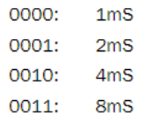
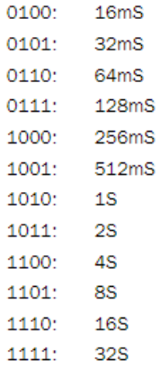

# 看门狗示例工程说明

> 本工程展示了系统提供的看门狗接口函数使用示例
>
> 1. 更新看门狗清狗时间
> 2. 关闭看门狗
> 3. 禁止SDK内部清除看门狗操作, 用户自己外部清除看门狗

---

## 适用平台

> 本工程适用以下芯片类型：
> 1. AC79系列芯片：AC790N、AC791N
>
> 杰理芯片和评估板的更多信息可在以下地址获取：[链接](https://shop321455197.taobao.com/?spm=a230r.7195193.1997079397.2.2a6d391d3n5udo)

## 工程配置说明

> 在SDK选择[demo_hello](../../../../apps/demo/demo_hello/board)或者其他demo的主工程文件或者主工程Makefile, 然后添加本事例工程代码

---

### 操作说明：

> 1. 编译工程，烧录镜像，复位启动
> 2. 系统启动后，可以通过串口软件看到示例的打印信息
>
> JIELI SDK的编译、烧写等操作方式的说明可在以下文档获取：[文档](../../../../doc/stuff/usb updater.pdf)

### 代码流程

> 1. setup_arch()
>
>    A）看门狗初始化wdt_init(0xc)，设置清狗时间为4s
>
> 2. c_main()入口：
>    A）关闭看门狗
>
>    B）创建用户自己外部清狗线程，防止死机复位，注释会死机
>
>    C）创建看门狗测试任务wdt_test_task
>    
> 3. wdt_test_task
>
>    A）若c_main()中关闭看门狗，程序进入while(1);等待，不会产生复位
>
>    B）若c_main()中注释关闭看门狗且注释clear_user用户自己外部清狗线程，进入while(1);迫使看门狗超时，产生复位
>
>    C）若c_main()中注释关闭看门狗但开启clear_user用户自己外部清狗线程，不会产生复位
>
> 
>
---

## 常见问题

> * 1.如何更新看门狗清狗时间？
>
>   答：看门狗清狗时间通过wdt_init(u8 time)去设置，具体的时间参数如下
>
>   
>
>   
>
> * 2.如何关闭看门狗？
>
>   答：看门狗关闭通过wdt_close()去设置
>
> * 3.如何禁止SDK内部清除看门狗操作, 用户自己外部清除看门狗？
>
>   答：在本示例提供的main.c中重写wdt_clear, 并且开启wdt_clear_user用户自己外部清狗线程即可
>

## 参考文档

> * N/A

