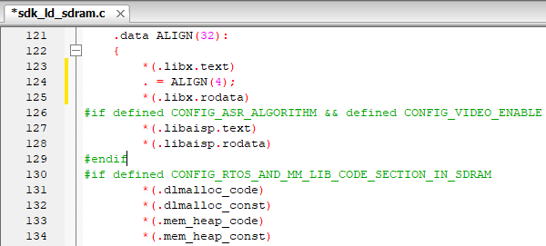
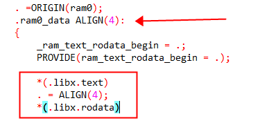
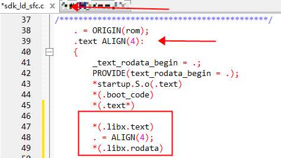

## 			库符号重定位到指定段方法

> * 为了节省内存或者提升性能, 用户想把整个库例如orig_libx.a文件的全部代码定位到内部ram或者flash或者sdram, 应该怎么做?
>
>   答:
>
>   1.新建一个批处理, 执行 [override-seg.exe](../../../../tools/utils/override-seg.exe)     --input orig_libx.a --output libx.a --code_seg ".libx.text" --const_seg ".libx.rodata"
>
>   2.在对应cpu目录下的[库目录](../../../../include_lib/liba/wl82)下 把orig_libx.a替换libx.a 
>
>   3.如果芯片封装有SDRAM, 想把库代码放置SDRAM运行的情况,在对应cpu目录下的[sdk_ld_sdram.c](../../../../cpu/wl82/sdk_ld_sdram.c)配置如下图
>
>   
>
> 
>
>   4.如果芯片封装有SDRAM, 想把库代码放置内部ram运行的情况,在对应cpu目录下的[sdk_ld_sdram.c](../../../../cpu/wl82/sdk_ld_sdram.c)配置如下图
>
>   
>
>   5.如果芯片封装没有SDRAM, 想把库代码放置内部ram运行的情况,在对应cpu目录下的[sdk_ld_sfc.c](../../../../cpu/wl82/sdk_ld_sfc.c)配置如下图
>
>   
>
> 
>
>   6.如果芯片封装没有SDRAM, 想把库代码放置FLASH运行的情况,在对应cpu目录下的[sdk_ld_sfc.c](../../../../cpu/wl82/sdk_ld_sfc.c)配置如下图
>
>   
>
> 
