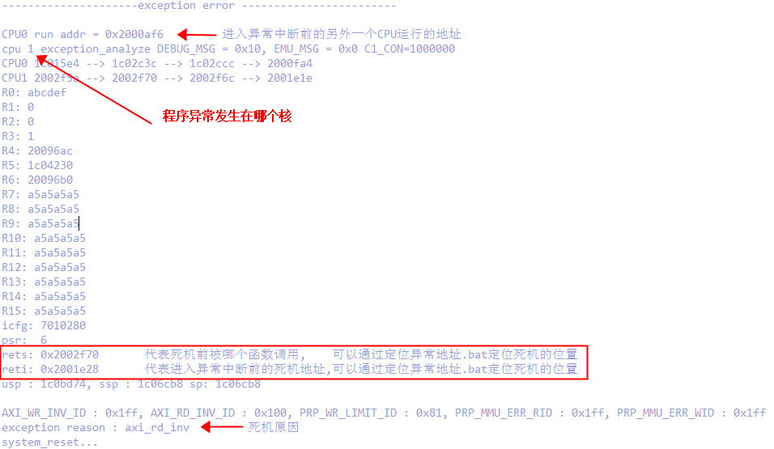
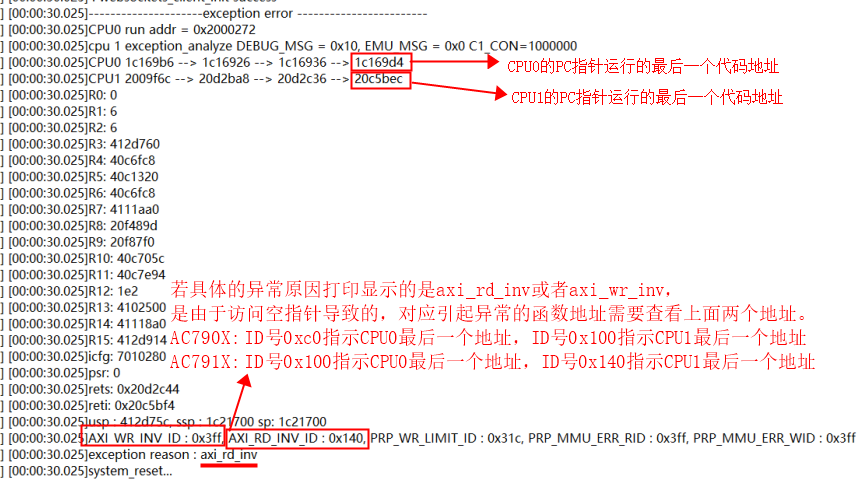

# 异常分析与定位使用示例工程说明

> 本工程模拟了多种情况下程序异常的情况,以及异常分析与定位的方法

---

## 适用平台

> 本工程适用以下芯片类型：
> 1. AC79系列芯片：AC790N、AC791N
>
> 杰理芯片和评估板的更多信息可在以下地址获取：[链接](https://shop321455197.taobao.com/?spm=a230r.7195193.1997079397.2.2a6d391d3n5udo)

## 工程配置说明

> 在SDK选择[demo_hello](../../../../apps/demo_hello/board)主工程文件或者主工程Makefile, 然后添加本事例工程代码

---

### 操作说明：

> 2. 编译工程，烧录镜像，复位启动
> 3. 系统启动后，可以通过串口软件看到示例的打印信息

> JIELI SDK的编译、烧写等操作方式的说明可在以下文档获取：[文档](../../../../doc/stuff/usb updater.pdf)

### 代码流程

> 1. c_main()入口：
>     A）模拟多种异常情况发生的可能性
>     
>     B) 举例使用硬件保护软件不能够改写的地址范围, 如果软件改写就触发异常
---

## 常见问题

> * 通常程序异常情况有哪些?
>
>   答:非对齐访问,指令非法,读写访问非法地址,除0异常,栈溢出,程序卡死看门狗复位
>
> * 如何定位死机的位置
>
>   答:通常发生异常后打印如下图:
>
>     
>
>   通过[定位异常地址](../../../../cpu/wl80/tools/定位异常地址.bat)输入reti或者rets地址, 注意输入的地址必须要要有0x开头, 即可定位到对应地址的函数
>
>   
>
>   
>
>   
>
> * 有时候定位到对应地址的函数不准确怎么办?
>
>   答:
>
>   1.需要用户根据代码目前正在运行的功能流程推测死机范围
>
>   2.有时候内存被篡改,并不是马上出发异常,而且当被篡改的内存访问的时候才触发
>
>   3.寻求FAE援助
>
> * 有时候发现内存被篡改,但是没有造成异常,应该如何查找?
>
>   答:使用硬件保护软件不能够改写的地址范围, 如果软件改写就触发异常
>
> * 栈溢出 stackoverflow 怎么办?
>
>   答: 增大异常打印中current_task指出的任务栈大小

## 参考文档

> * N/A