# EQ使用示例工程说明

> 本工程展示了EQ工具使用示例:
>
> 1. 如何使用EQ工具在线调试;
> 2. 如何使用EQ导入/导出EQ配置文件;
> 3. 如何使用EQ离线编辑模式；

---

## 适用平台

> 本工程适用以下芯片类型：
> 1. AC79系列芯片：AC791N (注意AC790N只能使用旧的EQ工具，不支持多带限幅器和多带压缩器功能，工具在sdk_tools/AC790N EQ TOOL.exe)
>
> 杰理芯片和评估板的更多信息可在以下地址获取：
> [链接](https://shop321455197.taobao.com/?spm=a230r.7195193.1997079397.2.2a6d391d3n5udo)

## 工程配置说明

> 在SDK选择 [AC791N_WIFI_STORY_MACHINE](..\..\..\wifi_story_machine\board\wl82) 主工程文件或者主工程Makefile
>
> app_config.h：打开支持在线EQ调试为EQ在线编辑。未打开时为离线模式，EQ配置参数从bin文件中读取。使用在线EQ时，EQ文件不生效。
>
> 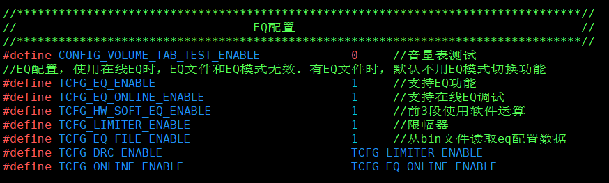

---

### 操作说明：

> 在线模式：
>
> 1.编译工程，烧录镜像，复位启动
>
> 2.系统启动后，打开EQ调试工具 [AC791N_配置工具入口](..\..\..\..\cpu\wl82\tools\AC791N_config_tool\AC791N_配置工具入口(Config Tools Entry).jlxproj) ，选择“打开音效配置工具(新EQ工具)”
>
> 
>
> 3.在线调试通过串口进行与上位机通讯，配置好串口端口，波特率后(波特率对应板级的uart1_data)，点击打开（暂时不支持蓝牙串口模式），注意引脚是否同时复用问题，串口引脚可以修改，详情查询 [UART](..\uart\readme.md) 。直接点击【打开】按钮，进行通讯，通讯成功以后会跳转到【EQ】界面，进行EQ各模式参数配置。
>
> 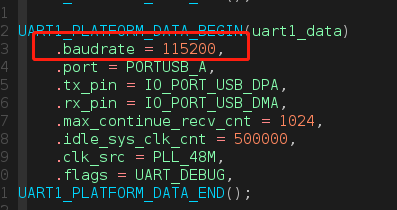
>
> 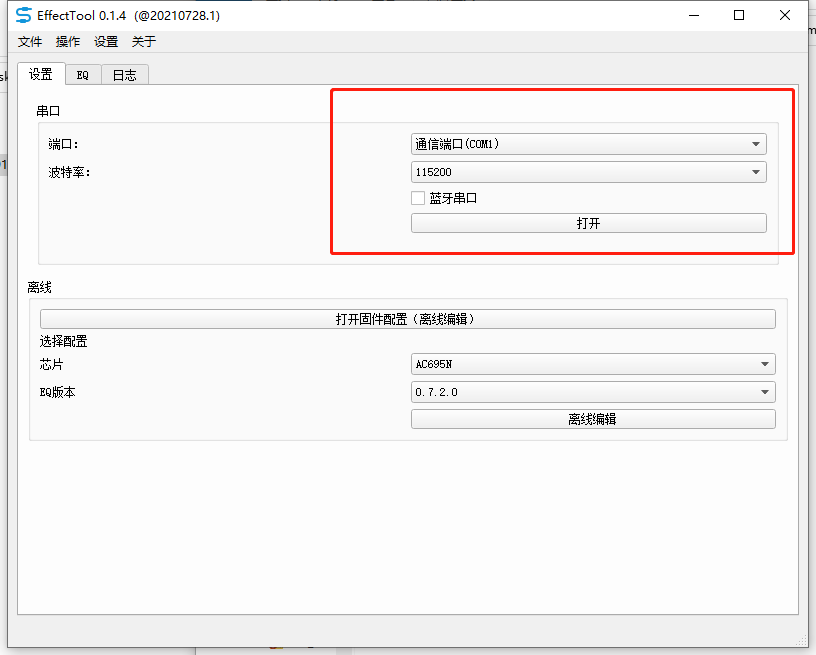
>
> 4.选择对应的模式, 然后点击编辑。普通音频EQ为播歌配置模式
>
> 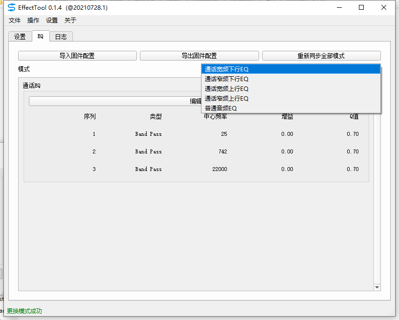
>
> 5.进入播歌EQ界面, 可以通过调节段点, 或修改对应段点数据, 进行频率、增益和高/低/带通等的设置，若当前设备在播放音乐，能直接听到修改前后的差别，根据需要进行调节。
>
> 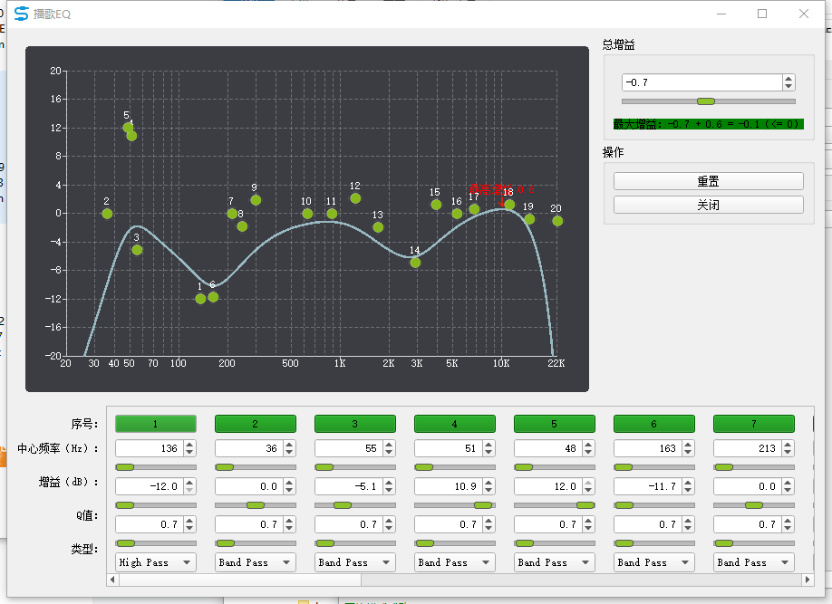
>
> 6.打开DRC设置：可以使用限幅器、多带限幅器、压缩器和多带压缩器。多带是进行分频器处理，可以设置低中分频点和中高分频点，也可调节分频器阶数。
>
> 限幅器：
> 使音频信号维持在一定的幅度范围内并且不引起饱和失真
> 阈值：是指限幅器启动的信号能量阈值
> 启动时间：是指当信号能量超过阈值后限幅器启动滞后的时间
> 释放时间：是指当信号能量从超过阈值回落到阈值之下时，衰减恢复所需的时间
>
> 压缩器：
> 使音频信号按比例进行压缩。
> 阈值 1、阈值 2：是指压缩器启动的信号能量阈值
> 压缩比 1、压缩比 2：是指信号的压缩比例
> 启动时间：是指当信号能量超过阈值后压缩器启动滞后的时间
> 释放时间：是指当信号能量从超过阈值回落到阈值之下时，衰减恢复所需的时间
>
> 分频器：
> 根据低频与中高频设置的频率，处理输入数据，输出低频、中频、和高频的三组数据。
> 分频器阶数：分频器过渡带的陡峭程度（值越大越陡峭，随之消耗的 mips 也会变大）
> 分频器为多带限幅或者多带压缩器服务
>
> 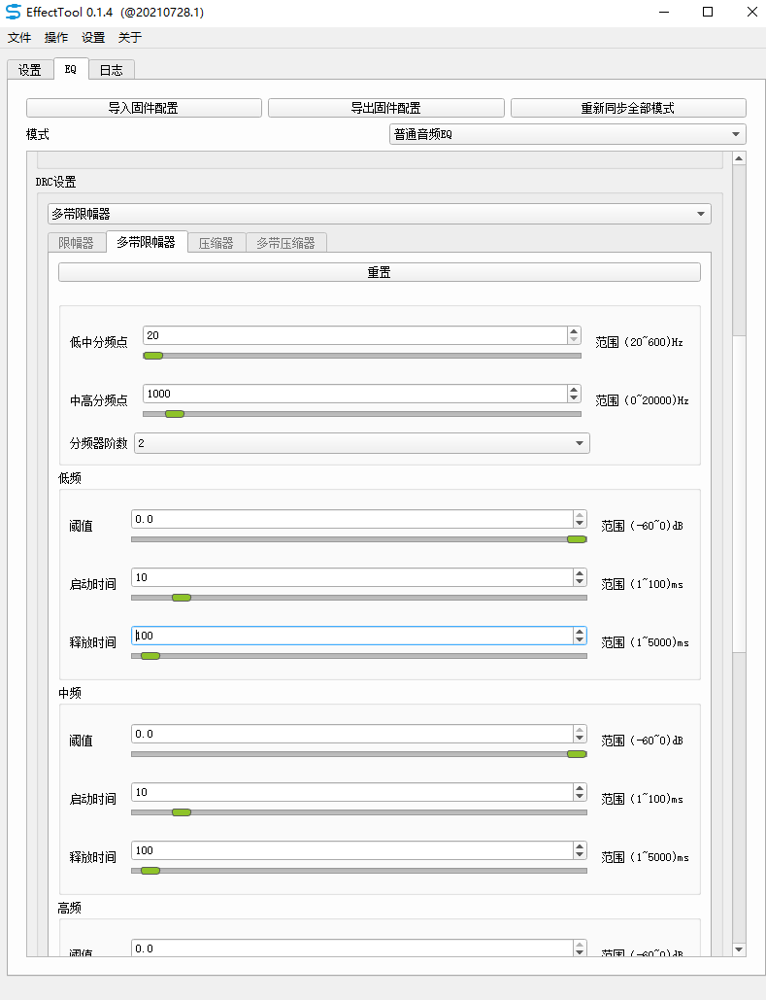
>
> 7.修改完后，点击”导出固件配置“，生成“eq_cfg_hw.bin”配置文件，将该文件放置 [cfg](..\..\..\..\cpu\wl82\tools\cfg) 目录下，重新烧录的时候会将该文件烧写进设备(重新烧写前记得将在线调试宏清零且TCFG_EQ_FILE_ENABLE置1)
>
> 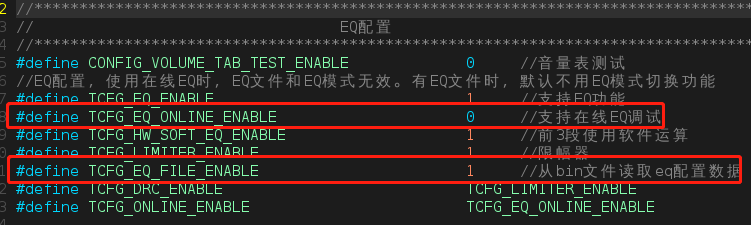
>
> 8.若客户需要查看或修改EQ的配置, 可以直接导入固件配置后, 点击编辑修改
>
> 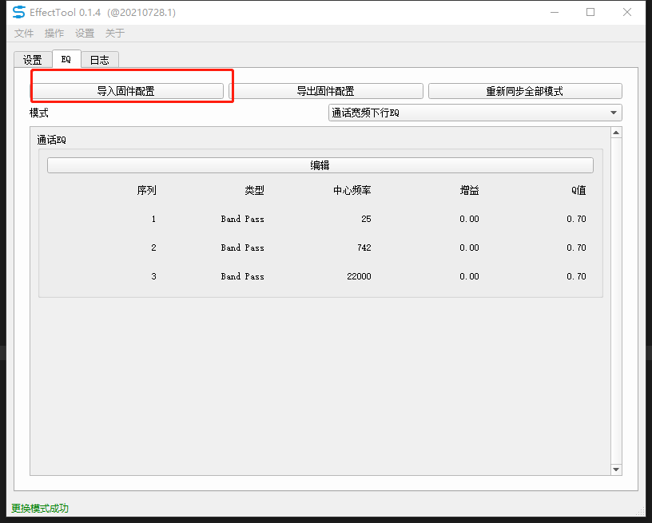
>
> 9.离线模式
>
> （1）没有配置文件，可生成一个配置文件：选择对应芯片和EQ版本，点击【离线编辑】按钮即可生成，生成后进行各模式的段数设置，之后进入EQ配置界面，完成参数配置调节后，点击导出固件配置，即可离线生成新配置文件。
>
> 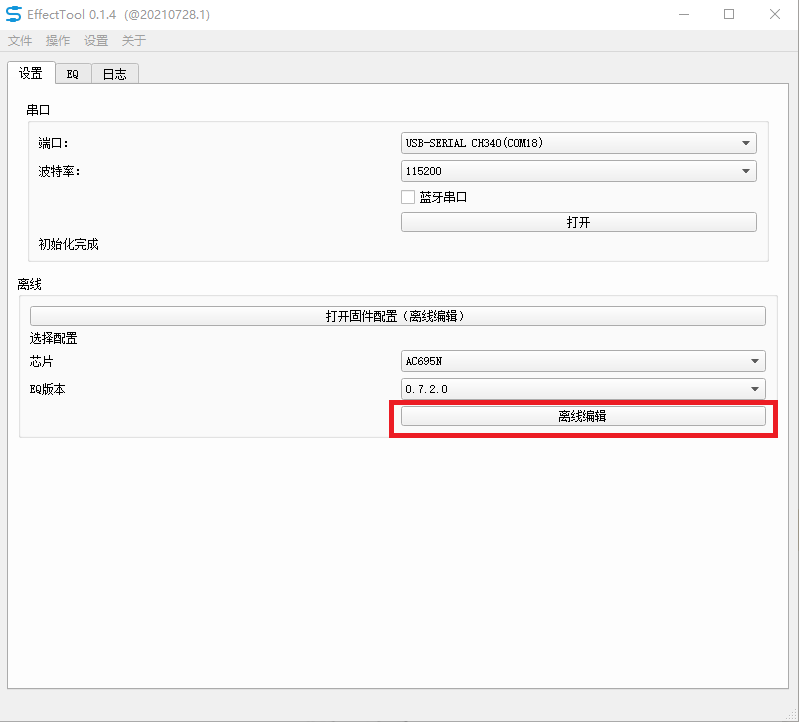
>
> 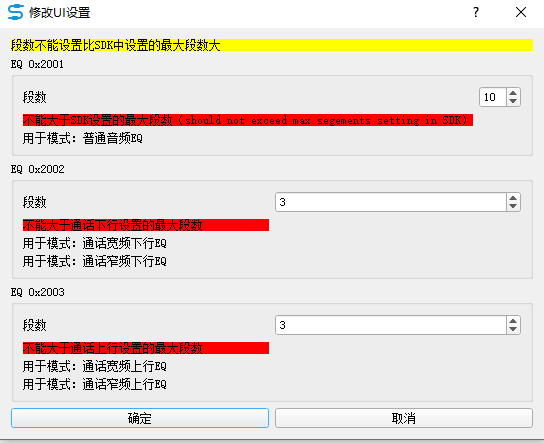
>
> (2)已有一个配置文件，需要离线编辑这个文件，可以在主界面中选择【打开固件配置（离线编辑）】按钮
>
> 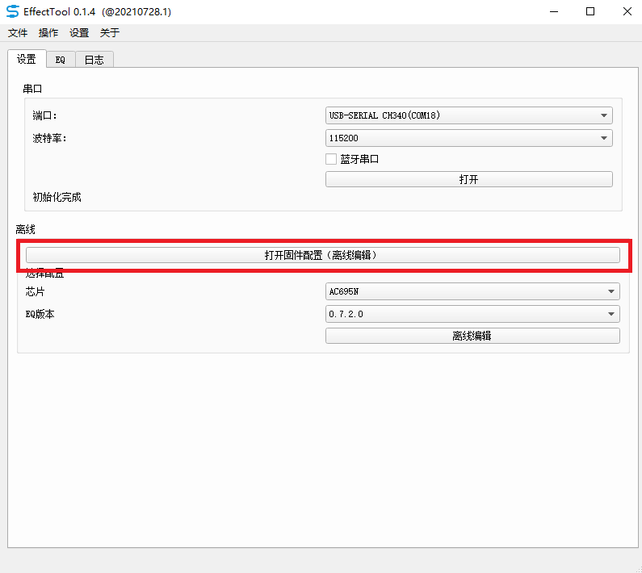
>
> 10.SDK代码在打开解码器时需要加上以下参数才会添加EQ效果
>
> 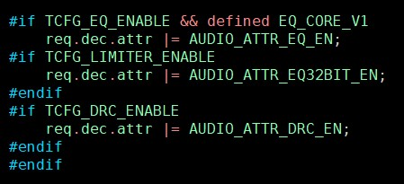
>
> JIELI SDK的编译、烧写等操作方式的说明可在以下文档获取：[文档](../../../../doc/stuff/usb updater.pdf)

---

## 常见问题

> * 离线编辑怎么使用?
>
>   答:目前离线编辑还没有涵盖当前型号芯片的配置，后续敬请期待。
>
> * 设备当前没有播歌，可以使用EQ调试工具吗？
>
>      答:可以的，只是没有歌曲的实时反馈，客户可以具体情况具体分析。
>      
> * 在线调试的配置未生效？
>
>      答：在线调试完成导出配置文件到相应位置以后，需关闭在线调试功能，之后再编译烧录后生效。

## 参考文档

> *  [effectTool工具使用说明.pdf](readme.assets\Cg9340.pdf) 

