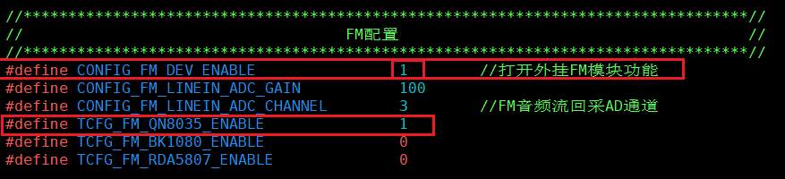
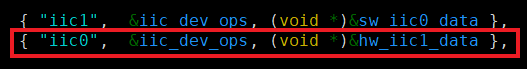
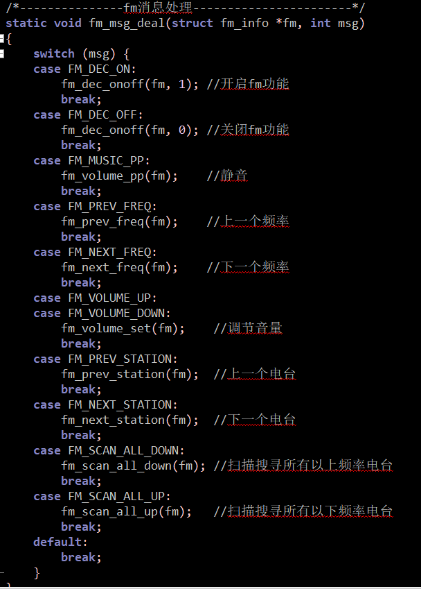
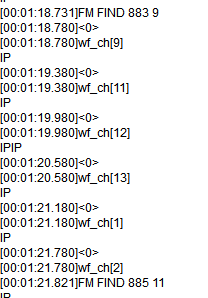
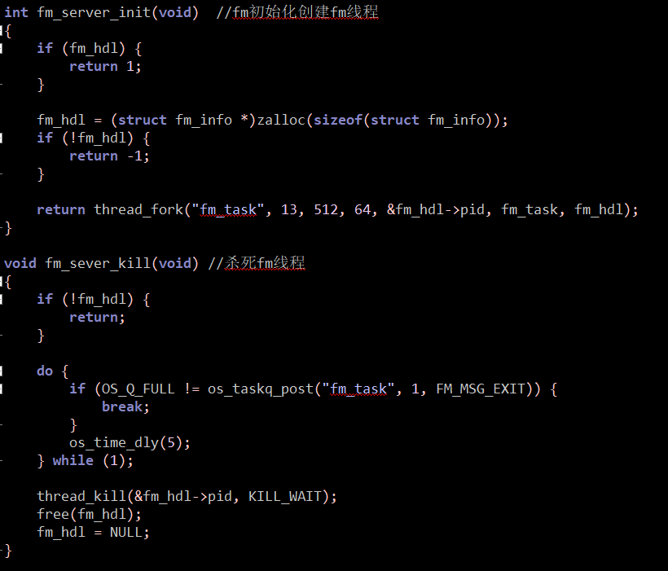
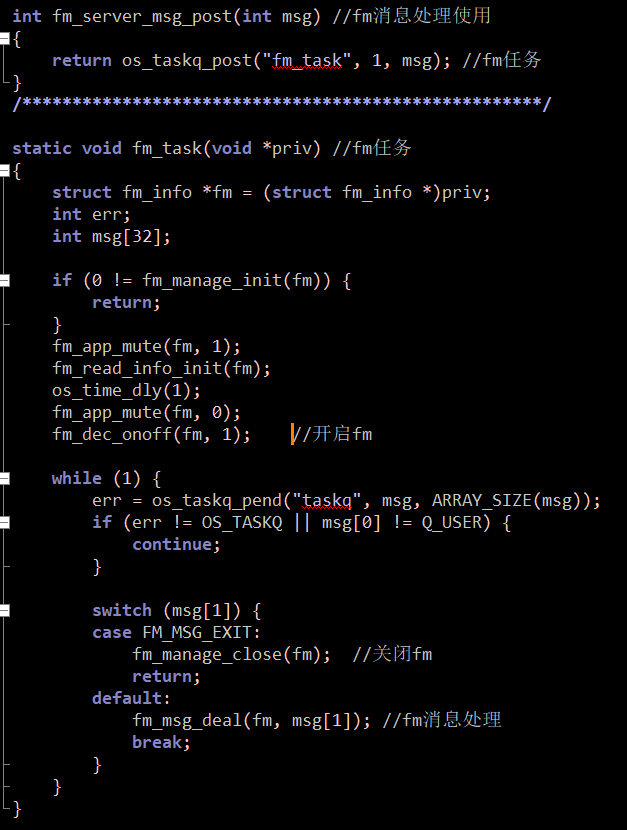

# fm电台功能说明

> 本说明介绍了fm功能：包括开关fm、暂停/播放、音量调节、频率调节、上下电台和扫描频率调节。
>
> 使用fm功能需外挂fm功能模块。

---

## 适用平台

> 本工程适用以下芯片类型：
>
> 1. AC79系列芯片：AC790N、AC791N

> 杰理芯片和评估板的更多信息可在以下地址获取：
> [链接](https://shop321455197.taobao.com/?spm=a230r.7195193.1997079397.2.2a6d391d3n5udo)

## 工程配置说明

> 1.app.config:FM配置
>
> - 打开宏#define CONFIG_FM_DEV_ENABLE                       1            //打开外挂FM模块功能
> - 打开宏#define TCFG_FM_QN8035_ENABLE                     1            //使用QN8035收音模块
> - 打开宏#define CONFIG_FM_LINEIN_ADC_GAIN             100         //FM音频AD增益
> - 打开宏#define CONFIG_FM_LINEIN_ADC_CHANNEL        3          //FM音频流回采AD通道
>
> 
>
> 2.board_7911B.c：板级iic配置，使用硬件iic0
>
> 
>
> 3.fm_manage.c:fm消息处理
>
> 
>

## 模块依赖

>  - 使用fm功能需外挂fm功能模块。

---

## 操作说明：

>1.按键说明：
>
>切换到fm模式以后
>
>- 长按KEY_DOWN进行下一个电台播放       fm_next_station(fm);  //下一个电台
>- 长按KEY_UP进行上一个电台播放   fm_prev_station(fm);  //上一个电台
>- 长按KEY_CANCELL进行扫描搜寻会自动进行搜台播放（如下图） fm_scan_all_down(fm); //扫描搜寻所有以上频率电台
>
>

>编译工程，烧录镜像，复位启动
>
>系统启动后，可以通过串口软件看到测试的打印信息

> JIELI SDK的编译、烧写等操作方式的说明可在以下文档获取：
> [文档](/doc/stuff/usb%20updater.pdf)

### 代码流程

>1.fm_manage.c：创建和杀死fm线程
>
>
>
>2.fm_manage.c：fm任务
>
>
>
>
---

## 常见问题

> * 1.切换到fm模式无响应
> * 答：查看外挂fm功能宏是否打开，查看iic是否对应配置，打开初始时会有底噪声为打开fm功能
> * 2.fm搜寻到电台但是播放噪声，未有电台声
> * 答：查看外挂fm模块天线是否接收信号良好

## 参考文档

> * N/A