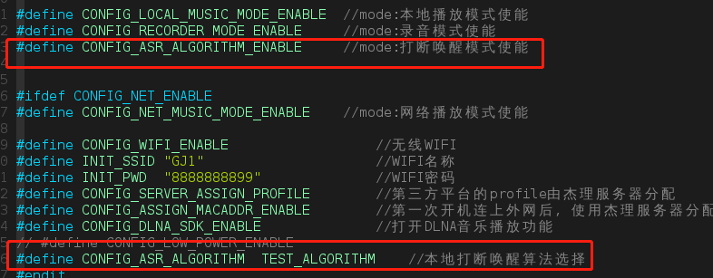
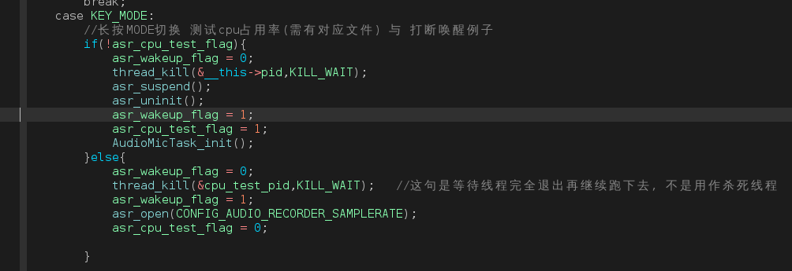
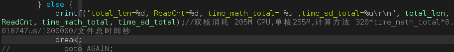

# 打断唤醒使用示例工程说明

> 本例子简单展示了打断唤醒的流程与打断唤醒cpu占用率测试

---

## 适用平台

> 本工程适用以下芯片类型：
> 1. AC79系列芯片：AC790N、AC791N
>
> 杰理芯片和评估板的更多信息可在以下地址获取：[链接](https://shop321455197.taobao.com/?spm=a230r.7195193.1997079397.2.2a6d391d3n5udo)

## 工程配置说明

> 在SDK选择[demo_audio](..\..\..\..\demo\demo_audio\board) 主工程文件或者主工程Makefile, 然后添加本事例工程代码

---

## 模块依赖
> * libauth.a   libauth_aisp.a								思必驰打断唤醒算法授权管理
> * aisIntlib_single_xiaoai.a   libaisp_single.a	思必驰单麦打断唤醒算法（小爱同学唤醒词）
> * libauth.a、libauth_aisp.a								思必驰打断唤醒算法授权管理
> * cJSON.a															  JSON格式构造和解析接口（第三方开源）

---

### 操作说明：
> 1. 连接配置好对应的MIC引脚
>
> 2. app_config.h:
>
>    打开 #define CONFIG_ASR_ALGORITHM  TEST_ALGORITHM 
>
>    打开#define CONFIG_ASR_ALGORITHM_ENABLE		
>
>    
>
> 3. 编译工程，烧录镜像，复位启动
>
> 4. 系统启动后，点击KEY_MODE切换到打断唤醒模式，可通过语音提示判断是否进入到打断唤醒模式

> JIELI SDK的编译、烧写等操作方式的说明可在以下文档获取： [文档](..\..\..\..\..\doc\stuff\usb updater.pdf) 

### 代码流程

> 
>
> 1. 从其他模式切换到打断唤醒模式时, (提示音提示“打断唤醒模式”) 默认进入语音识别例子程序：
>    1. 打开audio服务，初始化cbuf，注册audio服务处理函数，信号量创建，创建aisp_task线程
>    2. 获取第三方算法所需堆空间大小
>    3. 获取第三方授权信息,并且授权启动第三方算法程序
>    4. 申请算法运行所需内存
>    5. 运行第三方算法程序,处理数据后通过回调进行通知
>    6. 打开mic，获取语音数据
>    7. while环喂数据给第三方算法程序
>    8. 将整理好的数据喂给第三方算法程序
> 2. 长按KEY_MODE键，可切换成打断唤醒测试cpu占用率测试程序：
>    1. 等待SD卡插入
>    2. 获取第三方算法所需堆空间大小
>    3. 获取第三方授权信息,并且授权启动第三方算法程序
>    4. 打开测试文件(SD卡中需要有对应的文件<audio src="chan3-1.wav"></audio>)
>    5. 申请算法运行所需内存
>    6. 运行第三方算法程序,处理数据后通过回调进行通知
>    7. 将文件数据喂给算法程序，等待数据全部处理完成，显示结果
>
> 

## 常见问题

> * 1. 如何接入第三方打断唤醒？
>
>      可以根据[杰理开放平台文档](..\..\..\..\..\doc\stuff\杰理开放平台文档20201216_136.pdf) 发送邮件到杰理开发团队申请,然后把申请到的客户批次号填写到[platform_cfg.c](..\..\..\net\platform_cfg.c) 的get_macaddr_auth_key和get_macaddr_code函数 

## 参考文档

> * N/A