# DEMO_AUDIO示例工程说明

> 本工程展示了：
> 	1.本地播歌模块接口使用方法，通过播放SD卡文件播歌模块接口的使用。
> 	2.网络播歌接口使用方法，通过同局域网内设备可连接DLNA进行投歌播放。
> 	3.录音模块接口使用方法，将MIC的数字信号采集后推到DAC播放，也可保存录音文件到SD卡或者通过DAC直通，通过LINEIN录音直出到DAC播放演示LINEIN直通播歌。

---

## 适用平台

> 本工程适用以下芯片类型：
>
> 1. AC79系列芯片：AC790N、AC791N

> 杰理芯片和评估板的更多信息可在以下地址获取：
> [链接](https://shop321455197.taobao.com/?spm=a230r.7195193.1997079397.2.2a6d391d3n5udo)

## 工程配置说明

> 1.app_config.h：
>
> * 选择对应硬件开发环境的板级文件
> * 打开宏#define CONFIG_MP3_DEC_ENABLE 需要MP3解码格式，若想播放其他解码格式，需要打开对应的解码控制宏
> * 打开宏#define CONFIG_SD0_ENABLE 本地播放需配置SD卡
> * 打开 宏#define CONFIG_NET_ENABLE 网络播歌模式连接网络
>
> 2.对应板级文件board.c：
>
> - 配置好dac_data、adc_data、iis0_data和数字麦plnk0的时钟和数据引脚都采用重映射的使用配置：
>
> 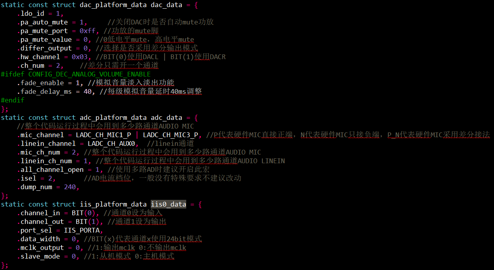
>
> 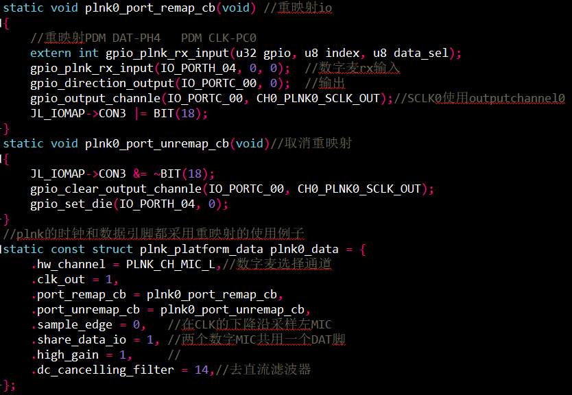
>
> - 打开宏#define CONFIG_AUDIO_ENC_SAMPLE_SOURCE    //录音设备源选择  
>
>   ```
> #define AUDIO_ENC_SAMPLE_SOURCE_MIC         0 //录音输入源： 模拟MIC
>   #define AUDIO_ENC_SAMPLE_SOURCE_PLNK0       1 //录音输入源：数字麦PLNK0
>   #define AUDIO_ENC_SAMPLE_SOURCE_PLNK1       2 //录音输入源：数字麦PLNK1
>   #define AUDIO_ENC_SAMPLE_SOURCE_IIS0        3 //录音输入源：IIS0
>   #define AUDIO_ENC_SAMPLE_SOURCE_IIS1        4 //录音输入源：IIS1
>   #define AUDIO_ENC_SAMPLE_SOURCE_LINEIN      5 //录音输入源：LINEIN
>   
>   #define CONFIG_AUDIO_ENC_SAMPLE_SOURCE     AUDIO_ENC_SAMPLE_SOURCE_MIC    //录音输入源选择
>   ```
>
> 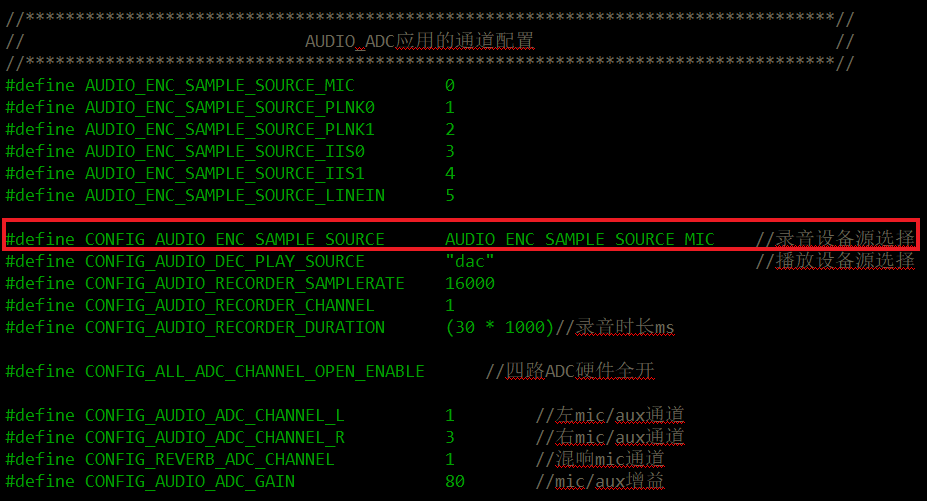
>
> - 网络播歌模式需要连接网络和使用DLNA音乐播放模式。
>
> 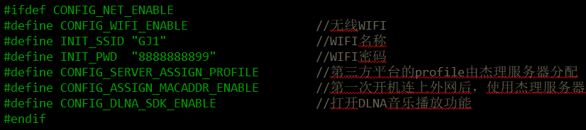
>
> 3.recorder录音：将MIC的数字信号采集后推到DAC播放，注意：如果需要播放两路MIC，DAC分别对应的是DACL和DACR，要留意芯片封装是否有DACR引脚出来， 而且要使能DAC的双通道输出，DAC如果采用差分输出方式也只会听到第一路MIC的声音。
>
> - 打开解码器：
>
> 
>
> - 打开编码器：
>
> 
>
> - MIC或者LINEIN模拟直通到DAC，不需要软件参与。因为 AUDIO ADC 数字模块上的使用限制，例如在使用通道 3 的时候，数字通道 0 和 1 一定要打开，所以在多路 AD 复用的情况下，建议把数字通道 4 路都打开，驱动里会自动分离各个通道的数据，具体使用方法如下：
>
>  1、请求 enc_server 打开时需要增加参数 req.enc.channel_bit_map = BIT(x)，x 代表要使用的哪一个通道。注意，如果上面的配置 all_channel_open = 0，一定要将所有 req.enc.channel_bit_map = 0;
>
>  2、AUDIO ADC 多路复用使用过程中，想动态调整增益，gain 的取值范围是 0-100，需要使用该函数void adc_multiplex_set_gain(const char *source, u8 channel_bit_map, u8 gain)；source 取值”mic”或者”linein”
>
> 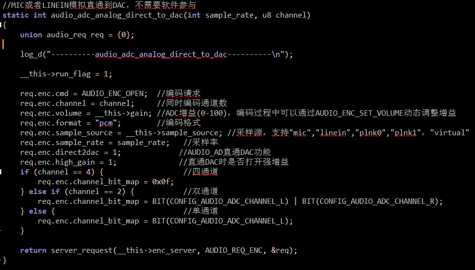
>
> - 录音创建文件到SD卡：
>
> 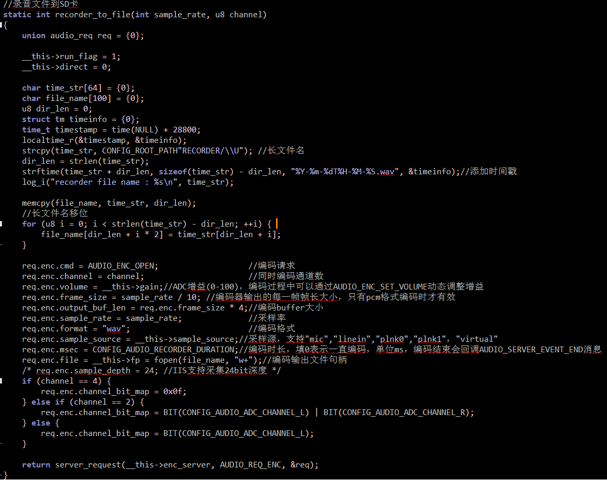
>
> 4.音频解码流程：
>
> - 打开解码服务：
>
> ```
> struct server *dec_server = server_open("audio_server", "dec"); 
> ```
>
> - 注册解码服务事件回调：
>
> ```
> server_register_event_handler(dec_server, priv, dec_server_event_handler); 
> ```
>
> - 解码请求参数解析：
>
> ```
> u8 cmd; //请求操作类型 
> u8 status; //请求后返回的解码状态 
> u8 channel; //解码通道数 
> u8 volume; //解码音量(0-100) 
> u8 priority; //解码优先级，暂时没用到 
> u16 pitchV; // >32768是音调变高，<32768音调变低，建议范围20000到50000 
> u8 speedV; // >80是变快，<80是变慢，建议范围：30到130 
> u16 attr; //解码属性 
> u8 digital_gain_mul; //数字增益乘值 
> u8 digital_gain_div; //数字增益除值 
> u32 output_buf_len; //解码buffer大小 
> u32 orig_sr; //原始采样率，强制变采样时才使用
> u32 sample_rate; //实际的解码采样率 
> u32 ff_fr_step; //快进快退级数 
> u32 total_time; //解码的总共时长 
> u32 play_time; //断点恢复时的当前播放时间 
> void *output_buf; //解码缓存buffer，默认填NULL，由解码器自己实现分配和释放 
> FILE *file; //需要解码的文件 
> char *dec_type; //解码格式
> const char *sample_source; //播放源 
> struct audio_dec_breakpoint *bp; //断点播放句柄 
> const struct audio_vfs_ops *vfs_ops; //虚拟文件操作句柄 
> void *eq_attr; //eq属性设置 
> void *eq_hdl; //预先申请好的的eq句柄
> struct audio_cbuf_t *virtual_audio; //虚拟解码句柄，供外部读写使用
> int (*dec_callback)(u8 *buf, u32 len); //解码后的PCM数据回调
> int (*dec_sync)(void *priv, u32 data_size, u16 *in_rate, u16 *out_rate); //解码对端采样率同步，常用于蓝牙解码
> ```
>
> - 关闭解码服务：server_close(dec_server);
>
> 5.音频编码流程：
>
> - 打开编码服务：
>
> ```
> struct server *enc_server = server_open("audio_server", "enc"); 
> ```
>
> - 注册编码服务事件回调：
>
> ```
> server_register_event_handler(enc_server, priv, enc_server_event_handler);
> ```
>
> - 编码请求参数解析：
>
> ```
> u8 cmd; //请求操作类型 
> u8 status; //编码器状态 
> u8 channel; //同时编码的通道数 
> u8 channel_bit_map; //ADC通道选择 
> u8 volume; //ADC增益(0-100)，编码过程中可以通过AUDIO_ENC_SET_VOLUME动态调整增益 
> u8 priority; //编码优先级，暂时没用到 
> u8 use_vad : 1; //是否使用VAD功能 
> u8 vad_auto_refresh : 1; //是否自动刷新VAD状态，赋值1表示SPEAK_START->SPEAK_STOP->SPEAK_START->SPEAK_STOP->....循环 
> u8 direct2dac : 1; //AUDIO_AD直通DAC功能 
> u8 high_gain : 1; //直通DAC时是否打开强增益 
> u8 amr_src : 1; //amr编码时的强制16k变采样为8kpcm数据，因为amr编码器暂时只支持8k编码
> u8 aec_enable : 1; //AEC回声消除功能，常用于蓝牙通话
> u8 ch_data_exchange : 1; //用于AEC差分回采时和MIC的通道数据交换
> u8 no_header : 1; //用于opus编码时是否需要添加头部格式
> u8 vir_data_wait : 1; //虚拟编码时是否允许丢失数据
> u8 no_auto_start : 1; //请求AUDIO_ENC_OPEN时不自动运行编码器，需要主动调用AUDIO_ENC_START
> u8 sample_depth : 6; //采样深度16bit或者24bit
> u16 vad_start_threshold; //VAD连续检测到声音的阈值，表示开始说话，回调AUDIO_SERVER_EVENT_SPEAK_START，单位ms，填0使用库内默认值 
> u16 vad_stop_threshold; //VAD连续检测到静音的阈值, 表示停止说话，回调 AUDIO_SERVER_EVENT_SPEAK_STOP，单位ms,填0使用库内默认值 
> u16 frame_size; //编码器输出的每一帧帧长大小，只有pcm格式编码时才有效 
> u16 frame_head_reserve_len; //编码输出的帧预留头部的大小
> u32 bitrate; //编码码率大小
> u32 output_buf_len; //编码buffer大小
> u32 sample_rate; //采样率 
> u32 msec; //编码时长，填0表示一直编码，单位ms，编码结束会回调AUDIO_SERVER_EVENT_END消息 
> FILE *file; //编码输出文件句柄
> u8 *output_buf; //编码buffer，默认填NULL，由编码器自动分配和释放资源  
> const char *format; //编码格式 
> const char *sample_source; //采样源，支持"mic","linein","plnk0","plnk1"，"virtual"，“iis0”，“iis1”，“spdif”
> const struct audio_vfs_ops *vfs_ops; //虚拟文件操作句柄 
> u32(*read_input)(u8 *buf, u32 len); //用于虚拟采样源"virtual"编码时的数据读取操作
> void *aec_attr; //AEC回声消除算法配置参数
> ```
>
> - 关闭编码服务：server_close(enc_server);
>
> 6.本地播放可选择FLASH、SD卡和U盘之间切换，通过扫描文件和搜索指定音频格式进行选择解码播放，有全盘搜索播放和目录搜索播放。
>
> 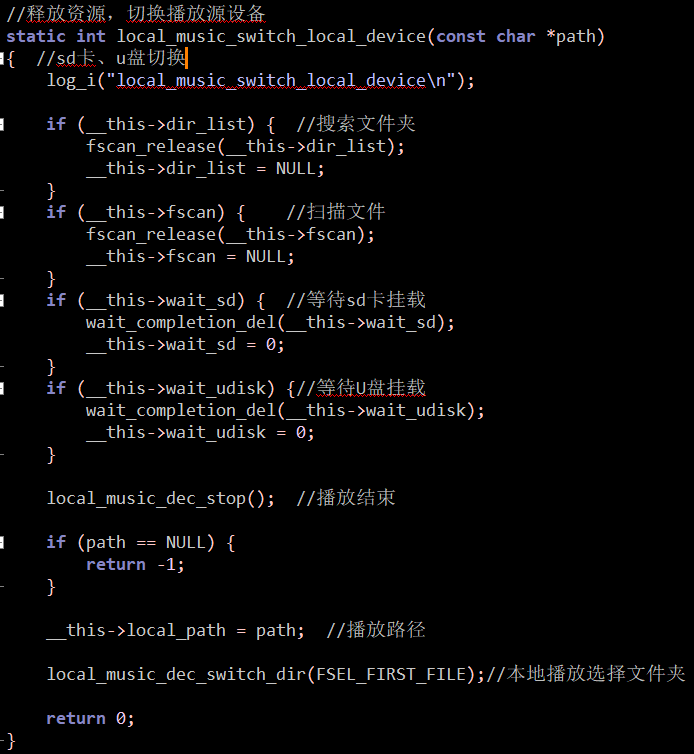
>
> ```
> //切换文件夹
> static int local_music_dec_switch_dir(int fsel_mode)
> {
>    ......
>      ......
>     //全盘播放
>     if (__this->local_play_all && __this->local_path != CONFIG_MUSIC_PATH_FLASH) {
>         //全盘搜索
>         if (__this->fscan) {
>             fscan_release(__this->fscan);
>         }
> #if CONFIG_DEC_DECRYPT_ENABLE    //扫描相应格式文件，包含子目录-r，-t扫描文件格式 ，-sn按照按照文件号排序，扫描目录层数2
>         __this->fscan = fscan(__this->local_path, "-r -tMP3WMAWAVM4AAMRAPEFLAAACSPXOPUDTSADPSMP -sn", 2);
> #else   
>         __this->fscan = fscan(__this->local_path, "-r -tMP3WMAWAVM4AAMRAPEFLAAACSPXOPUDTSADP -sn", 2);
> #endif
>         ......
>         return local_music_dec_switch_file(FSEL_FIRST_FILE);//切换歌曲
>     }
> 
>     //搜索文件夹
>     if (!__this->dir_list) {
>         __this->dir_list = fscan(__this->local_path, "-d -sn", 2);//扫描根目录文件夹
>         .......
>     }
> 
>     //选择文件夹
> __again:
>     do {
>         dir = fselect(__this->dir_list, fsel_mode, 0);//选择文件夹
>         if (dir) {
>             i++;
>             break;
>         }
>         if (fsel_mode == FSEL_NEXT_FILE) {//选择模式下一个文件
>             fsel_mode = FSEL_FIRST_FILE; //最开始文件开始
>         } else if (fsel_mode == FSEL_PREV_FILE) { //选择模式上一个文件
>             fsel_mode = FSEL_LAST_FILE; //最后一个文件开始
>         } else {
>             log_w("fselect_dir_faild, create dir\n");
>             return -1;
>         }
>     } while (i++ < __this->dir_list->file_number);//通过文件号选择文件
> 
>    ........
>     .......
> 
>     len = fget_name(dir, (u8 *)name, sizeof(name) - 1);//获取文件名长度
>     ........
>       .......
>     }
> 
>     fclose(dir);
> 
>     
>     fname_to_path(path, __this->local_path, name, len, 1, 0);
> 
> #if 0	//此处播放指定目录，用户填写的目录路径要注意中文编码问题，看不懂就直接用16进制把路径打印出来
>     const char *user_dir = "";  //指定目录
>     if (!file && strcmp(path, user_dir)) {
>         log_i("dir name : %s\n", path);
>         if (fsel_mode == FSEL_FIRST_FILE) {
>             fsel_mode = FSEL_NEXT_FILE;
>         } else if (fsel_mode == FSEL_LAST_FILE) {
>             fsel_mode = FSEL_PREV_FILE;
>         }
>         goto __again;
>     }
> #endif
> 
>     /*搜索文件夹下的音频文件，按序号排序*/
> #if CONFIG_DEC_DECRYPT_ENABLE   //扫描相应格式文件，包含子目录-r，-t扫描文件格式 ，-sn按照按照文件号排序，扫描目录层数2
>     __this->fscan = fscan(path, "-tMP3WMAWAVM4AAMRAPEFLAAACSPXOPUDTSADPSMP -sn", 2);
> #else
>     __this->fscan = fscan(path, "-tMP3WMAWAVM4AAMRAPEFLAAACSPXOPUDTSADP -sn", 2);
> #endif
> 
>     if (!file) {
>         if (!__this->fscan || !__this->fscan->file_number) {
>             if (fsel_mode == FSEL_FIRST_FILE) {//选择模式下一个文件
>                 fsel_mode = FSEL_NEXT_FILE;//最开始文件开始
>             } else if (fsel_mode == FSEL_LAST_FILE) {//选择模式上一个文件
>                 fsel_mode = FSEL_PREV_FILE;//最后一个文件开始
>             }
>             goto __again;
>         }
>         local_music_dec_switch_file(FSEL_FIRST_FILE);//切换歌曲
>     }
> 
>     return 0;
> }
> 
> ```
>
> 
>
> 7.网络播歌：通过ai_server平台服务器使用DLNA功能，将同局域网内可进行手机app支持的DLNA投播的音频投放到设备上播放。通过将网络文件数据缓存在网络缓存区后进行读取播放。
>
> | net_download接口                                             | 接口说明                                                     |
> | ------------------------------------------------------------ | ------------------------------------------------------------ |
> | int net_download_open(void **priv, struct net_download_parm *parm) | 打开网络进行文件下载，数据将缓存在网络缓存区，可下载文件     |
> | int net_download_read(void *priv, void *buf, u32 len)        | 读取网络缓存区中的数据                                       |
> | int net_download_seek(void *priv, u32 offset, int orig)      | 操作网络下载的进度                                           |
> | int net_download_close(void *priv)                           | 关闭网络文件下载，释放资源，若下载文件未完成则删除           |
> | int net_download_check_ready(void *priv)                     | 检查下载缓存区大小是否达到播放解码格式检查所需大小           |
> | char *net_download_get_media_type(void *priv)                | 获取下载媒体的类型                                           |
> | int net_download_get_file_len(void *priv)                    | 获取下载媒体的文件大小                                       |
> | int net_download_set_pp(void *priv, u8 pp)                   | 控制网络下载的暂停开关                                       |
> | int net_download_set_read_timeout(void *priv, u32 timeout_ms) | 设置读取缓存区超时时间                                       |
> | void net_download_buf_inactive(void *priv)                   | 关闭下载缓存区                                               |
> | void check_net_download_ready_timer(void *priv)              | 检查下载缓存定时器，异步等待网络下载ready，防止网络阻塞导致app卡住 |

## 模块依赖

> * audio_server.a 包含音频处理接口库
> * wl_wifi_sta_sfc.a  WIFI协议栈（STA模式)（内存优化版）
> * lib_mp3_dec.a 包含MP3解码依赖库
> * network_download.a 包含network_download协议依赖库
> * libdlna.a DLNA播放功能
> * http_cli.a HTTP请求功能
> * 其他说明见库文件简介说明文档

---

### 操作说明：
>！！！测试前请根据实际原理图配置好相应板级文件，尤其是串口打印和AUDIO ADC的对应IO口配置，还有AD按键对应阻值的配置
>
>1.按键操功能：
>	切换模式：MODE按键。
>	（1）本地播歌模式：
>			A) 暂停或继续播放：短按OK/PP按键。
>			B) 切换文件夹播放：长按OK/PP按键。
>			C) 音量增加：短按V+按键。
>			D) 音量减小：短按V-按键。
>			E) 播放上一首：长按V-按键。
>			F) 播放下一首：长按V+按键。
>	（2）网络播放模式：
>			A) 暂停或继续播放：短按OK/PP按键。
>			B) 音量增加：短按V+按键。
>			C) 音量减小：短按V-按键。
>			D) 播放上一首：长按V-按键。
>			E) 播放下一首：长按V+按键。
>	（3）录音模式：
>			A) 暂停或继续录音：短按K1按键。
>			B) 音量增加：短按V+按键。
>			C) 音量减小：短按V-按键。
>			D) ADC模拟增益增加：长按V+按键。
>			E) ADC模拟增益减小：长按V-按键。                                                                                                                                                                                     			F) 录制文件到SD卡：长按MODE按键。
>			G) 直通DAC：长按OK/PP。
>2.使用网络播放模式需要设备连上路由器，在app_config.h配置相应的SSID和PWD，然后打开手机里的各大音乐播放器app，点击DLNA投屏找到设备投屏。
>3.使用本地播放模式需要插入SD卡并且卡里面有支持解码格式的歌曲文件。
>4.使用录音模式linein输入时，使用音频线连接电脑音频输出，另一头连接AUX信号输入，连接原理图对应的IO。MIC/PLNK/IIS输入需要焊接相应的元器件。
>5.编译工程，烧录镜像，复位启动

> JIELI SDK的编译、烧写等操作方式的说明可在以下文档获取：
> [文档](/doc/stuff/usb%20updater.pdf)

### 控制命令

> * N/A

### 代码流程

>1.app_main()入口：
>	A) 调用mount_sd_to_fs()函数进行SD卡挂载。
>	B) 调用key_event_enable()进行按键事件使能。
>	C) 调用audio_demo_mode_switch()进行模式选择。
>
>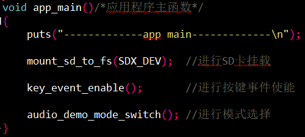
>
>2.模式切换audio_demo_mode_switch():
>	A) 创建audio_app，通过app_state_machine接口使得存在多个模式,并且多个模式之间是互斥关系(非后台)的情况下, 建立多个app_state_machine切换可以使得系统资源合理利用和降低CPU的消耗。
>
>
>
>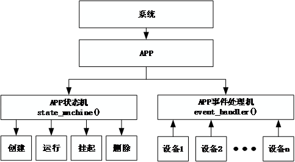
>
>
>
>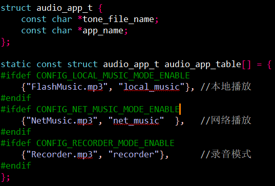
>
>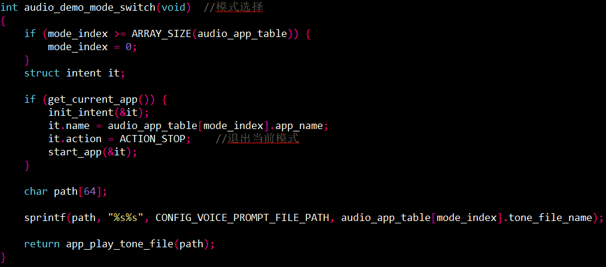
---

## 常见问题

> * N/A

## 参考文档

> * 《AC79xx音频服务使用开发文档.pdf》解码部分
> * 《AC79xx开发快速入门-v1.pdf》DAC部分