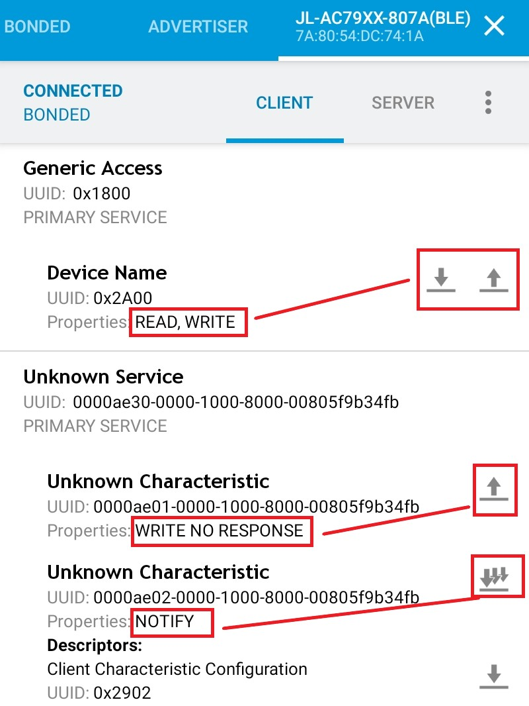
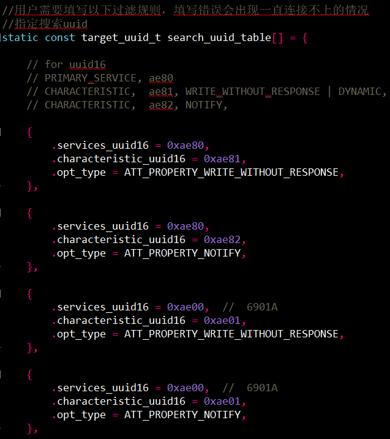
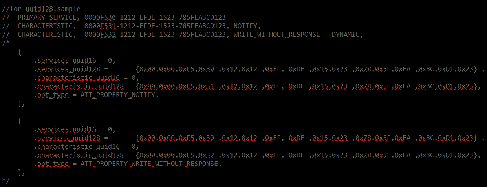
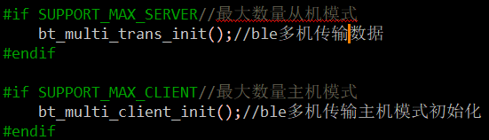
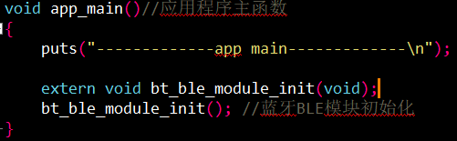
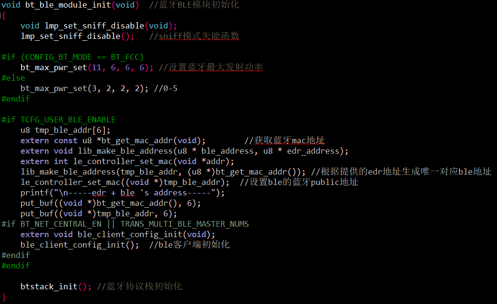
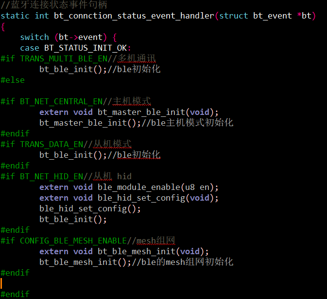
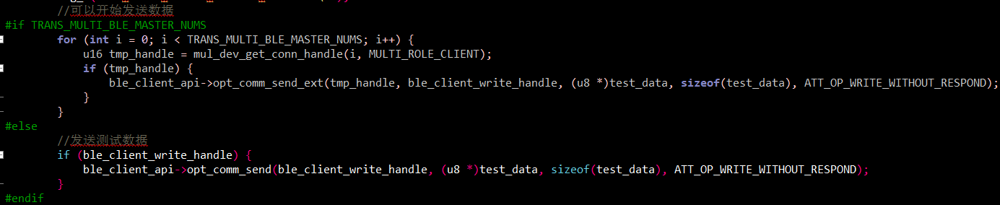

# DEMO_BLE示例工程说明

> 本工程展示了使用蓝牙BLE进行数据传输测试功能，通过ble进行读写通知数据传输。
>
> 1.从机 数传
>
> 2.主机 client角色
>
> 3.多机通讯
>
> 4.mesh测试demo

---

## 适用平台

> 本工程适用以下芯片类型：
>
> 1. AC79系列芯片：AC790N、AC791N

> 杰理芯片和评估板的更多信息可在以下地址获取：
> [链接](https://shop321455197.taobao.com/?spm=a230r.7195193.1997079397.2.2a6d391d3n5udo)

## 工程配置说明

> 1.app_config.h：
>
> A)打开宏#define TCFG_USER_BLE_ENABLE BLE功能使能
>
> B)BLE DEMO模式选择：选择需要打开的测试置1，同时只能选择一项
>
> - 打开宏#define TRANS_DATA_EN                         从机模式 数传
> - 打开宏#defineBT_NET_CENTRAL_EN                  主机模式 client角色 搜寻连接其它BLE从机
> - 打开宏#define TRANS_MULTI_BLE_EN               多机通讯（支持多个主机和从机同时运行）
> - 打开宏#define CONFIG_BLE_MESH_ENABLE     mesh组网测试demo
> 
>
> 
>

------

## 模块依赖

> - btctrler.a 蓝牙协议栈（底层驱动）
> - btstack.a 蓝牙协议栈
> - crypto_toolbox_Osize.a 蓝牙专用加解密工具箱
> - lib_ccm_aes.a ble配对AES硬件加解密
> - wl_rf_common.a RF模拟初始化接口
> - lib_sig_mesh.a ble mesh组网协议

------

### 操作说明：

> 1.从机模式：
>
> - 通过手机app（nrf connect）（扫描、发现、连接低功耗蓝牙设备的应用）连接到设备BLE的JL-AC79XXble
>
> 
>
> - 对已经连接的蓝牙ble设备进行trans_data传输数据，进行写write，读read,通知notify等操作。
>
> 
>
> 2.主机模式：主动通过搜索去连接其它BLE从机设备
>
> 用户需要填写以下过滤规则，填写错误会出现一直连接不上的情况,指定搜索对应profile的uuid。
>
> - uuid16：
>
> 
>
> - uuid128：
>
> 
>
> 3.多机通讯：通过多机通讯，初始化ble模块后，进行从机模式和主机模式的初始化
>
> - 多机通讯从机模式：bt_multi_trans_init(); ble多机从机数传
> - 多机通讯主机模式：bt_multi_client_init(); ble多机主机数传
>
> 
>
> 4.mesh组网测试demo：蓝牙Mesh网络是用于建立多对多（many：many）设备通信的低能耗蓝牙（Bluetooth Low Energy，也称为Bluetooth LE）的网络拓扑，网络中包含的蓝牙设备之间可以相互进行信息的传递。
>
> 在apps/common/ble/mesh/model_api.h选择对应的mesh测试模式
>
> 
>
> 
>
> 测试APP操作如下：
>
> 
>
> 

> JIELI SDK的编译、烧写等操作方式的说明可在以下文档获取：
> [文档](/doc/stuff/usb%20updater.pdf)

------

### 代码流程

> 1.app_main()入口：
> 	A)调用bt_ble_module_init() 蓝牙BLE协议栈初始化
>
> 
>
> 2.bt_ble_module_init()入口：
> 	A) 调用bt_max_pwr_set()函数设置蓝牙最大发射功率(0-11)。
> 	B) 调用bt_get_mac_addr()函数获取蓝牙mac地址。
> 	C) 调用lib_make_ble_address()函数根据提供的edr地址生成唯一对应ble地址。
> 	D) 调用le_controller_set_mac()函数设置ble的public地址。
> 	E) 调用btstack_init()函数进行蓝牙协议栈初始化。
> 
>
> 
>3.BLE各个DEMO的初始化入口：
> 
>
> 
>4.ble_report_data_deal()：主机模式下处理接收数据
> 
>
> 
>5.主机模式下发送测试数据：
> 
>
---

## 常见问题

> * N/A  

## 参考文档

> * N/A

