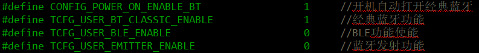
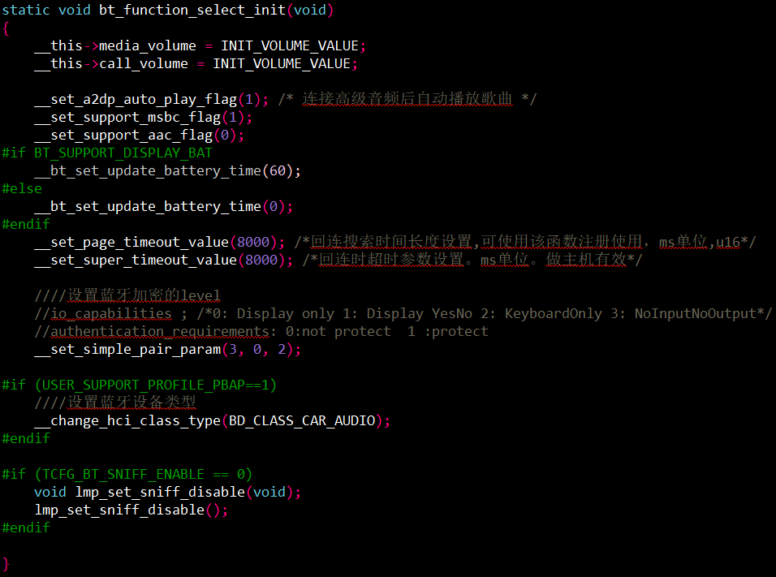
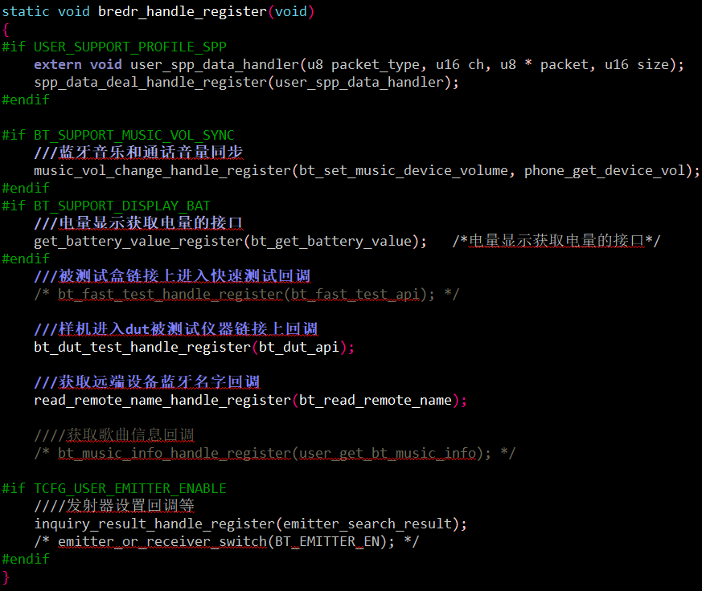
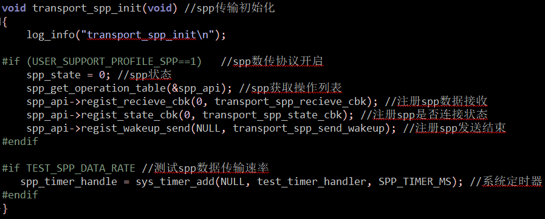
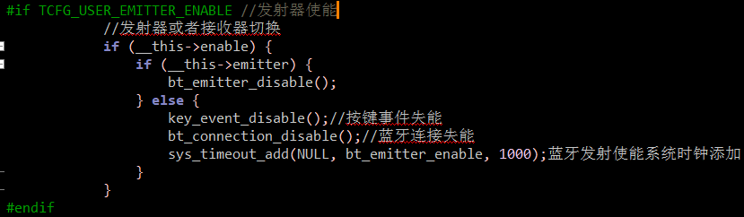
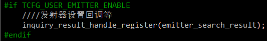
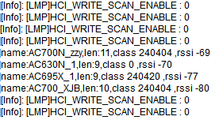

# DEMO_EDR示例工程说明

> 本工程展示了使用蓝牙EDR进行播歌和通话测试的使用示例：
>
> ​	1.实现蓝牙EDR播歌中暂停播放、上下曲、音量增减等功能。
> ​	2.实现蓝牙EDR通话中接听和挂断电话，音量增减等功能。                                                                                                                                                                                        	3.实现蓝牙发射功能。                                                                                                                                                     	                                                                          	4.实现spp数据传输功能。

---

## 适用平台

> 本工程适用以下芯片类型：
>
> 1. AC79系列芯片：AC790N、AC791N

> 杰理芯片和评估板的更多信息可在以下地址获取：
> [链接](https://shop321455197.taobao.com/?spm=a230r.7195193.1997079397.2.2a6d391d3n5udo)

## 工程配置说明

> app_config.h：
>
> - 打开宏 #define CONFIG_POWER_ON_ENABLE_BT  开机自动打开经典蓝牙
> - 打开宏 #define TCFG_USER_BT_CLASSIC_ENABLE 经典蓝牙功能
> - 打开 #define TCFG_USER_BLE_ENABLE  BLE功能使能
> - 打开 #define TCFG_USER_EMITTER_ENABLE  蓝牙发射功能
> - 打开宏#define SPP_TRANS_DATA_EN spp传输发送测试
>
> 

>修改蓝牙初始名称user_cfg.c：
>
>- 可修改bt_get_local_name()中edr_name：JL-AC79XX。
>
>
>
>- 在bt_get_pin_code()函数修改设备返回的pin code。
>- 如有特殊需求，可在bt_get_mac_addr()函数修改设备的蓝牙mac地址。

------

## 模块依赖

> - audio_server.a 包含音频处理接口库
> - btctrler.a 蓝牙协议栈（底层驱动）
> - btstack.a 蓝牙协议栈
> - crypto_toolbox_Osize.a 蓝牙专用加解密工具箱
> - libaec.a 回声消除
> - wl_rf_common.a RF模拟初始化接口
>

------

### 操作说明：

> 按键功能：
> 	1.播歌模式：
> 		A ) 暂停或播放：OK/PP按键。
> 		B ) 音量增大：短按V+按键。
> 		C ) 音量减小：短按V-按键。
> 	    D ) 播放上一首：长按V-按键。
> 	    E ) 播放下一首：长按V+按键。
>
> ​	2.通话模式：
>
> ​		A ) 接听或挂断电话：OK/PP按键。
> ​        B ) 音量增大：短按V+按键。
> ​		C ) 音量减小：短按V-按键。
>
> ​    3.发射模式：
>
> ​         长按MODE按键切换到蓝牙发射模式，进行设备搜索并根据过滤规则连接指定设备。
>
> ​	4.通过spp数传app进行开发板与手机之间的数据传输。间隔10ms，sent_len长度660，速率最快528000bps。底层限制了每次发送的最大长度，当sent_len超过668时受限制。
>
> ​    5.关闭或打开蓝牙，短按MODE按键。切换蓝牙到发射或者接收模式，长按MODE按键。

------

### 代码流程

> 1.app_main()入口：
> 	A ) 调用key_event_enable()函数使能按键事件。
> 	B ) 调用bt_ble_module_init()函数进行蓝牙模块初始化。
>
> 
>
> 2.bt_ble_module_init()入口：
> 	A ) 调用bt_function_select_init()函数进行经典蓝牙功能配置，包括音量是否同步、是否连接自动播放、是否定时更新电量、回连搜索超时、蓝牙加密等级和蓝牙设备类型等功能。
>
> 
>
> 
>
> ​	B ) 调用bredr_handle_register()函数进行协议栈回调函数注册，包括SPP数传数据回调、蓝牙音量同步接口回调、电量显示获取电量的接口、被测试盒链接上进入快速测试回调、样机进入dut被测试仪器链接上回调、获取远端设备蓝牙名字回调、获取歌曲信息回调、发射器设置回调等。
>
> 
>
> 
>
> ​	C ) 调用btstack_init()函数进行蓝牙协议栈初始化。
>
> ​	D ) 调用sys_auto_sniff_controle()函数进行自动进入sniff低功耗模式，空闲5s之后进入sniff模式。
>
> 
>
> ​	E ) bt_connction_status_event_handler()函数负责处理协议栈连接、加密、媒体播放、通话等各种状态的回调。
>
> ​    F ) bt_hci_event_handler()函数负责处理协议栈各种HCI事件的回调。
>
> 3.transport_spp_init()函数，spp传输初始化：
>
> 
>
> 4.蓝牙发射功能：蓝牙发射搜索结果回调处理，根据过滤规则可以做名字/地址过滤，也可以保存搜到的所有设备在选择一个进行连接。
>
> - 蓝牙发射 提供按键切换发射器或者是音箱功能：2:发射    1：接收   0: 关闭。
>
> 
>
> - 发射器设置回调包括设备名字name、设备名字长度len、设备类型class和设备信号强度rssi等。
>
> 
>
> 
---

## 常见问题

> * N/A  

## 参考文档

> * include_lib/btstack/avctp_user.h里面有蓝牙各个初始化接口的具体说明和控制命令的使用说明。

