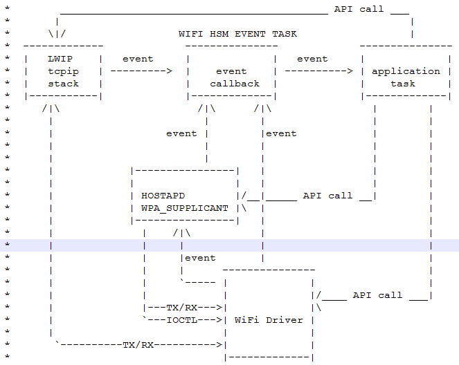
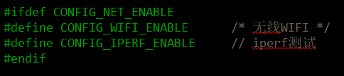
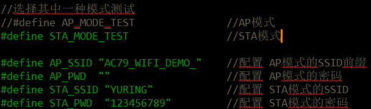
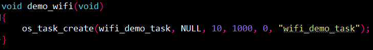
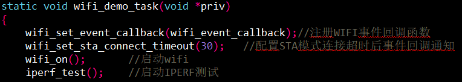

# DEMO_WIFI示例工程说明

> 本工程展示了使用iperf测试wifi吞吐率的使用示例:
>
> 1. WIFI STA模式测试IPERF。
> 2. WIFI AP模式测试IPERF。
> 3. IPERF的上下行吞吐率测试以及参数配置。

---

# WIFI框架图

## 适用平台

> 本工程适用以下芯片类型：
> 1. AC79系列芯片：AC790N、AC791N
>
> 杰理芯片和评估板的更多信息可在以下地址获取：[链接](https://shop321455197.taobao.com/?spm=a230r.7195193.1997079397.2.2a6d391d3n5udo)

## 工程配置说明

> app_config.h：
>
> - 打开宏 #define CONFIG_WIFI_ENABLE 无线WiFi
> - 打开宏#define CONFIG_IPERF_ENABLE iperf测试
>
> 

> wifi_demo_task.c:
>
> - 打开宏定义AP_MODE_TEST或者STA_MODE_TEST配置WIFI工作模式
> - 配置AP模式和STA模式的SSID（名称）和PWD（密码）
> - wifi_on(); 之后调用 iperf_test();
>
> 

## 模块依赖

> * 如果只需要测试STA模式和MONITOR模式, 工程文件或者Makefile包含wl_wifi_sta.a, wpasupplicant.a
> * 如果只需要测试AP模式, 工程文件或者Makefile包含wl_wifi_ap.a
> * 如果STA和AP模式均要测试, 工程文件或者Makefile包含wl_wifi.a,wpasupplicant.a
> * 其中wl_wifi_ap_sfc.a,wl_wifi_sta_sfc.a,wl_wifi_sfc.a为节省内存/降低性能版本的WIFI库

---

### 操作说明：

> *	设备端操作:
> 	1. 编译工程，烧录镜像，复位启动
> 	2. 系统启动后，可以通过串口软件看到示例的打印信息
>
> 	JIELI SDK的编译、烧写等操作方式的说明可在以下文档获取：[文档](../../../../doc/stuff/usb updater.pdf)
>
> *	手机端操作:
>
>   1.安卓手机可安装[Magic iPerf.apk](../../../../../sdk_tools/IPERF3 测试工具), 苹果手机端在商店安装对应收费版本软件, PC端可安装[iperf-3.1.3-win64.exe](../../../../../sdk_tools/IPERF3 测试工具) 
>
>   2.参考文档[iperf3工具说明](../../../../../sdk_tools/IPERF3 测试工具/iperf3工具说明.pdf)进行测试

### 代码流程

> 1. demo_wifi()入口：
>     A）创建WIFI启动任务wifi_demo_task
>     B）打印WIFI信号质量信息和吞吐率信息
>
> 
>
> ​	2.wifi_event_callback()：
> ​		A）case WIFI_EVENT_MODULE_INIT: 配置WIFI启动前的必要配置, 例如WIFI MP测试后校准PA参数, 	WIFI启动前的默认模式, 配置信息等
> ​		B）case WIFI_EVENT_MODULE_START:配置WIFI启动后的配置
>
> 
>
> ​	3.wifi_demo_task()函数流程:
> ​		A）注册WIFI事件回调函数
> ​		B）启动WIFI  
> ​		C）启动IPERF测试
>
> 
---

## 常见问题

> * WIFI库选择说明:
>
>   wl_wifi.a     			   包含AP和STA模式,占据大内存,性能强悍
>   wl_wifi_sfc.a     		包含AP和STA模式,占据内存小
>   wl_wifi_ap.a			  只包含AP模式,占据大内存,性能强悍
>   wl_wifi_ap_sfc.a       只包含AP模式,占据内存小
>   wl_wifi_sta.a			 只包含STA模式,占据大内存,性能强悍
>   wl_wifi_sta_sfc.a      只包含STA模式,占据内存小
>
>   lwip.a                        占据大内存,性能强悍
>   lwip_sfc.a                 占据内存小
>
>   wpasupplicant.a 如果需要使用STA模式,需要包含, 仅使用AP模式不需要包含
>
>   WIFI API接口头文件在 wifi/wifi_connect.h
>
> * iperf测试吞吐率一般结果为多少?
>
>     答:AP模式下一般TX/RX速率有800KB/S-2MB/S,STA模式下一般有200KB-1MB/S
>
> * 影响iperf测试吞吐率的因素有哪些?
>
>     答:
>
>   1.WIFI RF校准参数有没有进行仪器测试调整到SDK里面
>
>   2.板子天线是否有调试好
>
>   3.AP模式比STA模式吞吐率要高
>
>   4.空中信道是否有比较大的干扰
>
>   5.SDK运行过程中剩下的CPU使用率是否足够
>
>   6.测试手机,路由器,设备,距离是否足够小
>
>   7.使用占据资源多的高性能的WIFI库与LWIP库有利于提高吞吐率
>
>   8.程序运行在SDRAM模式比在SFC模式吞吐率要高

## 参考文档

> * [iperf3工具说明](../../../../../sdk_tools/IPERF3 测试工具/iperf3工具说明.pdf)